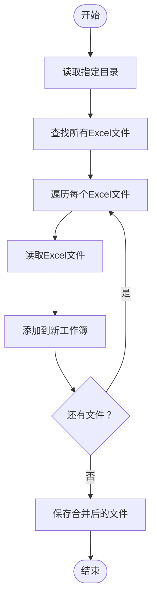
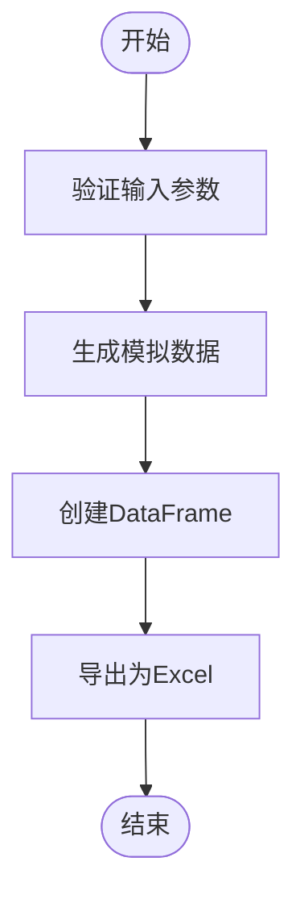
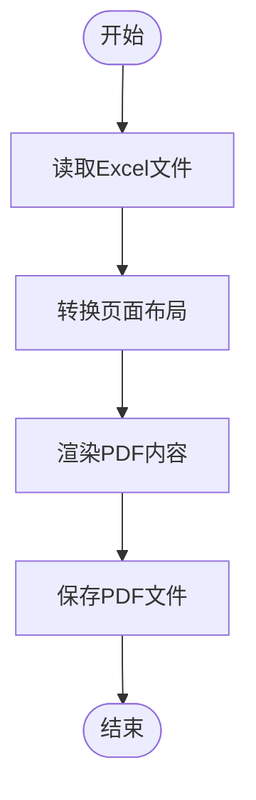
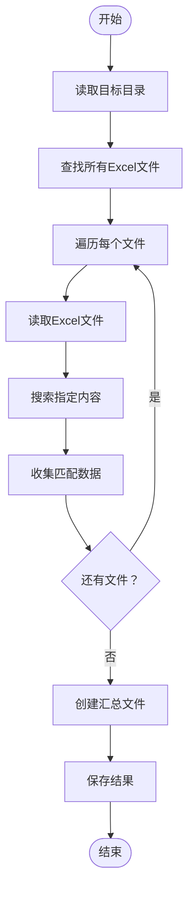
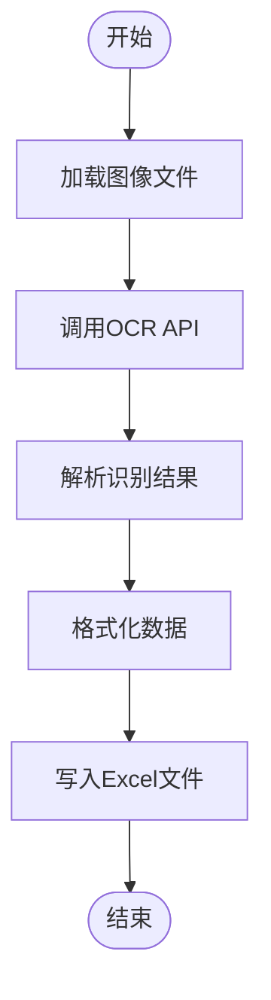
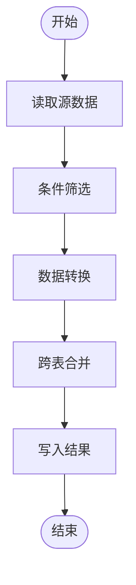

# Excel处理API

<cite>
**本文档引用的文件**
- [50-07-fake2excel.py](file://docs-pages\vuepress\course\code\50-07-fake2excel.py)
- [50-10-excel2pdf.py](file://docs-pages\vuepress\course\code\50-10-excel2pdf.py)
- [50-14-sheet2excel.py](file://docs-pages\vuepress\course\code\50-14-sheet2excel.py)
- [50-15-VatInvoiceOCR2Excel.py](file://docs-pages\vuepress\course\code\50-15-VatInvoiceOCR2Excel.py)
- [50-20-query4excel.py](file://docs-pages\vuepress\course\code\50-20-query4excel.py)
- [50-22-merge2excel.py](file://docs-pages\vuepress\course\code\50-22-merge2excel.py)
- [50-36-LicensePlateOCR.py](file://docs-pages\vuepress\course\code\50-36-LicensePlateOCR.py)
- [excel.md](file://docs-pages\vuepress\office\excel.md)
</cite>

## 目录
1. [简介](#简介)
2. [核心功能](#核心功能)
3. [数据合并](#数据合并)
4. [生成假数据](#生成假数据)
5. [导出为PDF](#导出为pdf)
6. [多工作表操作](#多工作表操作)
7. [数据查询](#数据查询)
8. [OCR结果写入](#ocr结果写入)
9. [依赖库配置](#依赖库配置)
10. [性能调优](#性能调优)

## 简介
本API参考文档详细介绍了Python-Office库中Excel处理的核心功能。该库提供了一系列简化Excel自动化办公的函数，通过一行代码即可实现复杂的数据处理任务。文档涵盖了数据合并、假数据生成、PDF导出、多工作表操作、数据查询及OCR结果写入等主要功能。

**Section sources**
- [excel.md](file://docs-pages\vuepress\office\excel.md#L1-L95)

## 核心功能
Python-Office库提供了多种Excel处理功能，主要包括：
- 数据合并：将多个Excel文件合并到一个文件的不同工作表中
- 假数据生成：批量生成模拟的Excel数据
- PDF导出：将Excel文件转换为PDF格式
- 多工作表操作：拆分或合并工作表
- 数据查询：在多个Excel文件中搜索特定内容
- OCR集成：将OCR识别结果写入Excel

这些功能通过简洁的API接口提供，使得复杂的Excel操作变得简单易用。

**Section sources**
- [excel.md](file://docs-pages\vuepress\office\excel.md#L1-L95)

## 数据合并
`merge2excel`函数用于将多个Excel文件合并到一个Excel文件的不同工作表中。

### 函数参数
- `dir_path`：包含多个Excel文件的文件夹路径
- `output_file`：输出文件的路径和名称（可选，默认为merge2excel.xlsx）

### 处理逻辑
函数会遍历指定文件夹中的所有Excel文件，并将每个文件作为单独的工作表添加到输出文件中。文件名通常用作工作表名称。

### 输出格式
生成一个包含多个工作表的Excel文件，每个原始Excel文件对应一个工作表。



**Diagram sources**
- [50-22-merge2excel.py](file://docs-pages\vuepress\course\code\50-22-merge2excel.py#L1-L13)
- [excel.md](file://docs-pages\vuepress\office\excel.md#L57-L72)

**Section sources**
- [50-22-merge2excel.py](file://docs-pages\vuepress\course\code\50-22-merge2excel.py#L1-L13)
- [excel.md](file://docs-pages\vuepress\office\excel.md#L57-L72)

## 生成假数据
`fake2excel`函数用于生成包含模拟数据的Excel文件。

### 函数参数
- `columns`：列名列表
- `rows`：生成的行数
- `language`：数据语言（中文或英文）
- `path`：输出文件路径

### 处理逻辑
根据指定的列名和行数，生成包含随机但合理的模拟数据的Excel文件。支持多种数据类型，如姓名、公司、电话号码等。

### 输出格式
生成一个包含指定列和行的Excel文件，数据为模拟的真实数据。



**Diagram sources**
- [50-07-fake2excel.py](file://docs-pages\vuepress\course\code\50-07-fake2excel.py#L1-L32)
- [excel.md](file://docs-pages\vuepress\office\excel.md#L74-L87)

**Section sources**
- [50-07-fake2excel.py](file://docs-pages\vuepress\course\code\50-07-fake2excel.py#L1-L32)
- [excel.md](file://docs-pages\vuepress\office\excel.md#L74-L87)

## 导出为PDF
`excel2pdf`函数用于将Excel文件转换为PDF格式。

### 函数参数
- `excel_path`：源Excel文件路径
- `pdf_path`：输出PDF文件路径

### 处理逻辑
读取Excel文件内容，保持原有的格式和布局，将其转换为PDF文档。转换过程中会保留单元格的样式、字体和颜色等信息。

### 输出格式
生成一个与原始Excel文件布局一致的PDF文件。



**Diagram sources**
- [50-10-excel2pdf.py](file://docs-pages\vuepress\course\code\50-10-excel2pdf.py#L1-L12)
- [excel.md](file://docs-pages\vuepress\office\excel.md#L17-L26)

**Section sources**
- [50-10-excel2pdf.py](file://docs-pages\vuepress\course\code\50-10-excel2pdf.py#L1-L12)
- [excel.md](file://docs-pages\vuepress\office\excel.md#L17-L26)

## 多工作表操作
### 拆分工作表
`sheet2excel`函数可以将一个Excel文件中的多个工作表拆分为独立的Excel文件。

#### 函数参数
- `file_path`：源Excel文件路径
- `output_path`：输出文件夹路径

#### 处理逻辑
读取源Excel文件的所有工作表，将每个工作表保存为单独的Excel文件，文件名通常基于工作表名称。

### 合并工作表
`merge2sheet`功能可以将多个工作表根据指定列合并为一个工作表。

#### 处理逻辑
通过pandas的merge或concat操作，将多个工作表的数据行合并到一个工作表中，支持不同的合并策略。

**Section sources**
- [50-14-sheet2excel.py](file://docs-pages\vuepress\course\code\50-14-sheet2excel.py#L1-L12)
- [excel.md](file://docs-pages\vuepress\office\excel.md#L41-L55)

## 数据查询
`query4excel`函数用于在多个Excel文件中查询符合条件的数据并汇总。

### 函数参数
- `query_content`：要搜索的内容
- `query_path`：包含Excel文件的目录路径
- `output_path`：输出文件路径
- `output_name`：输出文件名

### 处理逻辑
遍历指定目录中的所有Excel文件，搜索包含指定内容的单元格，将匹配的数据提取并汇总到一个新的Excel文件中。

### 输出格式
生成一个包含所有匹配数据的Excel文件，通常包含源文件信息和匹配内容。



**Diagram sources**
- [50-20-query4excel.py](file://docs-pages\vuepress\course\code\50-20-query4excel.py#L1-L15)
- [excel.md](file://docs-pages\vuepress\office\excel.md#L5-L14)

**Section sources**
- [50-20-query4excel.py](file://docs-pages\vuepress\course\code\50-20-query4excel.py#L1-L15)
- [excel.md](file://docs-pages\vuepress\office\excel.md#L5-L14)

## OCR结果写入
### 增值税发票OCR
`VatInvoiceOCR2Excel`函数可以识别增值税发票并将结果写入Excel。

#### 函数参数
- `input_path`：发票图像或PDF路径
- `output_path`：输出Excel文件路径
- `id`和`key`：腾讯云OCR API凭证

#### 处理逻辑
使用腾讯云OCR服务识别发票内容，提取关键字段（如发票代码、号码、金额等），并将这些数据结构化地写入Excel文件。

### 车牌识别
`LicensePlateOCR2Excel`函数用于车牌识别并写入Excel。

#### 处理逻辑
通过OCR技术识别车牌图像中的车牌号码，并将识别结果保存到Excel中。



**Diagram sources**
- [50-15-VatInvoiceOCR2Excel.py](file://docs-pages\vuepress\course\code\50-15-VatInvoiceOCR2Excel.py#L1-L28)
- [50-36-LicensePlateOCR.py](file://docs-pages\vuepress\course\code\50-36-LicensePlateOCR.py#L1-L17)

**Section sources**
- [50-15-VatInvoiceOCR2Excel.py](file://docs-pages\vuepress\course\code\50-15-VatInvoiceOCR2Excel.py#L1-L28)
- [50-36-LicensePlateOCR.py](file://docs-pages\vuepress\course\code\50-36-LicensePlateOCR.py#L1-L17)

## 依赖库配置
Excel处理功能主要依赖以下库：

### pandas配置
- **引擎选择**：使用openpyxl作为Excel读写引擎
- **内存模式**：对于大文件，建议使用chunking模式分块处理
- **数据类型推断**：可配置dtype参数以优化内存使用

### openpyxl配置
- **只读模式**：处理大文件时使用read_only=True
- **数据只读**：使用data_only=True获取计算后的值
- **内存优化**：对于只读操作，使用iter_rows()进行迭代

### 性能相关配置
```python
# 示例配置
import pandas as pd

# 读取大文件时的配置
df = pd.read_excel('large_file.xlsx', 
                   engine='openpyxl',
                   read_only=True,
                   data_only=True)
```

**Section sources**
- [excel.md](file://docs-pages\vuepress\office\excel.md#L1-L95)

## 性能调优
### 大数据集处理
对于大数据集，建议使用分块处理（chunking）来避免内存溢出。

#### 分块读取
```python
# 分块读取大Excel文件
chunk_size = 1000
for chunk in pd.read_excel('large_file.xlsx', chunksize=chunk_size):
    # 处理每个数据块
    process_chunk(chunk)
```

#### 内存优化技巧
- 使用适当的数据类型（如category代替object）
- 及时删除不再需要的DataFrame
- 使用生成器而非列表存储中间结果

### 最佳实践
1. **文件大小监控**：定期检查处理的文件大小
2. **内存使用监控**：使用memory_profiler监控内存使用
3. **异常处理**：为大文件处理添加适当的异常处理
4. **进度显示**：为长时间操作添加进度指示

### 复杂操作示例


**Diagram sources**
- [50-20-query4excel.py](file://docs-pages\vuepress\course\code\50-20-query4excel.py#L1-L15)
- [50-22-merge2excel.py](file://docs-pages\vuepress\course\code\50-22-merge2excel.py#L1-L13)

**Section sources**
- [50-20-query4excel.py](file://docs-pages\vuepress\course\code\50-20-query4excel.py#L1-L15)
- [50-22-merge2excel.py](file://docs-pages\vuepress\course\code\50-22-merge2excel.py#L1-L13)