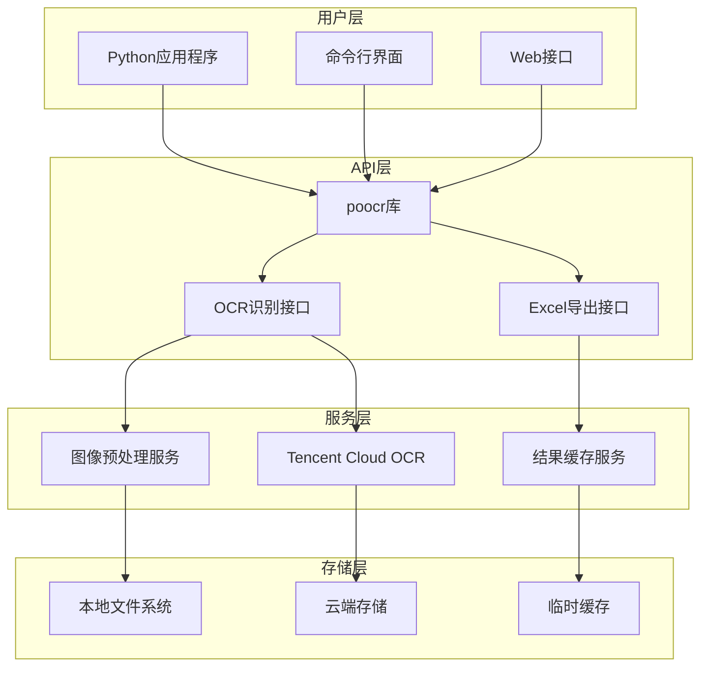
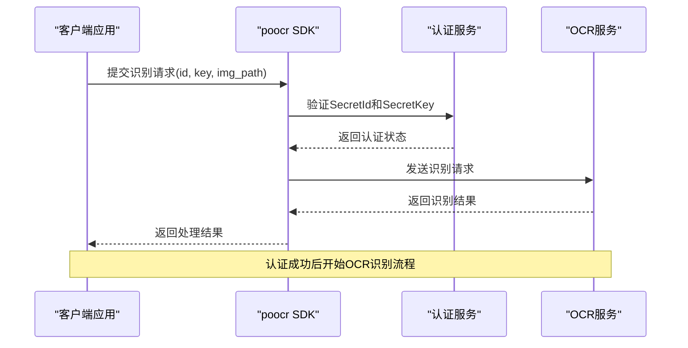
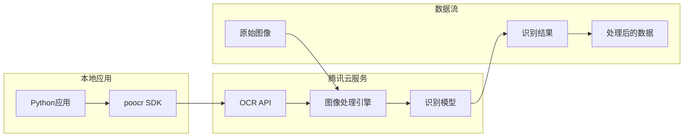
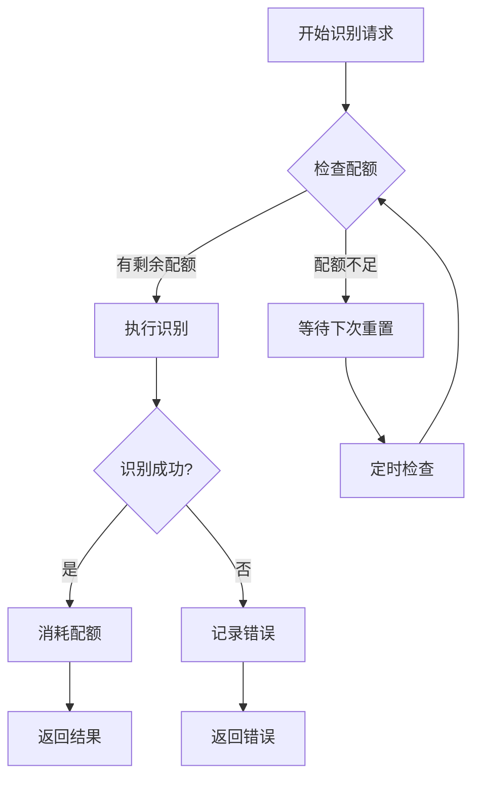
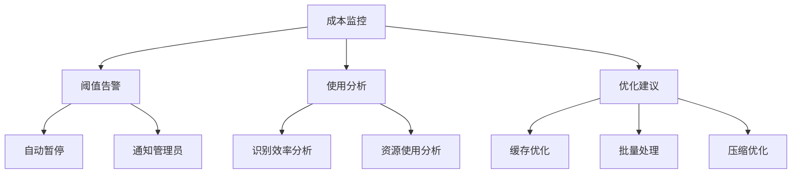
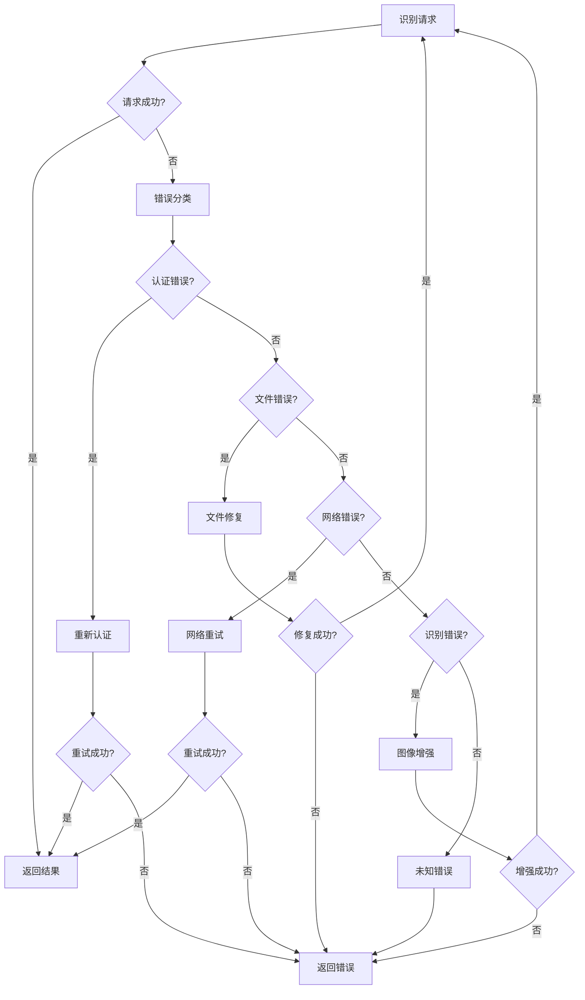
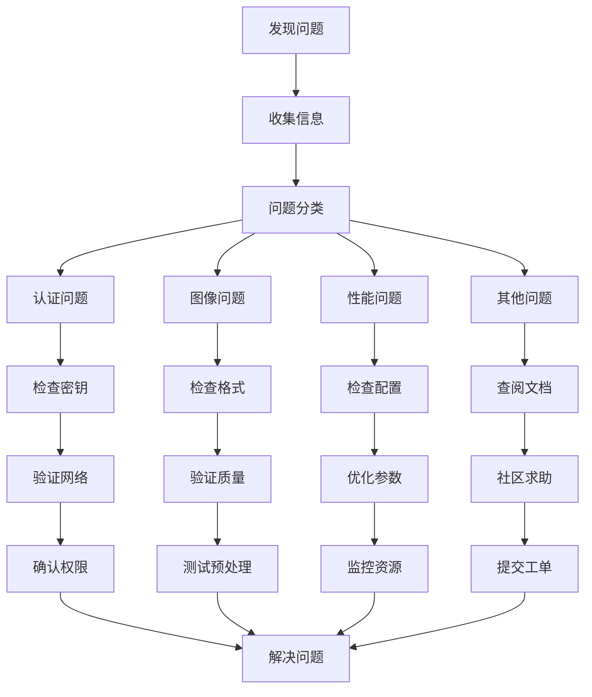

# OCR识别API参考文档

<cite>
**本文档引用的文件**
- [50-15-VatInvoiceOCR2Excel.py](file://docs-pages/vuepress/course/code/50-15-VatInvoiceOCR2Excel.py)
- [50-36-LicensePlateOCR.py](file://docs-pages/vuepress/course/code/50-36-LicensePlateOCR.py)
- [2-tencent_account.py](file://docs-pages/vuepress/course-002/5-poocr/code/2-tencent_account.py)
- [3-install_poocr.py](file://docs-pages/vuepress/course-002/5-poocr/code/3-install_poocr.py)
- [4-all_ocr_func.py](file://docs-pages/vuepress/course-002/5-poocr/code/4-all_ocr_func.py)
- [5-ocr2excel.py](file://docs-pages/vuepress/course-002/5-poocr/code/5-ocr2excel.py)
- [6-pdf-ocr.py](file://docs-pages/vuepress/course-002/5-poocr/code/6-pdf-ocr.py)
- [7-BizLicenseOCR.py](file://docs-pages/vuepress/course-002/5-poocr/code/7-BizLicenseOCR.py)
- [draft.md](file://docs-pages/vuepress/ref/draft.md)
- [50-15-VatInvoiceOCR2Excel.md](file://docs-pages/vuepress/course/docs/50-15-VatInvoiceOCR2Excel.md)
- [50-36-LicensePlateOCR.md](file://docs-pages/vuepress/course/docs/50-36-LicensePlateOCR.md)
- [2-tencent_account.md](file://docs-pages/vuepress/course-002/5-poocr/docs/2-tencent_account.md)
</cite>

## 目录
1. [简介](#简介)
2. [系统架构](#系统架构)
3. [核心功能](#核心功能)
4. [API调用详解](#api调用详解)
5. [认证参数配置](#认证参数配置)
6. [图像预处理要求](#图像预处理要求)
7. [识别精度控制](#识别精度控制)
8. [结果结构说明](#结果结构说明)
9. [第三方服务集成](#第三方服务集成)
10. [请求配额管理](#请求配额管理)
11. [成本优化策略](#成本优化策略)
12. [错误处理指南](#错误处理指南)
13. [性能优化建议](#性能优化建议)
14. [故障排除](#故障排除)
15. [最佳实践](#最佳实践)

## 简介

本文档详细介绍了基于Python Office项目的OCR识别API功能，该系统提供了强大的文字识别能力，支持增值税发票识别、车牌识别、通用PDF文字提取并导出至Excel等多种功能。系统底层基于腾讯云OCR服务，提供高达99%的识别准确率，支持100多种场景的文字识别需求。

### 主要特性

- **多场景识别**：支持发票、身份证、银行卡、车牌等多种证件识别
- **批量处理**：支持单文件和批量文件处理
- **Excel导出**：识别结果自动导出为结构化的Excel表格
- **PDF支持**：原生支持PDF文件的文字提取和识别
- **高精度识别**：基于腾讯云AI技术，准确率达99%
- **灵活配置**：支持自定义识别参数和输出格式

## 系统架构



**图表来源**
- [50-15-VatInvoiceOCR2Excel.py](file://docs-pages/vuepress/course/code/50-15-VatInvoiceOCR2Excel.py#L1-L28)
- [2-tencent_account.py](file://docs-pages/vuepress/course-002/5-poocr/code/2-tencent_account.py#L1-L40)

## 核心功能

### 增值税发票识别

增值税发票识别功能能够自动提取发票中的关键信息，包括发票代码、发票号码、开票日期、金额等字段，并将识别结果导出为结构化的Excel表格。

**主要识别字段**：
- 发票代码 (Invoice Code)
- 发票号码 (Invoice Number)
- 开票日期 (Issue Date)
- 金额 (Amount)
- 购买方信息 (Buyer Information)
- 销售方信息 (Seller Information)

### 车牌识别

车牌识别功能专为车辆牌照号码识别设计，支持各种类型的车牌格式，包括普通车牌、新能源车牌、军用车牌等。

**识别特点**：
- 支持多种车牌类型
- 高精度字符识别
- 自动格式化输出
- 多角度适应性

### 通用PDF文字提取

PDF文字提取功能支持从各种格式的PDF文件中提取文本内容，特别针对扫描版PDF进行了优化处理。

**处理流程**：
1. PDF页面分割
2. 图像预处理
3. 文字识别
4. 结果整合
5. 格式化输出

### Excel导出功能

所有识别结果均可自动导出为Excel格式，支持多种输出模式和自定义模板。

**输出选项**：
- 单文件导出
- 批量文件导出
- 自定义列名
- 数据验证

**章节来源**
- [50-15-VatInvoiceOCR2Excel.py](file://docs-pages/vuepress/course/code/50-15-VatInvoiceOCR2Excel.py#L15-L19)
- [50-36-LicensePlateOCR.py](file://docs-pages/vuepress/course/code/50-36-LicensePlateOCR.py#L13-L15)

## API调用详解

### 基础调用模式

所有OCR识别功能均采用统一的调用模式，支持两种主要接口：

#### 1. 直接识别接口

```python
# 基本调用格式
result = poocr.ocr.function_name(img_path=img_path, id=secret_id, key=secret_key)
```

#### 2. Excel导出接口

```python
# Excel导出调用格式
poocr.ocr2excel.function_name(
    input_path=input_path,
    output_excel=output_excel,
    id=secret_id,
    key=secret_key,
    **kwargs
)
```

### 增值税发票识别API

#### 函数签名
```python
poocr.ocr2excel.VatInvoiceOCR2Excel(
    input_path: str,
    output_excel: str,
    id: str,
    key: str,
    output_path: str = None,
    file_name: bool = True,
    **kwargs
)
```

#### 参数说明

| 参数 | 类型 | 必需 | 描述 |
|------|------|------|------|
| input_path | str | 是 | 输入文件路径，支持单文件或目录 |
| output_excel | str | 是 | 输出Excel文件名 |
| id | str | 是 | 腾讯云SecretId |
| key | str | 是 | 腾讯云SecretKey |
| output_path | str | 否 | 输出目录路径，默认为输入路径 |
| file_name | bool | 否 | 是否保留原文件名，默认True |

### 车牌识别API

#### 函数签名
```python
poocr.ocr.LicensePlateOCR(
    img_path: str,
    id: str,
    key: str,
    **kwargs
)
```

#### 参数说明

| 参数 | 类型 | 必需 | 描述 |
|------|------|------|------|
| img_path | str | 是 | 图像文件路径 |
| id | str | 是 | 腾讯云SecretId |
| key | str | 是 | 腾讯云SecretKey |

### 通用识别API

#### 函数签名
```python
poocr.ocr.function_name(
    img_path: str,
    id: str,
    key: str,
    **kwargs
)
```

#### 支持的识别功能

| 功能名称 | 函数名 | 描述 |
|----------|--------|------|
| 增值税发票识别 | VatInvoiceOCR | 识别增值税发票信息 |
| 车牌识别 | LicensePlateOCR | 识别车辆牌照号码 |
| 银行卡识别 | BankCardOCR | 识别银行卡信息 |
| 身份证识别 | IDCardOCR | 识别身份证信息 |
| 营业执照识别 | BizLicenseOCR | 识别营业执照信息 |

**章节来源**
- [50-15-VatInvoiceOCR2Excel.py](file://docs-pages/vuepress/course/code/50-15-VatInvoiceOCR2Excel.py#L15-L19)
- [50-36-LicensePlateOCR.py](file://docs-pages/vuepress/course/code/50-36-LicensePlateOCR.py#L13-L15)
- [4-all_ocr_func.py](file://docs-pages/vuepress/course-002/5-poocr/code/4-all_ocr_func.py#L20-L23)

## 认证参数配置

### 腾讯云SecretID和SecretKey

系统基于腾讯云OCR服务，需要配置有效的认证凭据：

#### 获取认证凭据

1. **免费体验**：访问腾讯云官网进行免费试用
2. **正式开通**：注册腾讯云账号并开通OCR服务
3. **凭据获取**：在控制台获取SecretId和SecretKey

#### 认证参数格式

```python
# 示例认证配置
tencent_id = 'AKIDztbwHThnrtr7IHUm3Pugeq0vpfbeq4GY'
tencent_key = 'Hi3KgI0b1FNes7Qlx5JnGg3jIm7HMZ2W'
```

#### 安全配置建议

1. **环境变量存储**：避免硬编码敏感信息
2. **权限控制**：限制API密钥的使用范围
3. **定期轮换**：定期更换认证凭据
4. **监控使用**：监控API调用频率和异常

### 认证流程



**图表来源**
- [2-tencent_account.py](file://docs-pages/vuepress/course-002/5-poocr/code/2-tencent_account.py#L15-L16)
- [3-install_poocr.py](file://docs-pages/vuepress/course-002/5-poocr/code/3-install_poocr.py#L13-L14)

**章节来源**
- [2-tencent_account.py](file://docs-pages/vuepress/course-002/5-poocr/code/2-tencent_account.py#L15-L16)
- [3-install_poocr.py](file://docs-pages/vuepress/course-002/5-poocr/code/3-install_poocr.py#L13-L14)
- [50-15-VatInvoiceOCR2Excel.py](file://docs-pages/vuepress/course/code/50-15-VatInvoiceOCR2Excel.py#L18-L19)

## 图像预处理要求

### 分辨率要求

不同识别任务对图像分辨率有不同的要求：

#### 增值税发票识别
- **最小分辨率**：300 DPI
- **推荐分辨率**：600 DPI
- **最大尺寸**：4096×4096像素

#### 车牌识别
- **最小分辨率**：150 DPI
- **推荐分辨率**：300 DPI
- **最小字符高度**：24像素

#### 通用识别
- **最小分辨率**：100 DPI
- **推荐分辨率**：300 DPI
- **图像质量**：清晰、无明显模糊

### 图像格式支持

| 格式 | 支持程度 | 推荐设置 |
|------|----------|----------|
| JPEG | 完全支持 | 质量85%以上 |
| PNG | 完全支持 | 无损压缩 |
| BMP | 支持 | 未压缩格式 |
| TIFF | 支持 | 单页TIFF |
| PDF | 原生支持 | 扫描版PDF优先 |

### 图像质量要求

#### 最佳实践
1. **光照均匀**：避免过亮或过暗区域
2. **无反光**：减少镜面反射影响
3. **无遮挡**：确保识别区域完整可见
4. **无变形**：保持图像几何形状正确

#### 预处理建议

```python
# 图像预处理示例（伪代码）
def preprocess_image(image_path):
    # 1. 调整亮度和对比度
    # 2. 去除噪声
    # 3. 二值化处理
    # 4. 形态学操作
    # 5. 尺寸调整
    return processed_image
```

### 批量处理优化

对于大量图像的批量处理，建议采用以下策略：

1. **队列管理**：使用任务队列处理大批量请求
2. **并发控制**：合理设置并发数避免超限
3. **进度监控**：实时监控处理进度和状态
4. **错误恢复**：实现断点续传和错误重试

**章节来源**
- [50-15-VatInvoiceOCR2Excel.py](file://docs-pages/vuepress/course/code/50-15-VatInvoiceOCR2Excel.py#L15-L17)
- [6-pdf-ocr.py](file://docs-pages/vuepress/course-002/5-poocr/code/6-pdf-ocr.py#L18-L22)

## 识别精度控制

### 精度等级设置

系统提供多个精度等级供用户选择：

#### 高精度模式
- **适用场景**：对识别准确性要求极高的场景
- **处理时间**：较长
- **准确率**：99%+
- **资源消耗**：较高

#### 标准模式
- **适用场景**：一般办公场景
- **处理时间**：中等
- **准确率**：95%+
- **资源消耗**：适中

#### 快速模式
- **适用场景**：大量数据的初步筛选
- **处理时间**：较短
- **准确率**：90%+
- **资源消耗**：较低

### 精度优化策略

#### 图像增强
```python
# 图像增强示例（伪代码）
def enhance_image_quality(image):
    # 1. 自动白平衡
    # 2. 对比度增强
    # 3. 锐化处理
    # 4. 噪声抑制
    return enhanced_image
```

#### 后处理优化
1. **结果验证**：对识别结果进行逻辑验证
2. **上下文匹配**：利用上下文信息提高准确性
3. **人工审核**：关键场景的人工复核机制

### 精度监控指标

| 指标 | 描述 | 目标值 |
|------|------|--------|
| 字符准确率 | 单个字符识别正确率 | >98% |
| 行准确率 | 整行文本识别正确率 | >95% |
| 整体准确率 | 整个文档识别正确率 | >90% |
| 处理速度 | 平均处理时间 | <5秒/张 |

## 结果结构说明

### JSON Schema定义

所有OCR识别结果均遵循标准的JSON Schema格式：

#### 基础响应结构
```json
{
  "code": 200,
  "message": "success",
  "data": {
    "text": "识别的文本内容",
    "words_info": [
      {
        "character": "字符",
        "location": {
          "x": 100,
          "y": 200,
          "width": 50,
          "height": 30
        },
        "confidence": 0.98
      }
    ],
    "extra_info": {}
  }
}
```

#### 增值税发票识别结果
```json
{
  "code": 200,
  "message": "success",
  "data": {
    "invoice_code": "发票代码",
    "invoice_number": "发票号码",
    "issue_date": "开票日期",
    "amount": "金额",
    "tax_amount": "税额",
    "total_amount": "合计金额",
    "buyer_info": {
      "name": "购买方名称",
      "taxpayer_number": "纳税人识别号",
      "address": "地址",
      "phone": "电话",
      "bank": "开户行",
      "account": "账号"
    },
    "seller_info": {
      "name": "销售方名称",
      "taxpayer_number": "纳税人识别号",
      "address": "地址",
      "phone": "电话",
      "bank": "开户行",
      "account": "账号"
    }
  }
}
```

#### 车牌识别结果
```json
{
  "code": 200,
  "message": "success",
  "data": {
    "plate_number": "车牌号码",
    "color": "颜色",
    "confidence": 0.95,
    "plate_type": "车牌类型",
    "plate_location": {
      "x": 100,
      "y": 200,
      "width": 300,
      "height": 100
    }
  }
}
```

### Excel导出格式

#### 增值税发票Excel结构
| 列名 | 数据类型 | 描述 |
|------|----------|------|
| 发票代码 | String | 发票唯一标识码 |
| 发票号码 | String | 发票序列号 |
| 开票日期 | Date | 发票开具日期 |
| 金额 | Decimal | 发票金额 |
| 税额 | Decimal | 发票税额 |
| 合计金额 | Decimal | 总金额 |
| 购买方名称 | String | 购买方单位名称 |
| 购买方税号 | String | 购买方纳税人识别号 |
| 销售方名称 | String | 销售方单位名称 |
| 销售方税号 | String | 销售方纳税人识别号 |

#### 车牌识别Excel结构
| 列名 | 数据类型 | 描述 |
|------|----------|------|
| 车牌号码 | String | 识别的车牌号码 |
| 车牌颜色 | String | 车牌颜色分类 |
| 置信度 | Float | 识别置信度分数 |
| 车牌类型 | String | 车牌类型描述 |
| 位置坐标 | String | 车牌在图像中的位置 |

### 结果验证机制

1. **格式验证**：检查JSON结构是否符合Schema
2. **数据完整性**：验证关键字段是否存在
3. **逻辑一致性**：检查数据间的逻辑关系
4. **边界检查**：验证数值范围合理性

**章节来源**
- [50-15-VatInvoiceOCR2Excel.py](file://docs-pages/vuepress/course/code/50-15-VatInvoiceOCR2Excel.py#L15-L19)
- [50-36-LicensePlateOCR.py](file://docs-pages/vuepress/course/code/50-36-LicensePlateOCR.py#L13-L15)

## 第三方服务集成

### 腾讯云OCR服务

系统基于腾讯云OCR服务构建，提供稳定可靠的识别能力：

#### 服务特点
- **高准确率**：基于深度学习的OCR引擎
- **多语言支持**：支持中文、英文及其他语言
- **实时处理**：毫秒级响应时间
- **稳定可靠**：企业级服务质量保证

#### 服务端点配置

```python
# 腾讯云OCR配置示例
from tencentcloud.common import credential
from tencentcloud.ocr.v20181119 import ocr_client, models

# 创建认证对象
cred = credential.Credential("SecretId", "SecretKey")

# 创建客户端
client = ocr_client.OcrClient(cred, "ap-guangzhou")
```

### 服务集成架构



**图表来源**
- [2-tencent_account.py](file://docs-pages/vuepress/course-002/5-poocr/code/2-tencent_account.py#L1-L40)

### 集成最佳实践

#### 1. 错误处理
```python
# 异常处理示例
try:
    result = poocr.ocr.VatInvoiceOCR(img_path, id, key)
except Exception as e:
    logger.error(f"OCR识别失败: {e}")
    # 实现降级策略
```

#### 2. 超时控制
```python
# 设置合理的超时时间
import requests
requests.post(url, timeout=30)  # 30秒超时
```

#### 3. 重试机制
```python
# 指数退避重试
import time
def retry_with_backoff(func, max_retries=3):
    for i in range(max_retries):
        try:
            return func()
        except Exception as e:
            if i == max_retries - 1:
                raise e
            time.sleep(2 ** i)  # 指数退避
```

### 替代方案

如果需要替代腾讯云OCR，可以考虑以下方案：

1. **百度智能云OCR**
2. **阿里云OCR**
3. **Google Cloud Vision**
4. **Azure Computer Vision**

每种方案都有其特点和适用场景，选择时应考虑准确率、成本、延迟等因素。

**章节来源**
- [2-tencent_account.py](file://docs-pages/vuepress/course-002/5-poocr/code/2-tencent_account.py#L32-L40)
- [draft.md](file://docs-pages/vuepress/ref/draft.md#L42-L45)

## 请求配额管理

### 免费额度政策

腾讯云为新用户提供1000次/月的免费OCR识别额度：

#### 额度获取
1. **注册账号**：访问腾讯云官网注册
2. **实名认证**：完成身份验证
3. **开通服务**：申请OCR服务权限
4. **额度激活**：系统自动分配免费额度

#### 额度查询
```python
# 额度查询示例（伪代码）
def check_quota_usage():
    # 查询当前使用情况
    # 检查剩余额度
    # 设置提醒阈值
    return quota_status
```

### 配额监控

#### 监控指标
- **每日使用量**：跟踪每日识别次数
- **剩余配额**：实时显示可用额度
- **使用趋势**：分析使用模式
- **异常告警**：检测异常使用行为

#### 配额管理策略



**图表来源**
- [2-tencent_account.py](file://docs-pages/vuepress/course-002/5-poocr/code/2-tencent_account.py#L32-L40)

### 配额优化技巧

#### 1. 缓存策略
```python
# 结果缓存示例
import hashlib
import pickle

def cache_ocr_result(key, result):
    cache_key = hashlib.md5(key.encode()).hexdigest()
    with open(f'cache/{cache_key}.pkl', 'wb') as f:
        pickle.dump(result, f)

def get_cached_result(key):
    cache_key = hashlib.md5(key.encode()).hexdigest()
    try:
        with open(f'cache/{cache_key}.pkl', 'rb') as f:
            return pickle.load(f)
    except FileNotFoundError:
        return None
```

#### 2. 批量处理
```python
# 批量处理示例
def batch_process_images(image_paths, batch_size=10):
    results = []
    for i in range(0, len(image_paths), batch_size):
        batch = image_paths[i:i+batch_size]
        # 批量处理逻辑
        results.extend(process_batch(batch))
    return results
```

#### 3. 优先级调度
- **紧急任务**：优先使用配额
- **后台任务**：在配额充足时处理
- **降级处理**：配额不足时降低精度

**章节来源**
- [2-tencent_account.py](file://docs-pages/vuepress/course-002/5-poocr/code/2-tencent_account.py#L32-L40)
- [draft.md](file://docs-pages/vuepress/ref/draft.md#L46-L50)

## 成本优化策略

### 成本构成分析

OCR识别的成本主要由以下因素决定：

#### 1. 请求次数成本
- **单价**：每次识别请求的费用
- **批量折扣**：大量请求可能享受折扣
- **免费额度**：充分利用免费资源

#### 2. 数据传输成本
- **上传费用**：图像文件上传费用
- **下载费用**：结果数据下载费用
- **带宽成本**：网络传输成本

#### 3. 存储成本
- **临时存储**：处理过程中的临时文件
- **结果存储**：识别结果的长期存储
- **缓存存储**：缓存数据的存储

### 优化策略

#### 1. 图像预处理优化
```python
# 图像压缩示例
from PIL import Image
import io

def compress_image(image_path, quality=85):
    with Image.open(image_path) as img:
        # 调整尺寸
        img.thumbnail((2048, 2048))
        # 压缩保存
        buffer = io.BytesIO()
        img.save(buffer, format='JPEG', quality=quality, optimize=True)
        return buffer.getvalue()
```

#### 2. 智能缓存机制
```python
# 多级缓存示例
class MultiLevelCache:
    def __init__(self):
        self.memory_cache = {}
        self.disk_cache = DiskCache()
        self.redis_cache = RedisCache()
    
    def get(self, key):
        # 内存缓存
        if key in self.memory_cache:
            return self.memory_cache[key]
        
        # 磁盘缓存
        result = self.disk_cache.get(key)
        if result:
            self.memory_cache[key] = result
            return result
        
        # Redis缓存
        result = self.redis_cache.get(key)
        if result:
            self.memory_cache[key] = result
            self.disk_cache.set(key, result)
            return result
        
        return None
```

#### 3. 批量处理优化
```python
# 批量处理配置
BATCH_CONFIG = {
    'max_batch_size': 100,
    'timeout': 30,
    'retry_count': 3,
    'compression_ratio': 0.8
}

def process_in_batches(images, batch_processor):
    batches = [images[i:i+BATCH_CONFIG['max_batch_size']] 
              for i in range(0, len(images), BATCH_CONFIG['max_batch_size'])]
    
    results = []
    for batch in batches:
        result = batch_processor(batch)
        results.extend(result)
    
    return results
```

### 成本监控

#### 监控指标
- **成本趋势**：每月成本变化趋势
- **使用分布**：不同功能的使用成本
- **效率指标**：单位成本的处理量
- **异常检测**：异常成本增长

#### 成本控制措施



**图表来源**
- [5-ocr2excel.py](file://docs-pages/vuepress/course-002/5-poocr/code/5-ocr2excel.py#L21-L23)
- [6-pdf-ocr.py](file://docs-pages/vuepress/course-002/5-poocr/code/6-pdf-ocr.py#L18-L22)

**章节来源**
- [5-ocr2excel.py](file://docs-pages/vuepress/course-002/5-poocr/code/5-ocr2excel.py#L21-L23)
- [6-pdf-ocr.py](file://docs-pages/vuepress/course-002/5-poocr/code/6-pdf-ocr.py#L18-L22)

## 错误处理指南

### 常见错误类型

#### 1. 认证错误
```python
# 认证错误示例
{
    "code": 401,
    "message": "Invalid signature",
    "error": "Signature verification failed"
}
```

#### 2. 文件错误
```python
# 文件相关错误
{
    "code": 400,
    "message": "File format not supported",
    "error": "Unsupported file format: bmp"
}
```

#### 3. 识别错误
```python
# 识别失败错误
{
    "code": 500,
    "message": "Recognition failed",
    "error": "Image quality too low"
}
```

### 错误处理策略

#### 1. 错误分类处理
```python
def handle_ocr_error(error):
    error_code = error.get('code')
    
    if error_code == 401:
        return handle_auth_error(error)
    elif error_code == 400:
        return handle_file_error(error)
    elif error_code == 500:
        return handle_recognition_error(error)
    else:
        return handle_unknown_error(error)
```

#### 2. 重试机制
```python
import time
from functools import wraps

def retry_on_failure(max_attempts=3, delay=1):
    def decorator(func):
        @wraps(func)
        def wrapper(*args, **kwargs):
            last_exception = None
            for attempt in range(max_attempts):
                try:
                    return func(*args, **kwargs)
                except Exception as e:
                    last_exception = e
                    if attempt < max_attempts - 1:
                        time.sleep(delay * (2 ** attempt))  # 指数退避
            raise last_exception
        return wrapper
    return decorator
```

#### 3. 降级处理
```python
def ocr_with_fallback(image_path, fallback_method=None):
    try:
        # 主要识别方法
        result = primary_ocr_method(image_path)
        return result
    except Exception as e:
        if fallback_method:
            # 降级处理
            return fallback_method(image_path)
        else:
            raise e
```

### 模糊图像处理

#### 问题诊断
当遇到模糊图像导致识别失败时，可以通过以下步骤进行诊断：

1. **图像质量检查**
```python
def check_image_quality(image_path):
    from PIL import Image
    import numpy as np
    
    img = Image.open(image_path)
    # 计算图像清晰度指标
    gray = np.array(img.convert('L'))
    laplacian = cv2.Laplacian(gray, cv2.CV_64F)
    variance = laplacian.var()
    
    return variance
```

2. **预处理增强**
```python
def enhance_blurry_image(image_path):
    from PIL import ImageEnhance
    import cv2
    import numpy as np
    
    # 使用OpenCV进行图像增强
    img = cv2.imread(image_path, 0)
    
    # 增强对比度
    clahe = cv2.createCLAHE(clipLimit=2.0, tileGridSize=(8,8))
    enhanced = clahe.apply(img)
    
    # 锐化处理
    kernel = np.array([[0, -1, 0], [-1, 5,-1], [0, -1, 0]])
    sharpened = cv2.filter2D(enhanced, -1, kernel)
    
    return sharpened
```

#### 解决方案

| 问题类型 | 解决方案 | 实施难度 |
|----------|----------|----------|
| 图像模糊 | 图像增强处理 | 中等 |
| 光照不均 | 自动白平衡 | 简单 |
| 角度倾斜 | 几何校正 | 困难 |
| 遮挡严重 | 分块识别 | 困难 |

### 错误恢复机制



**图表来源**
- [3-install_poocr.py](file://docs-pages/vuepress/course-002/5-poocr/code/3-install_poocr.py#L16-L18)

**章节来源**
- [3-install_poocr.py](file://docs-pages/vuepress/course-002/5-poocr/code/3-install_poocr.py#L16-L18)
- [4-all_ocr_func.py](file://docs-pages/vuepress/course-002/5-poocr/code/4-all_ocr_func.py#L20-L23)

## 性能优化建议

### 处理速度优化

#### 1. 并发处理
```python
import asyncio
from concurrent.futures import ThreadPoolExecutor

async def async_ocr_processing(image_paths):
    loop = asyncio.get_event_loop()
    with ThreadPoolExecutor(max_workers=5) as executor:
        tasks = []
        for path in image_paths:
            task = loop.run_in_executor(executor, process_single_image, path)
            tasks.append(task)
        
        results = await asyncio.gather(*tasks)
        return results
```

#### 2. 异步处理
```python
import aiohttp
import asyncio

async def async_ocr_request(session, image_data, secret_id, secret_key):
    url = "https://ocr.tencentcloudapi.com"
    headers = {"Content-Type": "application/json"}
    
    async with session.post(url, headers=headers, json=image_data) as response:
        return await response.json()
```

#### 3. 资源池管理
```python
from threading import Semaphore

class OCRProcessor:
    def __init__(self, max_concurrent=5):
        self.semaphore = Semaphore(max_concurrent)
        self.results = []
    
    async def process_with_limits(self, image_path):
        async with self.semaphore:
            return await self.process_single_image(image_path)
```

### 内存优化

#### 1. 流式处理
```python
def stream_process_large_pdf(pdf_path):
    from PyPDF2 import PdfReader
    
    reader = PdfReader(pdf_path)
    for page in reader.pages:
        image = extract_image_from_page(page)
        yield process_image(image)
```

#### 2. 内存映射
```python
import mmap
import os

def memory_map_ocr(file_path):
    with open(file_path, 'r+b') as f:
        mmapped_file = mmap.mmap(f.fileno(), 0)
        # 处理内存映射文件
        result = process_mmap_file(mmapped_file)
        mmapped_file.close()
        return result
```

### 网络优化

#### 1. 连接池管理
```python
import requests
from requests.adapters import HTTPAdapter
from urllib3.util.retry import Retry

def create_ocr_session():
    session = requests.Session()
    
    retry_strategy = Retry(
        total=3,
        backoff_factor=1,
        status_forcelist=[429, 500, 502, 503, 504],
    )
    
    adapter = HTTPAdapter(
        pool_connections=10,
        pool_maxsize=20,
        max_retries=retry_strategy
    )
    
    session.mount("http://", adapter)
    session.mount("https://", adapter)
    
    return session
```

#### 2. 压缩传输
```python
import gzip
import json

def compress_ocr_request(data):
    json_str = json.dumps(data)
    compressed = gzip.compress(json_str.encode('utf-8'))
    return compressed

def decompress_ocr_response(compressed_data):
    decompressed = gzip.decompress(compressed_data)
    return json.loads(decompressed.decode('utf-8'))
```

### 缓存优化

#### 1. 多级缓存
```python
class AdvancedCache:
    def __init__(self):
        self.local_cache = {}
        self.redis_cache = redis.Redis()
        self.file_cache = FileCache()
    
    def get(self, key):
        # 本地缓存
        if key in self.local_cache:
            return self.local_cache[key]
        
        # Redis缓存
        redis_result = self.redis_cache.get(key)
        if redis_result:
            self.local_cache[key] = redis_result
            return redis_result
        
        # 文件缓存
        file_result = self.file_cache.get(key)
        if file_result:
            self.local_cache[key] = file_result
            self.redis_cache.set(key, file_result)
            return file_result
        
        return None
```

**章节来源**
- [5-ocr2excel.py](file://docs-pages/vuepress/course-002/5-poocr/code/5-ocr2excel.py#L21-L23)

## 故障排除

### 常见问题诊断

#### 1. 认证失败问题

**症状**：返回401错误，提示认证失败

**排查步骤**：
```python
def diagnose_auth_issue(secret_id, secret_key):
    # 1. 检查密钥格式
    if not secret_id.startswith('AKID'):
        print("SecretId格式错误")
    
    # 2. 检查密钥长度
    if len(secret_key) < 32:
        print("SecretKey长度不足")
    
    # 3. 检查网络连接
    try:
        response = requests.get("https://ocr.tencentcloudapi.com")
        print(f"网络连接正常，状态码: {response.status_code}")
    except Exception as e:
        print(f"网络连接失败: {e}")
```

**解决方案**：
- 确认SecretId和SecretKey正确无误
- 检查网络代理设置
- 验证腾讯云账户状态

#### 2. 图像识别质量问题

**症状**：识别结果不准确或完全失败

**诊断流程**：
```python
def diagnose_image_quality(image_path):
    from PIL import Image
    import cv2
    import numpy as np
    
    # 1. 检查文件格式
    try:
        img = Image.open(image_path)
        print(f"图像格式: {img.format}, 尺寸: {img.size}")
    except Exception as e:
        print(f"文件格式错误: {e}")
        return
    
    # 2. 检查图像质量
    img_cv = cv2.imread(image_path, 0)
    variance = cv2.Laplacian(img_cv, cv2.CV_64F).var()
    print(f"图像清晰度: {variance}")
    
    # 3. 检查分辨率
    dpi = img.info.get('dpi', (72, 72))
    print(f"分辨率: {dpi} DPI")
```

#### 3. 性能问题

**症状**：处理速度慢或超时

**优化检查**：
```python
def performance_diagnosis():
    # 1. 检查并发设置
    print(f"当前并发数: {CURRENT_CONCURRENCY}")
    
    # 2. 检查内存使用
    import psutil
    memory = psutil.virtual_memory()
    print(f"内存使用率: {memory.percent}%")
    
    # 3. 检查磁盘空间
    disk = psutil.disk_usage('/')
    print(f"磁盘使用率: {disk.percent}%")
```

### 故障排除流程



**图表来源**
- [4-all_ocr_func.py](file://docs-pages/vuepress/course-002/5-poocr/code/4-all_ocr_func.py#L20-L23)

### 日志记录

#### 1. 结构化日志
```python
import logging
import json
from datetime import datetime

class OCRLogger:
    def __init__(self, log_file='ocr.log'):
        self.logger = logging.getLogger('ocr')
        handler = logging.FileHandler(log_file)
        formatter = logging.Formatter('%(asctime)s - %(name)s - %(levelname)s - %(message)s')
        handler.setFormatter(formatter)
        self.logger.addHandler(handler)
        self.logger.setLevel(logging.INFO)
    
    def log_request(self, image_path, secret_id, result):
        log_data = {
            'timestamp': datetime.now().isoformat(),
            'image_path': image_path,
            'secret_id': secret_id[:8] + '...' + secret_id[-4:],  # 隐藏密钥
            'result': result,
            'status': 'success' if result['code'] == 200 else 'failure'
        }
        self.logger.info(json.dumps(log_data))
```

#### 2. 性能监控
```python
import time
from functools import wraps

def monitor_performance(func):
    @wraps(func)
    def wrapper(*args, **kwargs):
        start_time = time.time()
        try:
            result = func(*args, **kwargs)
            duration = time.time() - start_time
            log_performance(func.__name__, duration, 'success')
            return result
        except Exception as e:
            duration = time.time() - start_time
            log_performance(func.__name__, duration, 'failure', str(e))
            raise
    return wrapper

def log_performance(func_name, duration, status, error=None):
    performance_data = {
        'function': func_name,
        'duration': duration,
        'status': status,
        'error': error,
        'timestamp': datetime.now().isoformat()
    }
    print(f"Performance: {performance_data}")
```

**章节来源**
- [4-all_ocr_func.py](file://docs-pages/vuepress/course-002/5-poocr/code/4-all_ocr_func.py#L20-L23)
- [7-BizLicenseOCR.py](file://docs-pages/vuepress/course-002/5-poocr/code/7-BizLicenseOCR.py#L15-L16)

## 最佳实践

### 开发最佳实践

#### 1. 代码组织
```python
# 推荐的项目结构
ocr_project/
├── src/
│   ├── ocr_api.py          # OCR API封装
│   ├── utils/
│   │   ├── image_utils.py  # 图像处理工具
│   │   ├── cache.py        # 缓存管理
│   │   └── config.py       # 配置管理
├── tests/
│   ├── test_ocr.py         # 单元测试
│   └── fixtures/           # 测试数据
├── docs/
│   └── api_reference.md    # API文档
└── requirements.txt        # 依赖管理
```

#### 2. 错误处理
```python
class OCRService:
    def __init__(self, secret_id, secret_key):
        self.secret_id = secret_id
        self.secret_key = secret_key
        self.validate_credentials()
    
    def validate_credentials(self):
        """验证认证凭据"""
        if not self.secret_id or not self.secret_key:
            raise ValueError("SecretId和SecretKey不能为空")
        
        # 可以添加更详细的验证逻辑
        if len(self.secret_id) < 10 or len(self.secret_key) < 10:
            raise ValueError("SecretId和SecretKey格式不正确")
```

#### 3. 配置管理
```python
import os
from dataclasses import dataclass

@dataclass
class OCRConfig:
    secret_id: str = os.getenv('OCR_SECRET_ID')
    secret_key: str = os.getenv('OCR_SECRET_KEY')
    max_retries: int = 3
    timeout: int = 30
    cache_enabled: bool = True
    batch_size: int = 10
    
    @classmethod
    def from_env(cls):
        return cls(
            secret_id=os.getenv('OCR_SECRET_ID'),
            secret_key=os.getenv('OCR_SECRET_KEY'),
            max_retries=int(os.getenv('OCR_MAX_RETRIES', '3')),
            timeout=int(os.getenv('OCR_TIMEOUT', '30'))
        )
```

### 生产环境部署

#### 1. 容器化部署
```dockerfile
FROM python:3.9-slim

WORKDIR /app

COPY requirements.txt .
RUN pip install -r requirements.txt

COPY src/ .

ENV OCR_SECRET_ID=""
ENV OCR_SECRET_KEY=""

CMD ["python", "-m", "src.main"]
```

#### 2. 监控配置
```yaml
# prometheus.yml
global:
  scrape_interval: 15s

scrape_configs:
  - job_name: 'ocr_service'
    static_configs:
      - targets: ['localhost:8080']
    metrics_path: '/metrics'
    scrape_interval: 5s
```

#### 3. 负载均衡
```nginx
upstream ocr_backend {
    server ocr_worker1:8000;
    server ocr_worker2:8000;
    server ocr_worker3:8000;
}

server {
    listen 80;
    
    location /ocr {
        proxy_pass http://ocr_backend;
        proxy_set_header Host $host;
        proxy_set_header X-Real-IP $remote_addr;
    }
}
```

### 安全最佳实践

#### 1. 敏感信息保护
```python
import base64
from cryptography.fernet import Fernet

class SecureConfig:
    def __init__(self, encryption_key):
        self.cipher = Fernet(encryption_key)
    
    def encrypt_secret(self, secret):
        return self.cipher.encrypt(secret.encode()).decode()
    
    def decrypt_secret(self, encrypted_secret):
        return self.cipher.decrypt(encrypted_secret.encode()).decode()
```

#### 2. API访问控制
```python
from flask import Flask, request
from functools import wraps

app = Flask(__name__)

def require_api_key(f):
    @wraps(f)
    def decorated_function(*args, **kwargs):
        api_key = request.headers.get('X-API-Key')
        if not api_key or not validate_api_key(api_key):
            return {'error': 'Invalid API key'}, 401
        return f(*args, **kwargs)
    return decorated_function
```

### 性能最佳实践

#### 1. 缓存策略
```python
from functools import lru_cache
import hashlib

class OptimizedOCR:
    def __init__(self):
        self.cache = {}
    
    @lru_cache(maxsize=1000)
    def cached_ocr(self, image_hash, image_format):
        """使用LRU缓存优化频繁识别"""
        return self._perform_ocr(image_hash, image_format)
    
    def hash_image(self, image_data):
        """生成图像哈希值"""
        return hashlib.md5(image_data).hexdigest()
```

#### 2. 批量处理
```python
class BatchProcessor:
    def __init__(self, batch_size=10, max_wait=5):
        self.batch_size = batch_size
        self.max_wait = max_wait
        self.pending_requests = []
        self.last_batch_time = time.time()
    
    def add_request(self, request):
        self.pending_requests.append(request)
        
        if (len(self.pending_requests) >= self.batch_size or 
            time.time() - self.last_batch_time > self.max_wait):
            self.process_batch()
    
    def process_batch(self):
        if self.pending_requests:
            batch_results = self._process_requests(self.pending_requests)
            self.pending_requests.clear()
            self.last_batch_time = time.time()
            return batch_results
```

### 测试最佳实践

#### 1. 单元测试
```python
import unittest
from unittest.mock import patch, MagicMock

class TestOCRService(unittest.TestCase):
    @patch('poocr.ocr.VatInvoiceOCR')
    def test_vat_invoice_recognition(self, mock_ocr):
        # 设置模拟返回值
        mock_ocr.return_value = {
            'code': 200,
            'data': {
                'invoice_code': '12345678',
                'invoice_number': '00000001'
            }
        }
        
        # 执行测试
        result = ocr_service.recognize_vat_invoice('test_image.jpg')
        
        # 验证结果
        self.assertEqual(result['invoice_code'], '12345678')
        self.assertEqual(result['invoice_number'], '00000001')
```

#### 2. 集成测试
```python
import pytest
import tempfile

@pytest.fixture
def test_image():
    with tempfile.NamedTemporaryFile(suffix='.jpg') as f:
        # 创建测试图像
        create_test_image(f.name)
        yield f.name

def test_full_ocr_pipeline(test_image):
    # 完整的OCR处理流程测试
    config = OCRConfig.from_env()
    service = OCRService(config)
    
    result = service.process_image(test_image)
    
    assert result['code'] == 200
    assert 'text' in result['data']
    assert len(result['data']['text']) > 0
```

**章节来源**
- [50-15-VatInvoiceOCR2Excel.py](file://docs-pages/vuepress/course/code/50-15-VatInvoiceOCR2Excel.py#L1-L28)
- [50-36-LicensePlateOCR.py](file://docs-pages/vuepress/course/code/50-36-LicensePlateOCR.py#L1-L17)