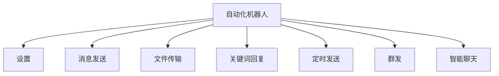
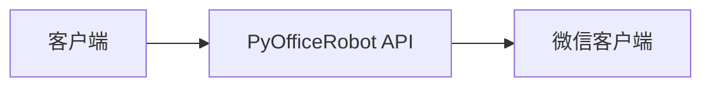
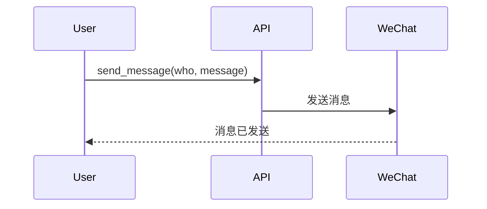
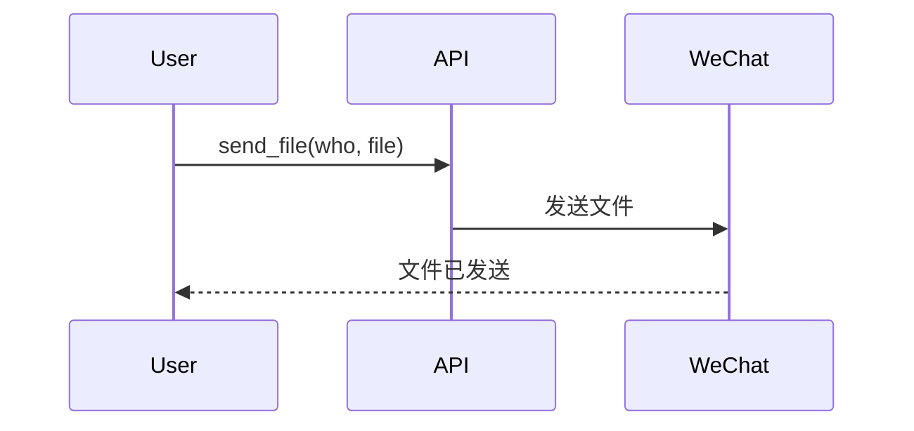
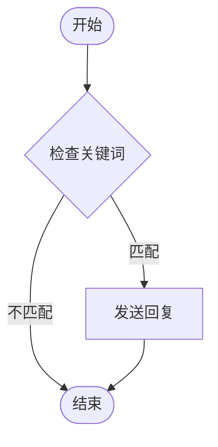
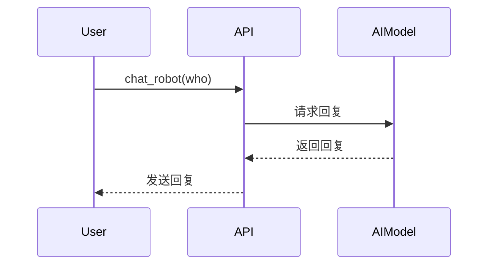
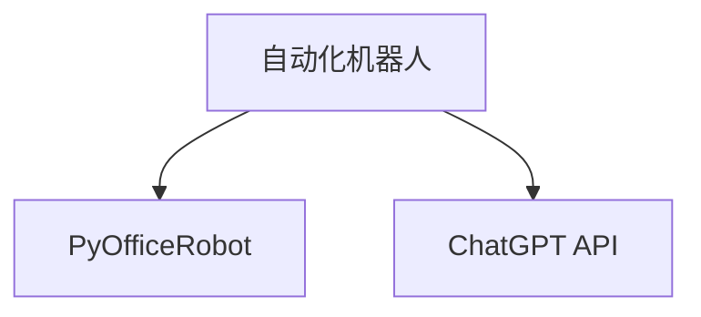

# 自动化机器人API

<cite>
**本文档引用的文件**
- [10-01-setup.py](file://docs-pages/vuepress/course-002/10-PyOfficeRobot/code/10-01-setup.py)
- [10-02-send_message.py](file://docs-pages/vuepress/course-002/10-PyOfficeRobot/code/10-02-send_message.py)
- [10-03-send_file.py](file://docs-pages/vuepress/course-002/10-PyOfficeRobot/code/10-03-send_file.py)
- [10-04-chat_by_keywords.py](file://docs-pages/vuepress/course-002/10-PyOfficeRobot/code/10-04-chat_by_keywords.py)
- [10-06-send_message_by_time.py](file://docs-pages/vuepress/course-002/10-PyOfficeRobot/code/10-06-send_message_by_time.py)
- [10-10-chat_robot.py](file://docs-pages/vuepress/course-002/10-PyOfficeRobot/code/10-10-chat_robot.py)
- [10-09-send.py](file://docs-pages/vuepress/course-002/10-PyOfficeRobot/code/10-09-send.py)
- [50-08-airobot.py](file://docs-pages/vuepress/course/code/50-08-airobot.py)
- [50-31-group_send.py](file://docs-pages/vuepress/course/code/50-31-group_send.py)
- [@AutomationLog.txt](file://docs-pages/vuepress/course-002/10-PyOfficeRobot/code/@AutomationLog.txt)
- [robot.md](file://docs-pages/vuepress/office/robot.md)
- [10-PyOfficeRobot.md](file://docs-pages/vuepress/course-002/10-PyOfficeRobot/10-PyOfficeRobot.md)
</cite>

## 目录
1. [简介](#简介)
2. [项目结构](#项目结构)
3. [核心组件](#核心组件)
4. [架构概述](#架构概述)
5. [详细组件分析](#详细组件分析)
6. [依赖分析](#依赖分析)
7. [性能考虑](#性能考虑)
8. [故障排除指南](#故障排除指南)
9. [结论](#结论)

## 简介
本文档详细描述了基于PyOfficeRobot框架的自动化机器人API，涵盖微信群发、单聊消息发送、文件传输、关键词回复机器人及AI对话集成等功能。文档解析了底层通信协议的工作原理，说明了消息队列处理和异常重试机制，并提供了高并发场景下的稳定性配置建议。

## 项目结构
项目结构清晰地组织了自动化机器人的各个功能模块，包括设置、消息发送、文件传输、关键词回复、定时发送、群发和智能聊天等。每个功能模块都有对应的代码和文档文件，便于用户学习和使用。

**图示来源**
- [10-PyOfficeRobot.md](file://docs-pages/vuepress/course-002/10-PyOfficeRobot/10-PyOfficeRobot.md)

**本节来源**
- [10-PyOfficeRobot.md](file://docs-pages/vuepress/course-002/10-PyOfficeRobot/10-PyOfficeRobot.md)

## 核心组件
核心组件包括消息发送、文件传输、关键词回复、定时发送、群发和智能聊天等。这些组件通过简单的API调用实现复杂的功能，使得开发者可以快速集成到自己的应用中。

**本节来源**
- [10-02-send_message.py](file://docs-pages/vuepress/course-002/10-PyOfficeRobot/code/10-02-send_message.py)
- [10-03-send_file.py](file://docs-pages/vuepress/course-002/10-PyOfficeRobot/code/10-03-send_file.py)
- [10-04-chat_by_keywords.py](file://docs-pages/vuepress/course-002/10-PyOfficeRobot/code/10-04-chat_by_keywords.py)
- [10-06-send_message_by_time.py](file://docs-pages/vuepress/course-002/10-PyOfficeRobot/code/10-06-send_message_by_time.py)
- [10-09-send.py](file://docs-pages/vuepress/course-002/10-PyOfficeRobot/code/10-09-send.py)
- [10-10-chat_robot.py](file://docs-pages/vuepress/course-002/10-PyOfficeRobot/code/10-10-chat_robot.py)

## 架构概述
系统架构基于PyOfficeRobot库，通过调用不同的API实现各种自动化功能。架构设计简洁，易于扩展和维护。

**图示来源**
- [robot.md](file://docs-pages/vuepress/office/robot.md)

## 详细组件分析
### 消息发送分析
消息发送功能允许用户向指定联系人发送文本消息。支持换行符和特殊字符。

**图示来源**
- [10-02-send_message.py](file://docs-pages/vuepress/course-002/10-PyOfficeRobot/code/10-02-send_message.py)

**本节来源**
- [10-02-send_message.py](file://docs-pages/vuepress/course-002/10-PyOfficeRobot/code/10-02-send_message.py)

### 文件传输分析
文件传输功能允许用户向指定联系人发送文件，包括图片、文档和软件等。

**图示来源**
- [10-03-send_file.py](file://docs-pages/vuepress/course-002/10-PyOfficeRobot/code/10-03-send_file.py)

**本节来源**
- [10-03-send_file.py](file://docs-pages/vuepress/course-002/10-PyOfficeRobot/code/10-03-send_file.py)

### 关键词回复分析
关键词回复功能允许用户设置关键词和对应的回复内容，当收到包含关键词的消息时，自动回复预设内容。

**图示来源**
- [10-04-chat_by_keywords.py](file://docs-pages/vuepress/course-002/10-PyOfficeRobot/code/10-04-chat_by_keywords.py)

**本节来源**
- [10-04-chat_by_keywords.py](file://docs-pages/vuepress/course-002/10-PyOfficeRobot/code/10-04-chat_by_keywords.py)

### 智能聊天分析
智能聊天功能集成了AI对话模型，如ChatGPT，实现与用户的自然语言交互。

**图示来源**
- [10-10-chat_robot.py](file://docs-pages/vuepress/course-002/10-PyOfficeRobot/code/10-10-chat_robot.py)

**本节来源**
- [10-10-chat_robot.py](file://docs-pages/vuepress/course-002/10-PyOfficeRobot/code/10-10-chat_robot.py)

## 依赖分析
项目依赖于PyOfficeRobot库，该库提供了与微信客户端交互的API。此外，智能聊天功能依赖于外部的AI模型API，如ChatGPT。

**图示来源**
- [10-PyOfficeRobot.md](file://docs-pages/vuepress/course-002/10-PyOfficeRobot/10-PyOfficeRobot.md)
- [10-10-chat_robot.py](file://docs-pages/vuepress/course-002/10-PyOfficeRobot/code/10-10-chat_robot.py)

**本节来源**
- [10-PyOfficeRobot.md](file://docs-pages/vuepress/course-002/10-PyOfficeRobot/10-PyOfficeRobot.md)
- [10-10-chat_robot.py](file://docs-pages/vuepress/course-002/10-PyOfficeRobot/code/10-10-chat_robot.py)

## 性能考虑
在高并发场景下，建议使用消息队列来处理消息发送请求，以避免微信客户端的频率限制。同时，可以设置重试机制来处理网络异常。

## 故障排除指南
常见问题包括消息发送失败、文件传输中断等。可以通过查看日志文件[@AutomationLog.txt](file://docs-pages/vuepress/course-002/10-PyOfficeRobot/code/@AutomationLog.txt)来诊断问题。

**本节来源**
- [@AutomationLog.txt](file://docs-pages/vuepress/course-002/10-PyOfficeRobot/code/@AutomationLog.txt)

## 结论
本文档详细介绍了自动化机器人API的各个方面，从项目结构到核心组件，再到详细的组件分析和依赖关系。通过这些信息，开发者可以快速理解和使用PyOfficeRobot库来实现各种自动化功能。