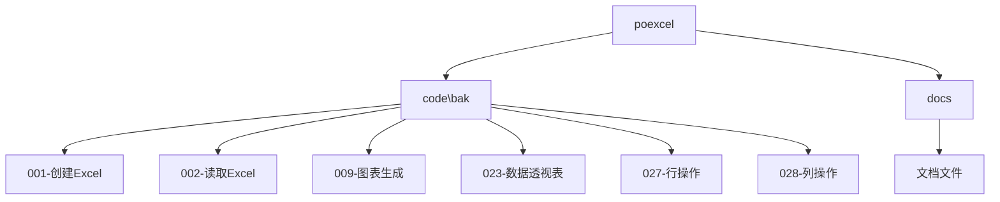

# Excel处理

<cite>
**本文档中引用的文件**  
- [1.1-创建Excel文件（无数据）.py](file://docs-pages\vuepress\course-002\poexcel\code\bak\001\1.1-创建Excel文件（无数据）.py)
- [1.2-创建Excel文件（有数据）.py](file://docs-pages\vuepress\course-002\poexcel\code\bak\001\1.2-创建Excel文件（有数据）.py)
- [2.1-读取Excel文件.py](file://docs-pages\vuepress\course-002\poexcel\code\bak\002\2.1-读取Excel文件.py)
- [2.2-读取Excel文件（错位）.py](file://docs-pages\vuepress\course-002\poexcel\code\bak\002\2.2-读取Excel文件（错位）.py)
- [2.3-读取Excel文件（有空行）.py](file://docs-pages\vuepress\course-002\poexcel\code\bak\002\2.3-读取Excel文件（有空行）.py)
- [2.4-读取Excel文件（无标题）.py](file://docs-pages\vuepress\course-002\poexcel\code\bak\002\2.4-读取Excel文件（无标题）.py)
- [2.5-解决读取会生成新的index问题.py](file://docs-pages\vuepress\course-002\poexcel\code\bak\002\2.5-解决读取会生成新的index问题.py)
- [23.1-数据透视表.py](file://docs-pages\vuepress\course-002\poexcel\code\bak\023\23.1-数据透视表.py)
- [9.1-柱状图（pandas）.py](file://docs-pages\vuepress\course-002\poexcel\code\bak\009\9.1-柱状图（pandas）.py)
- [10.1-分组柱状图.py](file://docs-pages\vuepress\course-002\poexcel\code\bak\010\10.1-分组柱状图.py)
- [11.1-叠加柱状图.py](file://docs-pages\vuepress\course-002\poexcel\code\bak\011\11.1-叠加柱状图.py)
- [12.1-饼图.py](file://docs-pages\vuepress\course-002\poexcel\code\bak\012\12.1-饼图.py)
- [13.1-折线图和叠加区域图.py](file://docs-pages\vuepress\course-002\poexcel\code\bak\013\13.1-折线图和叠加区域图.py)
- [14.1-散点图.py](file://docs-pages\vuepress\course-002\poexcel\code\bak\014、015\14.1-散点图.py)
- [15.1-直方图.py](file://docs-pages\vuepress\course-002\poexcel\code\bak\014、015\15.1-直方图.py)
- [16.1-多表联立（merge）.py](file://docs-pages\vuepress\course-002\poexcel\code\bak\016\16.1-多表联立（merge）.py)
- [20.1-数据去重.py](file://docs-pages\vuepress\course-002\poexcel\code\bak\020\20.1-数据去重.py)
- [27.1-行追加内容（已有内容）.py](file://docs-pages\vuepress\course-002\poexcel\code\bak\027\27.1-行追加内容（已有内容）.py)
- [28.1-列合并内容.py](file://docs-pages\vuepress\course-002\poexcel\code\bak\028\28.1-列合并内容.py)
- [条件格式.ipynb](file://docs-pages\vuepress\course-002\poexcel\code\bak\025、026\条件格式.ipynb)
- [50-03-pip.md](file://docs-pages\vuepress\course-002\poexcel\docs\50-03-pip.md)
</cite>

## 目录
1. [简介](#简介)
2. [项目结构](#项目结构)
3. [核心功能](#核心功能)
4. [Excel创建与写入](#excel创建与写入)
5. [Excel读取与数据处理](#excel读取与数据处理)
6. [数据透视表](#数据透视表)
7. [图表生成](#图表生成)
8. [数据格式支持](#数据格式支持)
9. [底层依赖与性能优化](#底层依赖与性能优化)
10. [常见错误处理](#常见错误处理)
11. [与其他功能联动](#与其他功能联动)
12. [结论](#结论)

## 简介
`python-office` 是一个专注于自动化办公的Python库，提供了简洁的API来处理Excel文件。本文档全面介绍其Excel处理能力，包括创建、读取、写入、数据处理和图表生成等功能。通过实际代码示例，展示如何使用该库完成复杂操作，并提供性能优化技巧和错误处理方案。

## 项目结构
`python-office` 的Excel处理模块位于 `poexcel` 目录下，包含多个子目录和文件，分别对应不同的功能和示例代码。



**图示来源**
- [1.1-创建Excel文件（无数据）.py](file://docs-pages\vuepress\course-002\poexcel\code\bak\001\1.1-创建Excel文件（无数据）.py)
- [2.1-读取Excel文件.py](file://docs-pages\vuepress\course-002\poexcel\code\bak\002\2.1-读取Excel文件.py)

## 核心功能
`python-office` 提供了丰富的Excel处理功能，主要包括：
- 创建和写入Excel文件
- 读取和解析Excel文件
- 数据处理和分析
- 图表生成
- 数据透视表
- 与其他办公功能联动

## Excel创建与写入
### 创建空Excel文件
使用 `pandas` 库可以轻松创建空的Excel文件。

```python
import pandas as pd

df = pd.DataFrame()
df.to_excel("./001.xlsx")
print("Done!")
```

**代码来源**
- [1.1-创建Excel文件（无数据）.py](file://docs-pages\vuepress\course-002\poexcel\code\bak\001\1.1-创建Excel文件（无数据）.py)

### 创建带数据的Excel文件
可以将数据直接写入Excel文件，支持多种数据结构。

```python
import pandas as pd

df = pd.DataFrame({"ID": [1, 2, 3], "Name": ["Tim", "Victory", "Nick"]})
df.to_excel("./001-data.xlsx")
print("Done!")
```

**代码来源**
- [1.2-创建Excel文件（有数据）.py](file://docs-pages\vuepress\course-002\poexcel\code\bak\001\1.2-创建Excel文件（有数据）.py)

## Excel读取与数据处理
### 基本读取
使用 `pandas` 的 `read_excel` 函数可以读取Excel文件。

```python
import pandas as pd

df = pd.read_excel("./Books.xlsx")
```

**代码来源**
- [2.1-读取Excel文件.py](file://docs-pages\vuepress\course-002\poexcel\code\bak\002\2.1-读取Excel文件.py)

### 处理特殊格式
#### 读取错位数据
当Excel文件的标题行不在第一行时，可以指定 `header` 参数。

```python
people = pd.read_excel("./example-malposition.xlsx", header=1)
```

**代码来源**
- [2.2-读取Excel文件（错位）.py](file://docs-pages\vuepress\course-002\poexcel\code\bak\002\2.2-读取Excel文件（错位）.py)

#### 处理空行
读取包含空行的Excel文件时，可以使用 `header` 参数跳过空行。

```python
people = pd.read_excel("./example-empty_row.xlsx", header=1)
```

**代码来源**
- [2.3-读取Excel文件（有空行）.py](file://docs-pages\vuepress\course-002\poexcel\code\bak\002\2.3-读取Excel文件（有空行）.py)

#### 处理无标题数据
当Excel文件没有标题行时，可以设置 `header=None` 并手动指定列名。

```python
people = pd.read_excel("./example-no_header.xlsx", header=None)
people.columns = ["ID", "Name"]
```

**代码来源**
- [2.4-读取Excel文件（无标题）.py](file://docs-pages\vuepress\course-002\poexcel\code\bak\002\2.4-读取Excel文件（无标题）.py)

### 数据处理
#### 数据去重
使用 `drop_duplicates` 方法可以去除重复数据。

```python
df.drop_duplicates(inplace=True)
```

**代码来源**
- [20.1-数据去重.py](file://docs-pages\vuepress\course-002\poexcel\code\bak\020\20.1-数据去重.py)

#### 行操作
支持行的追加、修改、插入、删除等操作。

```python
# 行追加
df.loc[len(df)] = new_row
```

**代码来源**
- [27.1-行追加内容（已有内容）.py](file://docs-pages\vuepress\course-002\poexcel\code\bak\027\27.1-行追加内容（已有内容）.py)

#### 列操作
支持列的合并、追加、删除、插入、重命名等操作。

```python
# 列合并
df['Combined'] = df['Col1'] + df['Col2']
```

**代码来源**
- [28.1-列合并内容.py](file://docs-pages\vuepress\course-002\poexcel\code\bak\028\28.1-列合并内容.py)

## 数据透视表
使用 `pandas` 的 `pivot_table` 函数可以创建数据透视表。

```python
import pandas as pd

df = pd.read_excel("data.xlsx")
pivot_table = pd.pivot_table(df, values='Sales', index=['Month'], columns=['Product'], aggfunc=sum)
```

**代码来源**
- [23.1-数据透视表.py](file://docs-pages\vuepress\course-002\poexcel\code\bak\023\23.1-数据透视表.py)

## 图表生成
### 柱状图
使用 `pandas` 的绘图功能可以生成柱状图。

```python
df.plot(kind='bar', x='Name', y='Sales')
```

**代码来源**
- [9.1-柱状图（pandas）.py](file://docs-pages\vuepress\course-002\poexcel\code\bak\009\9.1-柱状图（pandas）.py)

### 分组柱状图
生成分组柱状图以比较不同类别的数据。

```python
df.plot(kind='bar', x='Month', y=['ProductA', 'ProductB'], figsize=(10, 6))
```

**代码来源**
- [10.1-分组柱状图.py](file://docs-pages\vuepress\course-002\poexcel\code\bak\010\10.1-分组柱状图.py)

### 叠加柱状图
生成叠加柱状图以显示数据的累积效果。

```python
df.plot(kind='bar', stacked=True, x='Month', y=['ProductA', 'ProductB'])
```

**代码来源**
- [11.1-叠加柱状图.py](file://docs-pages\vuepress\course-002\poexcel\code\bak\011\11.1-叠加柱状图.py)

### 饼图
生成饼图以显示各部分的比例。

```python
df.plot(kind='pie', y='Sales', labels=df['Product'], autopct='%1.1f%%')
```

**代码来源**
- [12.1-饼图.py](file://docs-pages\vuepress\course-002\poexcel\code\bak\012\12.1-饼图.py)

### 折线图
生成折线图以显示数据的趋势。

```python
df.plot(kind='line', x='Month', y='Sales')
```

**代码来源**
- [13.1-折线图和叠加区域图.py](file://docs-pages\vuepress\course-002\poexcel\code\bak\013\13.1-折线图和叠加区域图.py)

### 散点图
生成散点图以显示两个变量之间的关系。

```python
df.plot(kind='scatter', x='Height', y='Weight')
```

**代码来源**
- [14.1-散点图.py](file://docs-pages\vuepress\course-002\poexcel\code\bak\014、015\14.1-散点图.py)

### 直方图
生成直方图以显示数据的分布。

```python
df['Age'].plot(kind='hist', bins=10)
```

**代码来源**
- [15.1-直方图.py](file://docs-pages\vuepress\course-002\poexcel\code\bak\014、015\15.1-直方图.py)

## 数据格式支持
`python-office` 支持多种数据格式，包括：
- Excel (.xlsx, .xls)
- CSV (.csv)
- TSV (.tsv)
- 文本文件 (.txt)

### 读取CSV文件
```python
df = pd.read_csv("data.csv")
```

### 读取TSV文件
```python
df = pd.read_csv("data.tsv", sep='\t')
```

### 读取文本文件
```python
df = pd.read_csv("data.txt", sep=' ')
```

**代码来源**
- [22.1-读取csv文件中的数据.py](file://docs-pages\vuepress\course-002\poexcel\code\bak\022\22.1-读取csv文件中的数据.py)
- [22.2-读取tsv文件中的数据.py](file://docs-pages\vuepress\course-002\poexcel\code\bak\022\22.2-读取tsv文件中的数据.py)
- [22.3-读取txt文件中的数据.py](file://docs-pages\vuepress\course-002\poexcel\code\bak\022\22.3-读取txt文件中的数据.py)

## 底层依赖与性能优化
### 底层依赖
`python-office` 主要依赖以下库：
- `pandas`：用于数据处理和分析
- `openpyxl`：用于读写Excel文件
- `matplotlib`：用于图表生成

### 性能优化技巧
1. **批量操作**：尽量使用向量化操作而不是循环
2. **内存管理**：及时释放不再使用的数据
3. **文件大小**：避免创建过大的Excel文件
4. **索引优化**：合理使用索引提高查询效率

## 常见错误处理
### 文件锁定
当Excel文件被其他程序占用时，会出现文件锁定错误。解决方案包括：
- 确保文件未被其他程序打开
- 使用异常处理捕获 `PermissionError`

### 格式不兼容
不同版本的Excel文件可能存在格式不兼容问题。建议：
- 使用 `.xlsx` 格式
- 确保 `openpyxl` 版本兼容

### 数据类型错误
确保数据类型正确，避免类型转换错误。可以使用 `astype` 方法进行类型转换。

## 与其他功能联动
`python-office` 可以与其他功能联动使用，例如：
- **PDF转换**：将Excel文件转换为PDF
- **OCR识别**：从图片中提取文字并写入Excel
- **邮件发送**：将生成的Excel文件作为附件发送

### 与PDF功能联动
```python
import office

office.excel2pdf("input.xlsx", "output.pdf")
```

### 与OCR功能联动
```python
import office

office.ocr2excel("image.jpg", "output.xlsx")
```

**代码来源**
- [50-03-pip.md](file://docs-pages\vuepress\course-002\poexcel\docs\50-03-pip.md)

## 结论
`python-office` 提供了一套完整的Excel处理解决方案，通过简洁的API实现了复杂的办公自动化任务。无论是创建、读取、写入还是数据分析，都能高效完成。结合其他功能，可以实现更强大的自动化流程。