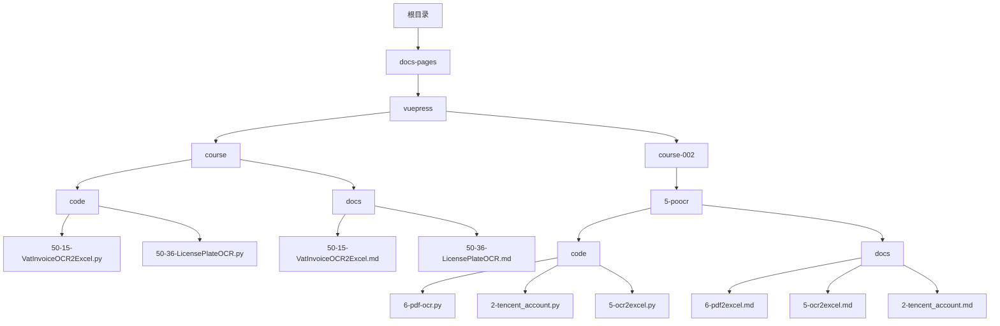
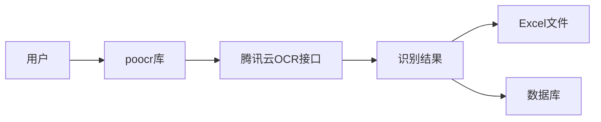
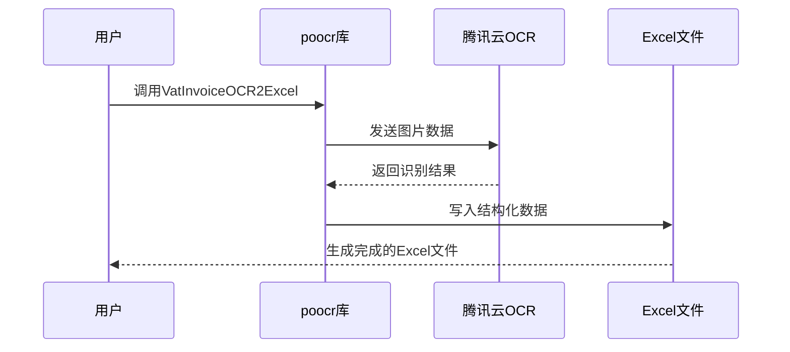
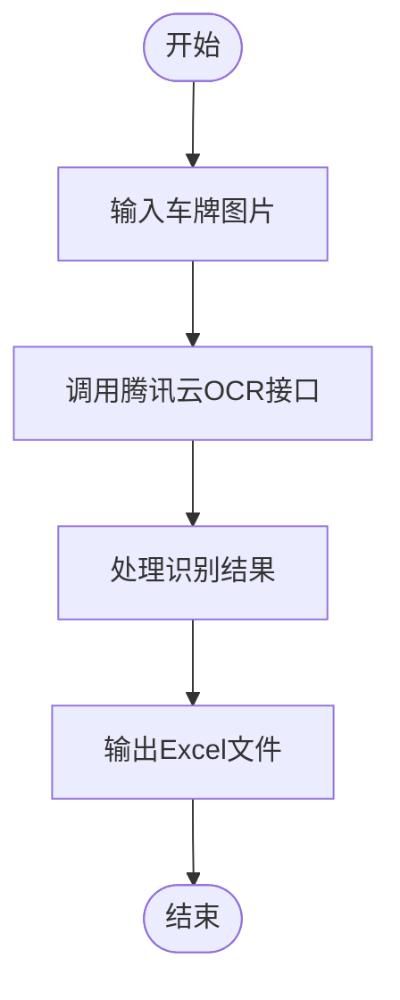
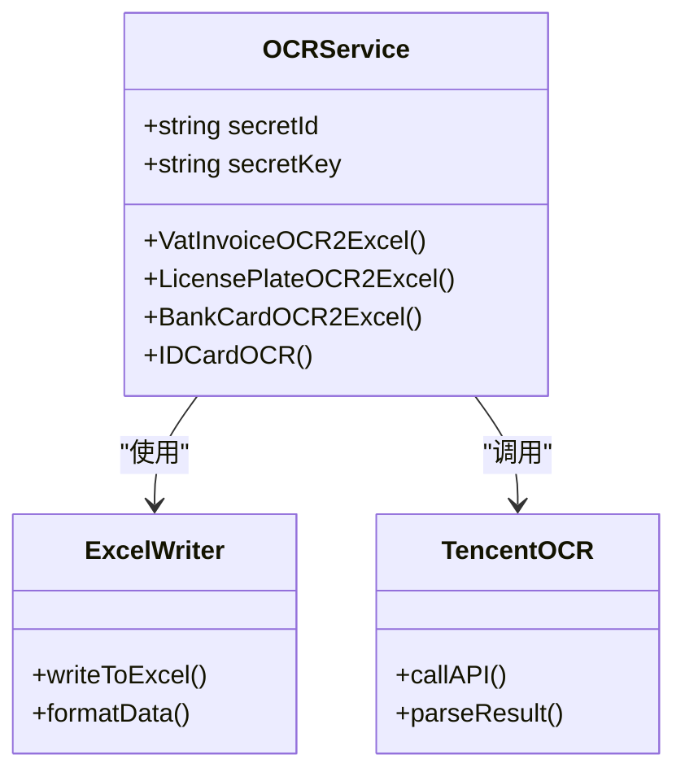
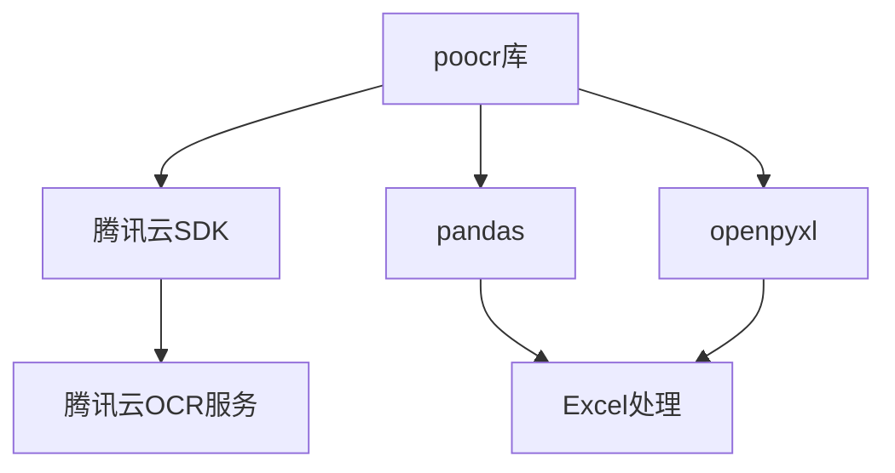

# OCR识别

<cite>
**本文档引用文件**   
- [50-15-VatInvoiceOCR2Excel.py](file://docs-pages/vuepress/course/code/50-15-VatInvoiceOCR2Excel.py)
- [50-36-LicensePlateOCR.py](file://docs-pages/vuepress/course/code/50-36-LicensePlateOCR.py)
- [6-pdf-ocr.py](file://docs-pages/vuepress/course-002/5-poocr/code/6-pdf-ocr.py)
- [2-tencent_account.py](file://docs-pages/vuepress/course-002/5-poocr/code/2-tencent_account.py)
- [5-ocr2excel.py](file://docs-pages/vuepress/course-002/5-poocr/code/5-ocr2excel.py)
- [url.py](file://url.py)
- [50-15-VatInvoiceOCR2Excel.md](file://docs-pages/vuepress/course/docs/50-15-VatInvoiceOCR2Excel.md)
- [50-36-LicensePlateOCR.md](file://docs-pages/vuepress/course/docs/50-36-LicensePlateOCR.md)
- [2-tencent_account.md](file://docs-pages/vuepress/course-002/5-poocr/docs/2-tencent_account.md)
- [5-ocr2excel.md](file://docs-pages/vuepress/course-002/5-poocr/docs/5-ocr2excel.md)
- [6-pdf2excel.md](file://docs-pages/vuepress/course-002/5-poocr/docs/6-pdf2excel.md)
- [ocr.md](file://docs-pages/vuepress/office/ocr.md)
</cite>

## 目录
1. [简介](#简介)
2. [项目结构](#项目结构)
3. [核心功能](#核心功能)
4. [架构概述](#架构概述)
5. [详细组件分析](#详细组件分析)
6. [依赖分析](#依赖分析)
7. [性能考虑](#性能考虑)
8. [故障排除指南](#故障排除指南)
9. [结论](#结论)

## 简介
本文档全面介绍了基于腾讯云OCR接口的自动化识别系统，涵盖增值税发票识别、车牌识别、通用文字识别及PDF OCR等场景。系统通过`poocr`第三方库实现，支持100多种场景的文字识别，包括发票、驾驶证、身份证等。用户只需1-3行代码即可实现批量OCR识别，并将结果自动保存到Excel文件中。

## 项目结构
本项目采用模块化设计，主要包含课程代码、文档和配置文件。核心OCR功能位于`docs-pages/vuepress/course/code/`目录下，相关文档位于`docs-pages/vuepress/course/docs/`目录。

**图示来源**
- [50-15-VatInvoiceOCR2Excel.py](file://docs-pages/vuepress/course/code/50-15-VatInvoiceOCR2Excel.py)
- [50-36-LicensePlateOCR.py](file://docs-pages/vuepress/course/code/50-36-LicensePlateOCR.py)
- [6-pdf-ocr.py](file://docs-pages/vuepress/course-002/5-poocr/code/6-pdf-ocr.py)

**章节来源**
- [50-15-VatInvoiceOCR2Excel.py](file://docs-pages/vuepress/course/code/50-15-VatInvoiceOCR2Excel.py)
- [50-36-LicensePlateOCR.py](file://docs-pages/vuepress/course/code/50-36-LicensePlateOCR.py)

## 核心功能
系统提供多种OCR识别功能，主要包括增值税发票识别、车牌识别、银行卡识别、身份证识别等。所有功能通过`poocr`库调用腾讯云AI接口实现，每个功能只需1-3行代码即可完成。

**章节来源**
- [50-15-VatInvoiceOCR2Excel.py](file://docs-pages/vuepress/course/code/50-15-VatInvoiceOCR2Excel.py)
- [50-36-LicensePlateOCR.py](file://docs-pages/vuepress/course/code/50-36-LicensePlateOCR.py)
- [5-ocr2excel.py](file://docs-pages/vuepress/course-002/5-poocr/code/5-ocr2excel.py)

## 架构概述
系统架构基于腾讯云OCR服务，通过`poocr`库封装API调用。用户只需提供腾讯云的SecretId和SecretKey，即可调用各种OCR功能。识别结果可自动保存为Excel文件，实现端到端的数据采集流程。

**图示来源**
- [50-15-VatInvoiceOCR2Excel.py](file://docs-pages/vuepress/course/code/50-15-VatInvoiceOCR2Excel.py)
- [2-tencent_account.py](file://docs-pages/vuepress/course-002/5-poocr/code/2-tencent_account.py)

## 详细组件分析
### 增值税发票识别分析
增值税发票识别功能通过`VatInvoiceOCR2Excel`函数实现，可批量识别发票并自动保存到Excel文件中。

**图示来源**
- [50-15-VatInvoiceOCR2Excel.py](file://docs-pages/vuepress/course/code/50-15-VatInvoiceOCR2Excel.py)
- [6-pdf-ocr.py](file://docs-pages/vuepress/course-002/5-poocr/code/6-pdf-ocr.py)

**章节来源**
- [50-15-VatInvoiceOCR2Excel.py](file://docs-pages/vuepress/course/code/50-15-VatInvoiceOCR2Excel.py)
- [50-15-VatInvoiceOCR2Excel.md](file://docs-pages/vuepress/course/docs/50-15-VatInvoiceOCR2Excel.md)

### 车牌识别分析
车牌识别功能通过`LicensePlateOCR2Excel`函数实现，可识别车牌号码并保存到Excel文件中。

**图示来源**
- [50-36-LicensePlateOCR.py](file://docs-pages/vuepress/course/code/50-36-LicensePlateOCR.py)
- [5-ocr2excel.py](file://docs-pages/vuepress/course-002/5-poocr/code/5-ocr2excel.py)

**章节来源**
- [50-36-LicensePlateOCR.py](file://docs-pages/vuepress/course/code/50-36-LicensePlateOCR.py)
- [50-36-LicensePlateOCR.md](file://docs-pages/vuepress/course/docs/50-36-LicensePlateOCR.md)

### 通用文字识别分析
通用文字识别功能支持多种场景，包括身份证、银行卡、营业执照等。

**图示来源**
- [5-ocr2excel.py](file://docs-pages/vuepress/course-002/5-poocr/code/5-ocr2excel.py)
- [4-all_ocr_func.py](file://docs-pages/vuepress/course-002/5-poocr/code/4-all_ocr_func.py)

**章节来源**
- [5-ocr2excel.py](file://docs-pages/vuepress/course-002/5-poocr/code/5-ocr2excel.py)
- [5-ocr2excel.md](file://docs-pages/vuepress/course-002/5-poocr/docs/5-ocr2excel.md)

## 依赖分析
系统主要依赖腾讯云OCR服务和`poocr`库。腾讯云提供AI识别能力，`poocr`库封装API调用并处理结果。

**图示来源**
- [url.py](file://url.py)
- [2-tencent_account.py](file://docs-pages/vuepress/course-002/5-poocr/code/2-tencent_account.py)

**章节来源**
- [url.py](file://url.py)
- [2-tencent_account.md](file://docs-pages/vuepress/course-002/5-poocr/docs/2-tencent_account.md)

## 性能考虑
系统性能主要受网络延迟和腾讯云API调用限制影响。建议采用批量处理方式，合理安排调用频率，避免超出免费额度。

## 故障排除指南
常见问题包括API密钥错误、网络连接问题、图片格式不支持等。建议检查密钥配置，确保网络畅通，使用支持的图片格式。

**章节来源**
- [2-tencent_account.py](file://docs-pages/vuepress/course-002/5-poocr/code/2-tencent_account.py)
- [2-tencent_account.md](file://docs-pages/vuepress/course-002/5-poocr/docs/2-tencent_account.md)

## 结论
本文档详细介绍了基于腾讯云OCR接口的自动化识别系统，涵盖了配置流程、API调用、结果解析和数据存储等各个方面。系统简单易用，适合各种OCR识别需求。