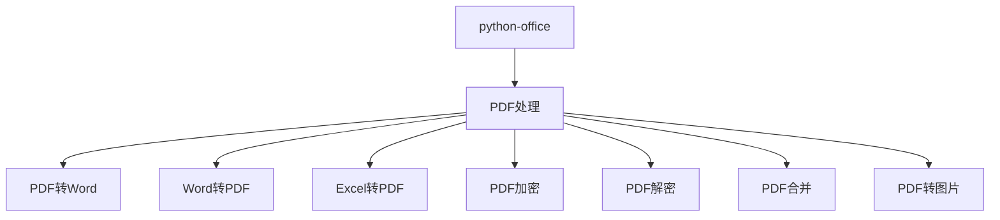
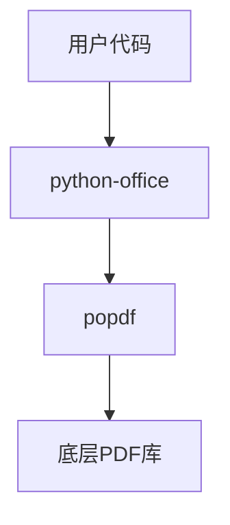
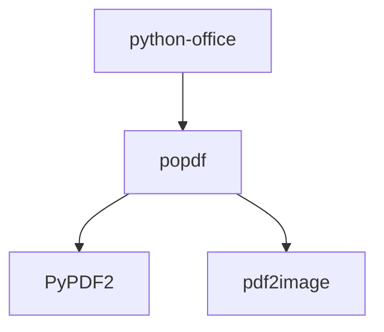

# PDF处理

<cite>
**本文档引用的文件**
- [50-04-pdf2docx.py](file://docs-pages/vuepress/course/code/50-04-pdf2docx.py)
- [50-05-docx2pdf.py](file://docs-pages/vuepress/course/code/50-05-docx2pdf.py)
- [50-10-excel2pdf.py](file://docs-pages/vuepress/course/code/50-10-excel2pdf.py)
- [50-38-encrypt4pdf.py](file://docs-pages/vuepress/course/code/50-38-encrypt4pdf.py)
- [50-39-decrypt4pdf.py](file://docs-pages/vuepress/course/code/50-39-decrypt4pdf.py)
- [50-40-merge2pdf.py](file://docs-pages/vuepress/course/code/50-40-merge2pdf.py)
- [50-41-pdf2imgs.py](file://docs-pages/vuepress/course/code/50-41-pdf2imgs.py)
- [pdf.md](file://docs-pages/vuepress/office/pdf.md)
</cite>

## 目录
1. [简介](#简介)
2. [项目结构](#项目结构)
3. [核心功能](#核心功能)
4. [架构概述](#架构概述)
5. [详细功能分析](#详细功能分析)
6. [依赖分析](#依赖分析)
7. [性能考虑](#性能考虑)
8. [故障排除指南](#故障排除指南)
9. [结论](#结论)

## 简介
python-office是一个专为Python自动化办公设计的库，提供了一行代码实现各种办公自动化任务的能力。本文档重点介绍其PDF处理功能，包括PDF转Word、Excel转PDF、PDF加密解密、PDF合并、PDF转图片等操作。

## 项目结构
python-office的PDF处理功能主要位于`docs-pages/vuepress/course/code/`目录下的多个Python脚本文件中，每个文件对应一个特定的PDF处理功能。



**图示来源**
- [50-04-pdf2docx.py](file://docs-pages/vuepress/course/code/50-04-pdf2docx.py)
- [50-05-docx2pdf.py](file://docs-pages/vuepress/course/code/50-05-docx2pdf.py)
- [50-10-excel2pdf.py](file://docs-pages/vuepress/course/code/50-10-excel2pdf.py)
- [50-38-encrypt4pdf.py](file://docs-pages/vuepress/course/code/50-38-encrypt4pdf.py)
- [50-39-decrypt4pdf.py](file://docs-pages/vuepress/course/code/50-39-decrypt4pdf.py)
- [50-40-merge2pdf.py](file://docs-pages/vuepress/course/code/50-40-merge2pdf.py)
- [50-41-pdf2imgs.py](file://docs-pages/vuepress/course/code/50-41-pdf2imgs.py)

**本节来源**
- [50-04-pdf2docx.py](file://docs-pages/vuepress/course/code/50-04-pdf2docx.py)
- [50-05-docx2pdf.py](file://docs-pages/vuepress/course/code/50-05-docx2pdf.py)
- [50-10-excel2pdf.py](file://docs-pages/vuepress/course/code/50-10-excel2pdf.py)

## 核心功能
python-office的PDF处理功能涵盖了多种常见的办公需求，所有功能都可以通过一行代码实现。

**本节来源**
- [50-04-pdf2docx.py](file://docs-pages/vuepress/course/code/50-04-pdf2docx.py#L1-L32)
- [50-05-docx2pdf.py](file://docs-pages/vuepress/course/code/50-05-docx2pdf.py#L1-L31)
- [50-10-excel2pdf.py](file://docs-pages/vuepress/course/code/50-10-excel2pdf.py#L1-L31)
- [50-38-encrypt4pdf.py](file://docs-pages/vuepress/course/code/50-38-encrypt4pdf.py#L1-L40)
- [50-39-decrypt4pdf.py](file://docs-pages/vuepress/course/code/50-39-decrypt4pdf.py#L1-L54)
- [50-40-merge2pdf.py](file://docs-pages/vuepress/course/code/50-40-merge2pdf.py#L1-L77)
- [50-41-pdf2imgs.py](file://docs-pages/vuepress/course/code/50-41-pdf2imgs.py#L1-L27)

## 架构概述
python-office的PDF处理功能基于popdf库实现，提供了简洁的API接口，使得用户可以轻松地完成各种PDF处理任务。



**图示来源**
- [pdf.md](file://docs-pages/vuepress/office/pdf.md#L1-L112)

## 详细功能分析
### PDF转Word
使用`office.pdf.pdf2docx()`函数可以将PDF文件转换为Word文档。

```python
office.pdf.pdf2docx(file_path=r'这里填你的PDF文件位置',
                    output_path=r'这里填转换后的Word保存位置')
```

**本节来源**
- [50-04-pdf2docx.py](file://docs-pages/vuepress/course/code/50-04-pdf2docx.py#L1-L32)

### Word转PDF
使用`office.word.docx2pdf()`函数可以将Word文档转换为PDF文件。

```python
office.word.docx2pdf(path=r'这里填你的Word文件位置',
                    output_path=r'这里填转换后的PDF保存位置')
```

**本节来源**
- [50-05-docx2pdf.py](file://docs-pages/vuepress/course/code/50-05-docx2pdf.py#L1-L31)

### Excel转PDF
使用`office.excel.excel2pdf()`函数可以将Excel文件转换为PDF文件。

```python
office.excel.excel2pdf(path=r'这里填你的Excel文件位置',
                       output_path=r'这里填转换后的PDF保存位置')
```

**本节来源**
- [50-10-excel2pdf.py](file://docs-pages/vuepress/course/code/50-10-excel2pdf.py#L1-L31)

### PDF加密
使用`office.pdf.encrypt4pdf()`函数可以对PDF文件进行加密。

```python
office.pdf.encrypt4pdf(path=r'这里填你的PDF文件位置',
                      password="你的密码",
                      output_path=r'这里填加密后的PDF保存位置')
```

**本节来源**
- [50-38-encrypt4pdf.py](file://docs-pages/vuepress/course/code/50-38-encrypt4pdf.py#L1-L40)

### PDF解密
使用`office.pdf.decrypt4pdf()`函数可以对加密的PDF文件进行解密。

```python
office.pdf.decrypt4pdf(path=r'这里填你的加密PDF文件位置',
                      password="你的密码",
                      res_pdf=r'这里填解密后的PDF保存位置')
```

**本节来源**
- [50-39-decrypt4pdf.py](file://docs-pages/vuepress/course/code/50-39-decrypt4pdf.py#L1-L54)

### PDF合并
使用`office.pdf.merge2pdf()`函数可以将多个PDF文件合并为一个PDF文件。

```python
office.pdf.merge2pdf(one_by_one=[r'第一个PDF文件位置', r'第二个PDF文件位置'],
                    output=r'合并后的PDF保存位置')
```

**本节来源**
- [50-40-merge2pdf.py](file://docs-pages/vuepress/course/code/50-40-merge2pdf.py#L1-L77)

### PDF转图片
使用`office.pdf.pdf2imgs()`函数可以将PDF文件转换为图片。

```python
office.pdf.pdf2imgs(pdf_path=r'这里填你的PDF文件位置',
                   out_dir=r'这里填图片输出文件夹')
```

**本节来源**
- [50-41-pdf2imgs.py](file://docs-pages/vuepress/course/code/50-41-pdf2imgs.py#L1-L27)

## 依赖分析
python-office的PDF处理功能依赖于popdf库，该库提供了底层的PDF处理能力。



**图示来源**
- [pdf.md](file://docs-pages/vuepress/office/pdf.md#L1-L112)

**本节来源**
- [pdf.md](file://docs-pages/vuepress/office/pdf.md#L1-L112)

## 性能考虑
在处理大型PDF文件时，建议使用适当的硬件资源，并考虑分批处理以避免内存溢出。

## 故障排除指南
### 中文乱码
确保PDF文件的编码正确，并使用支持中文的字体。

### 文件损坏
检查输入文件是否完整，避免在处理过程中中断操作。

**本节来源**
- [50-04-pdf2docx.py](file://docs-pages/vuepress/course/code/50-04-pdf2docx.py#L1-L32)
- [50-05-docx2pdf.py](file://docs-pages/vuepress/course/code/50-05-docx2pdf.py#L1-L31)
- [50-10-excel2pdf.py](file://docs-pages/vuepress/course/code/50-10-excel2pdf.py#L1-L31)
- [50-38-encrypt4pdf.py](file://docs-pages/vuepress/course/code/50-38-encrypt4pdf.py#L1-L40)
- [50-39-decrypt4pdf.py](file://docs-pages/vuepress/course/code/50-39-decrypt4pdf.py#L1-L54)
- [50-40-merge2pdf.py](file://docs-pages/vuepress/course/code/50-40-merge2pdf.py#L1-L77)
- [50-41-pdf2imgs.py](file://docs-pages/vuepress/course/code/50-41-pdf2imgs.py#L1-L27)

## 结论
python-office提供了一套完整的PDF处理解决方案，通过简单的API调用即可实现各种复杂的PDF操作，极大地提高了办公自动化效率。