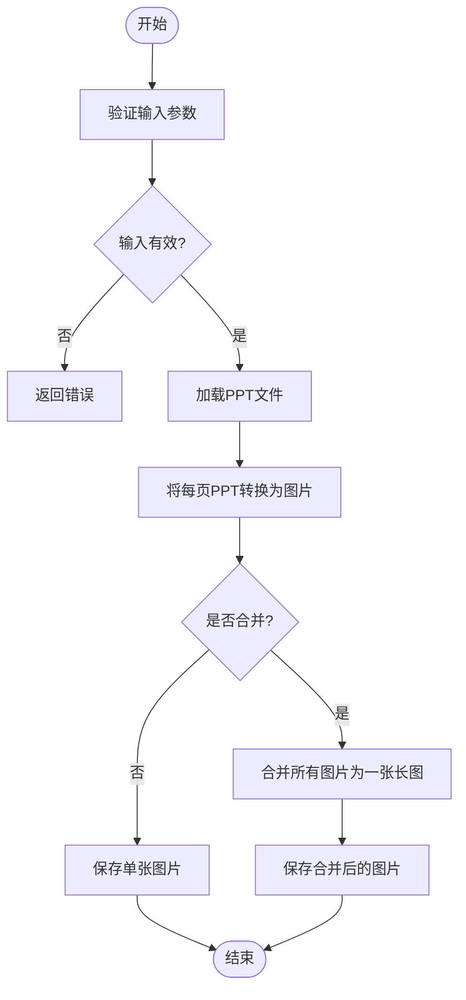
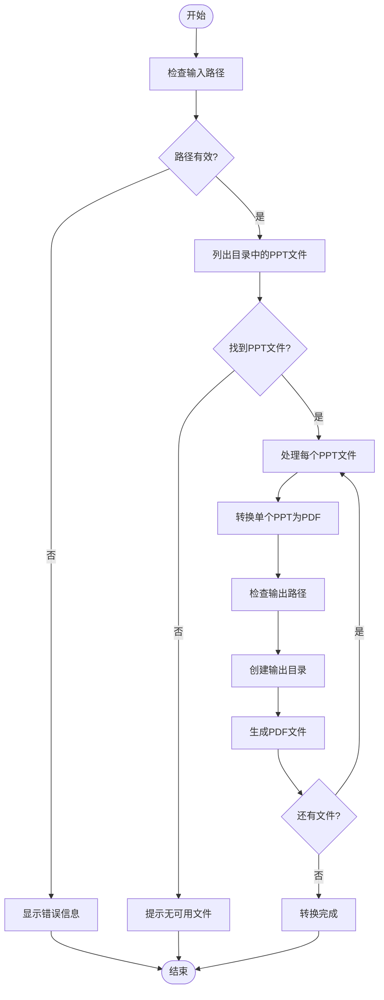
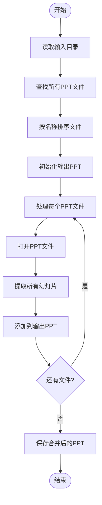
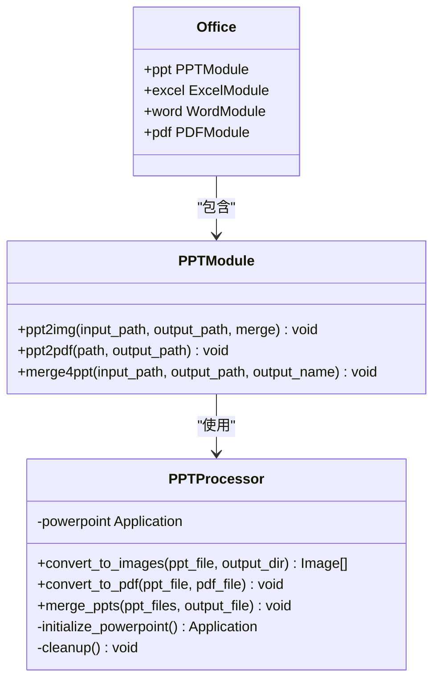
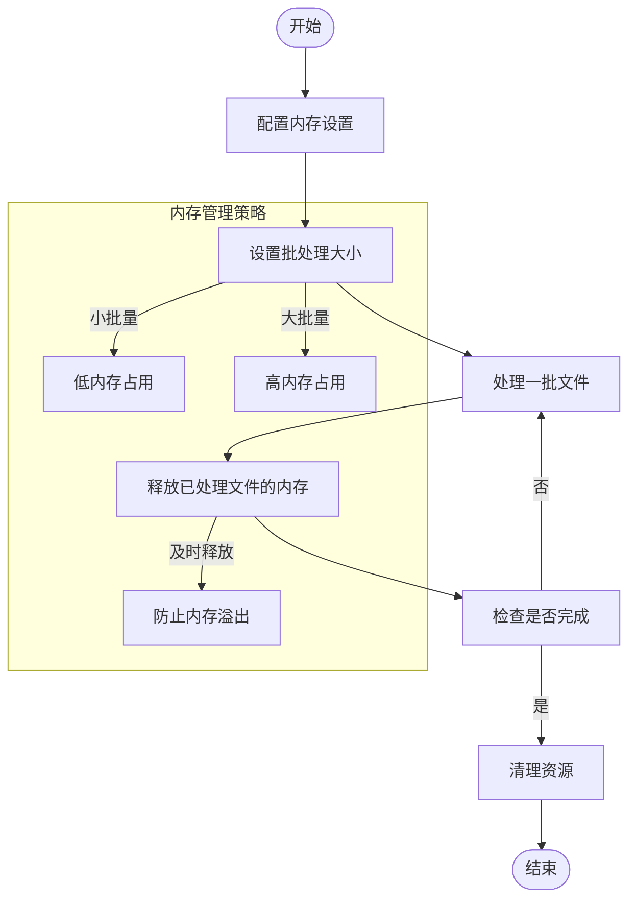
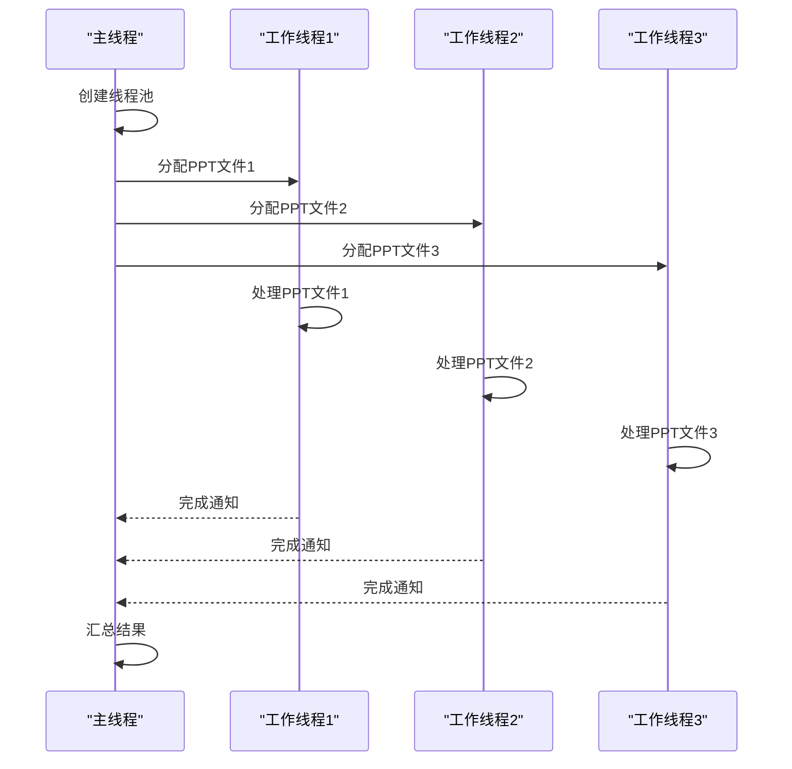
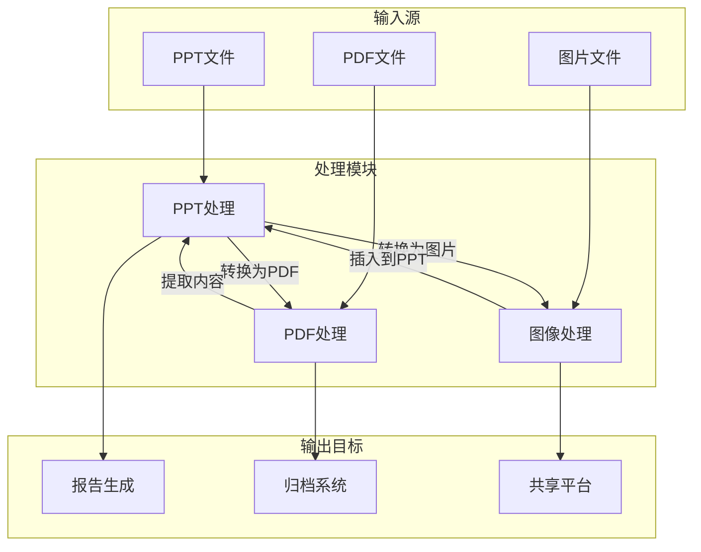

# PPT处理

<cite>
**本文档中引用的文件**   
- [50-06-ppt2img.py](file://docs-pages\vuepress\course\code\50-06-ppt2img.py)
- [50-13-ppt2pdf.py](file://docs-pages\vuepress\course\code\50-13-ppt2pdf.py)
- [50-30-merge4ppt.py](file://docs-pages\vuepress\course\code\50-30-merge4ppt.py)
- [ppt.md](file://docs-pages\vuepress\office\ppt.md)
</cite>

## 目录
1. [简介](#简介)
2. [PPT转图片](#ppt转图片)
3. [PPT转PDF](#ppt转pdf)
4. [PPT合并](#ppt合并)
5. [依赖库工作机制](#依赖库工作机制)
6. [常见问题及解决方案](#常见问题及解决方案)
7. [性能优化建议](#性能优化建议)
8. [与其他模块的集成](#与其他模块的集成)

## 简介
本文档详细介绍了Python Office项目中PPT处理功能的实现方式，包括PPT转图片、PPT转PDF和PPT合并等核心操作。文档结合代码示例说明了调用方法和参数配置，解释了依赖库的工作机制，并提供了常见问题的解决方案和性能优化建议。

## PPT转图片
PPT转图片功能允许用户将PPT文件转换为图片格式，支持单张图片输出或合并为一张长图。



**图源**
- [50-06-ppt2img.py](file://docs-pages\vuepress\course\code\50-06-ppt2img.py#L14-L16)

**节源**
- [50-06-ppt2img.py](file://docs-pages\vuepress\course\code\50-06-ppt2img.py#L14-L16)
- [ppt.md](file://docs-pages\vuepress\office\ppt.md#L22-L24)

## PPT转PDF
PPT转PDF功能支持将PPT文件批量转换为PDF格式，适用于需要将演示文稿转换为可打印或可共享格式的场景。



**图源**
- [50-13-ppt2pdf.py](file://docs-pages\vuepress\course\code\50-13-ppt2pdf.py#L132-L180)

**节源**
- [50-13-ppt2pdf.py](file://docs-pages\vuepress\course\code\50-13-ppt2pdf.py#L132-L180)
- [ppt.md](file://docs-pages\vuepress\office\ppt.md#L11-L12)

## PPT合并
PPT合并功能允许用户将多个PPT文件合并为一个单一的PPT文件，便于整理和分享。



**图源**
- [50-30-merge4ppt.py](file://docs-pages\vuepress\course\code\50-30-merge4ppt.py#L11-L13)

**节源**
- [50-30-merge4ppt.py](file://docs-pages\vuepress\course\code\50-30-merge4ppt.py#L11-L13)
- [ppt.md](file://docs-pages\vuepress\office\ppt.md#L32-L34)

## 依赖库工作机制
PPT处理功能主要依赖于`python-office`和`poppt`两个库，它们提供了简洁的API接口来处理PPT文件。

### python-office库
`python-office`是一个综合性的办公自动化库，其中的PPT模块提供了高级别的抽象，使得PPT处理操作变得简单易用。



**图源**
- [50-06-ppt2img.py](file://docs-pages\vuepress\course\code\50-06-ppt2img.py#L11)
- [50-13-ppt2pdf.py](file://docs-pages\vuepress\course\code\50-13-ppt2pdf.py#L20)

### poppt库
`poppt`是专门用于PPT处理的库，提供了更底层的控制和更多的配置选项。

```mermaid
sequenceDiagram
participant User as "用户"
participant Office as "office.ppt"
participant Poppt as "poppt"
participant COM as "PowerPoint COM"
User->>Office : ppt2img(input_path, output_path, merge=True)
Office->>Poppt : 调用相应方法
Poppt->>COM : 创建PowerPoint应用实例
COM-->>Poppt : 返回应用对象
Poppt->>COM : 打开PPT文件
COM-->>Poppt : 返回PPT对象
Poppt->>COM : 遍历每张幻灯片
loop 每张幻灯片
Poppt->>COM : 导出为图片
COM-->>Poppt : 返回图片数据
end
Poppt->>Poppt : 合并图片如果merge=True
Poppt->>User : 保存图片文件
User<<--Poppt : 完成通知
```

**图源**
- [50-06-ppt2img.py](file://docs-pages\vuepress\course\code\50-06-ppt2img.py#L19-L23)
- [50-13-ppt2pdf.py](file://docs-pages\vuepress\course\code\50-13-ppt2pdf.py#L20)

## 常见问题及解决方案
在使用PPT处理功能时，可能会遇到一些常见问题，以下是这些问题的解决方案。

### 字体丢失问题
当PPT中使用了特殊字体而目标系统未安装时，会出现字体丢失问题。

**解决方案：**
1. 在转换前确保目标系统安装了PPT中使用的所有字体
2. 使用嵌入字体功能（如果支持）
3. 转换为图片格式以保留原始外观

### 布局错乱问题
复杂的PPT布局在转换过程中可能出现错乱。

**解决方案：**
1. 简化PPT设计，避免过于复杂的布局
2. 使用高分辨率设置进行转换
3. 在转换后手动检查并调整关键页面

### 文件路径问题
长文件路径或包含特殊字符的路径可能导致处理失败。

**解决方案：**
1. 使用短路径和简单文件名
2. 确保路径不包含中文或特殊字符
3. 使用绝对路径而非相对路径

**节源**
- [50-06-ppt2img.py](file://docs-pages\vuepress\course\code\50-06-ppt2img.py)
- [50-13-ppt2pdf.py](file://docs-pages\vuepress\course\code\50-13-ppt2pdf.py)
- [50-30-merge4ppt.py](file://docs-pages\vuepress\course\code\50-30-merge4ppt.py)

## 性能优化建议
对于大规模PPT处理任务，以下性能优化建议可以提高处理效率和稳定性。

### 批量处理大文件时的内存管理
处理大量或大型PPT文件时，内存管理至关重要。



**关键策略：**
- 采用分批处理方式，避免一次性加载过多文件
- 及时释放已处理文件占用的内存资源
- 设置合理的超时机制，防止长时间挂起

**图源**
- [50-13-ppt2pdf.py](file://docs-pages\vuepress\course\code\50-13-ppt2pdf.py#L127-L131)

### 多线程处理
利用多线程可以显著提高PPT处理速度。



**节源**
- [50-13-ppt2pdf.py](file://docs-pages\vuepress\course\code\50-13-ppt2pdf.py#L127-L131)

## 与其他模块的集成
PPT处理功能可以与其他办公自动化模块无缝集成，形成完整的办公自动化解决方案。



**集成路径：**
- PPT转PDF后可进一步使用PDF处理模块进行编辑或加密
- PPT转图片后可使用图像处理模块添加水印或压缩
- 合并后的PPT可作为报告生成的基础模板

**图源**
- [50-06-ppt2img.py](file://docs-pages\vuepress\course\code\50-06-ppt2img.py)
- [50-13-ppt2pdf.py](file://docs-pages\vuepress\course\code\50-13-ppt2pdf.py)
- [50-30-merge4ppt.py](file://docs-pages\vuepress\course\code\50-30-merge4ppt.py)