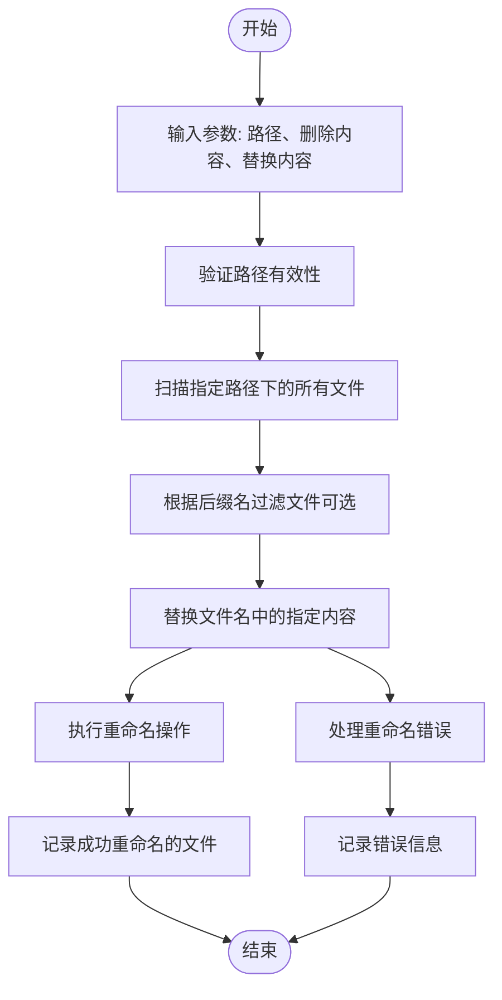
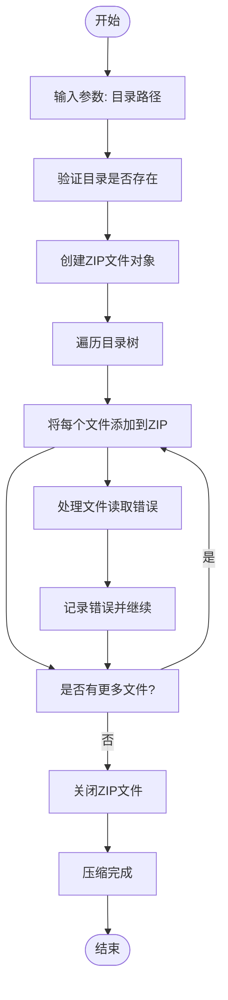
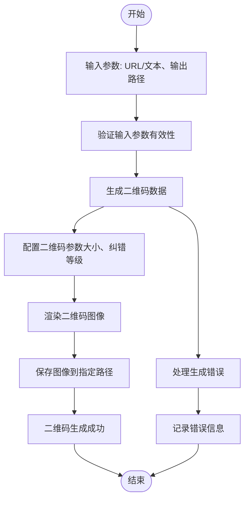
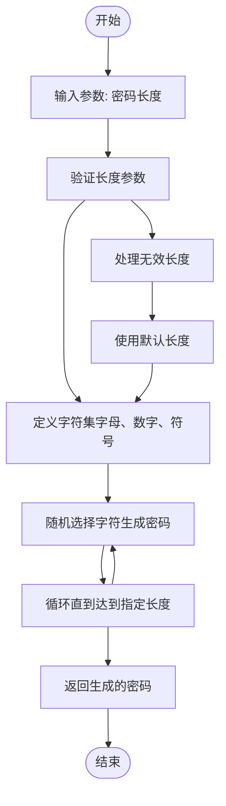
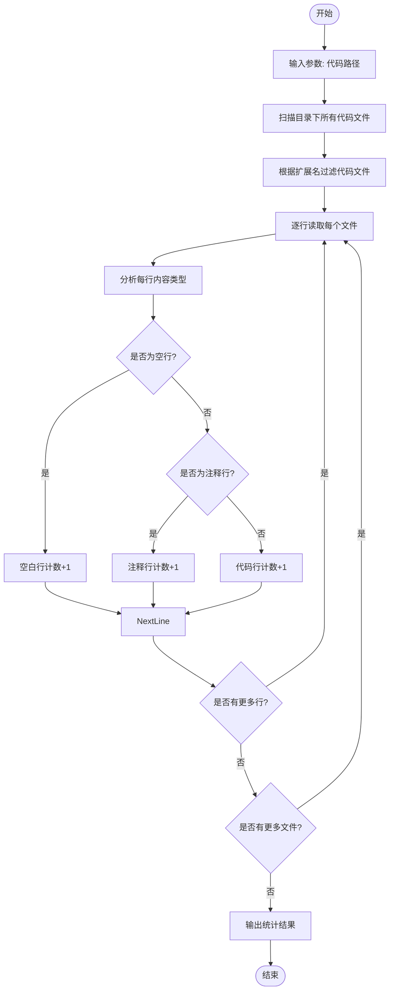
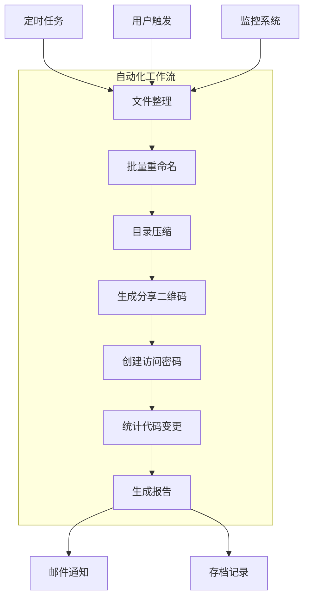

# 工具类功能

<cite>
**本文档中引用的文件**   
- [50-23-replace4filename.py](file://docs-pages/vuepress/course/code/50-23-replace4filename.py)
- [50-28-zip4dir.py](file://docs-pages/vuepress/course/code/50-28-zip4dir.py)
- [50-33-passwordtools.py](file://docs-pages/vuepress/course/code/50-33-passwordtools.py)
- [50-34-qrcodetools.py](file://docs-pages/vuepress/course/code/50-34-qrcodetools.py)
- [50-44-count_line.py](file://docs-pages/vuepress/course/code/50-44-count_line.py)
- [50-23-replace4filename.md](file://docs-pages/vuepress/course/docs/50-23-replace4filename.md)
- [50-28-zip4dir.md](file://docs-pages/vuepress/course/docs/50-28-zip4dir.md)
- [50-33-passwordtools.md](file://docs-pages/vuepress/course/docs/50-33-passwordtools.md)
- [50-34-qrcodetools.md](file://docs-pages/vuepress/course/docs/50-34-qrcodetools.md)
- [50-44-count_line.md](file://docs-pages/vuepress/course/docs/50-44-count_line.md)
</cite>

## 目录
1. [简介](#简介)
2. [文件批量重命名](#文件批量重命名)
3. [目录压缩](#目录压缩)
4. [二维码生成](#二维码生成)
5. [密码工具](#密码工具)
6. [代码行数统计](#代码行数统计)
7. [最佳实践](#最佳实践)
8. [集成与自动化](#集成与自动化)
9. [总结](#总结)

## 简介
本综合文档系统介绍了`python-office`项目中的核心工具类功能，涵盖文件批量重命名、目录压缩、二维码生成、密码生成和代码行数统计等实用功能。这些工具旨在提升办公自动化效率，简化日常重复性任务。通过模块化设计，这些功能可以轻松集成到更大的自动化流程中，为开发者和办公人员提供便捷的解决方案。

## 文件批量重命名

该功能允许用户批量修改文件名中的特定内容，支持文件和目录的重命名操作。通过简单的函数调用，可以实现大规模文件的快速重命名，特别适用于需要统一命名规范的场景。

**图示来源**
- [50-23-replace4filename.py](file://docs-pages/vuepress/course/code/50-23-replace4filename.py#L1-L21)
- [50-23-replace4filename.md](file://docs-pages/vuepress/course/docs/50-23-replace4filename.md#L1-L50)

**节来源**
- [50-23-replace4filename.py](file://docs-pages/vuepress/course/code/50-23-replace4filename.py#L1-L21)
- [50-23-replace4filename.md](file://docs-pages/vuepress/course/docs/50-23-replace4filename.md#L1-L100)

## 目录压缩

此功能提供了一键压缩整个目录的能力，将指定文件夹及其内容打包为ZIP格式的压缩文件。这对于文件备份、传输和归档非常有用，简化了手动压缩的操作流程。

**图示来源**
- [50-28-zip4dir.py](file://docs-pages/vuepress/course/code/50-28-zip4dir.py#L1-L13)
- [50-28-zip4dir.md](file://docs-pages/vuepress/course/docs/50-28-zip4dir.md#L1-L40)

**节来源**
- [50-28-zip4dir.py](file://docs-pages/vuepress/course/code/50-28-zip4dir.py#L1-L13)
- [50-28-zip4dir.md](file://docs-pages/vuepress/course/docs/50-28-zip4dir.md#L1-L80)

## 二维码生成

该工具能够将任意URL或文本内容转换为二维码图像，支持自定义输出路径。生成的二维码可用于分享链接、存储信息或作为身份验证的辅助手段。

**图示来源**
- [50-34-qrcodetools.py](file://docs-pages/vuepress/course/code/50-34-qrcodetools.py#L1-L13)
- [50-34-qrcodetools.md](file://docs-pages/vuepress/course/docs/50-34-qrcodetools.md#L1-L35)

**节来源**
- [50-34-qrcodetools.py](file://docs-pages/vuepress/course/code/50-34-qrcodetools.py#L1-L13)
- [50-34-qrcodetools.md](file://docs-pages/vuepress/course/docs/50-34-qrcodetools.md#L1-L70)

## 密码工具

此功能提供安全的随机密码生成功能，可以根据指定长度生成高强度密码。对于需要频繁创建账户或更新密码的场景非常有用，确保密码的安全性和复杂性。

**图示来源**
- [50-33-passwordtools.py](file://docs-pages/vuepress/course/code/50-33-passwordtools.py#L1-L14)
- [50-33-passwordtools.md](file://docs-pages/vuepress/course/docs/50-33-passwordtools.md#L1-L30)

**节来源**
- [50-33-passwordtools.py](file://docs-pages/vuepress/course/code/50-33-passwordtools.py#L1-L14)
- [50-33-passwordtools.md](file://docs-pages/vuepress/course/docs/50-33-passwordtools.md#L1-L60)

## 代码行数统计

该工具能够扫描指定代码目录，统计代码总行数、空行数和注释行数，为代码质量评估和项目进度管理提供数据支持。

**图示来源**
- [50-44-count_line.py](file://docs-pages/vuepress/course/code/50-44-count_line.py#L1-L14)
- [50-44-count_line.md](file://docs-pages/vuepress/course/docs/50-44-count_line.md#L1-L45)

**节来源**
- [50-44-count_line.py](file://docs-pages/vuepress/course/code/50-44-count_line.py#L1-L14)
- [50-44-count_line.md](file://docs-pages/vuepress/course/docs/50-44-count_line.md#L1-L75)

## 最佳实践

### 路径规范
- 使用绝对路径或相对于脚本文件的相对路径
- 在Windows系统中建议使用原始字符串（r前缀）避免转义问题
- 确保路径中的目录存在，避免文件操作失败

### 异常捕获
- 在批量操作中使用try-catch块捕获单个文件处理错误
- 记录失败的文件名和错误原因，便于后续排查
- 提供回滚机制或备份选项，防止数据丢失

### 性能优化
- 对于大量文件操作，考虑使用生成器逐个处理而非一次性加载
- 在多核系统上可以考虑并行处理不同目录
- 定期清理临时文件和缓存

### 安全注意事项
- 密码生成应使用安全的随机数生成器
- 文件操作前验证用户权限
- 敏感信息（如密码）不应硬编码在脚本中

## 集成与自动化

这些工具类功能可以作为更大自动化流程的组成部分：

**图示来源**
- [50-23-replace4filename.py](file://docs-pages/vuepress/course/code/50-23-replace4filename.py)
- [50-28-zip4dir.py](file://docs-pages/vuepress/course/code/50-28-zip4dir.py)
- [50-34-qrcodetools.py](file://docs-pages/vuepress/course/code/50-34-qrcodetools.py)
- [50-33-passwordtools.py](file://docs-pages/vuepress/course/code/50-33-passwordtools.py)
- [50-44-count_line.py](file://docs-pages/vuepress/course/code/50-44-count_line.py)

## 总结
本文档系统介绍了`python-office`项目中的核心工具类功能，包括文件批量重命名、目录压缩、二维码生成、密码工具和代码行数统计。这些功能通过简洁的API设计，为日常办公自动化提供了强大的支持。通过遵循最佳实践，用户可以安全高效地使用这些工具，并将其集成到更复杂的自动化流程中，显著提升工作效率和代码管理质量。