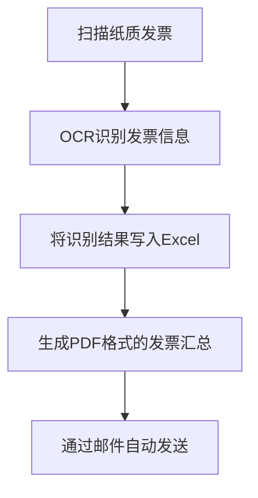
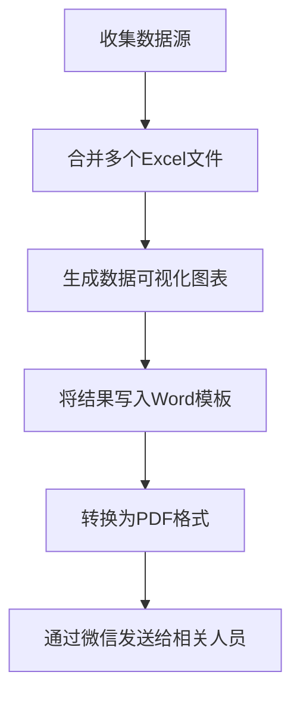

# 核心功能

<cite>
**本文档中引用的文件**   
- [pdf.md](file://docs-pages/vuepress/office/pdf.md)
- [excel.md](file://docs-pages/vuepress/office/excel.md)
- [robot.md](file://docs-pages/vuepress/office/robot.md)
- [ocr.md](file://docs-pages/vuepress/office/ocr.md)
- [email.md](file://docs-pages/vuepress/office/email.md)
- [image.md](file://docs-pages/vuepress/office/image.md)
- [word.md](file://docs-pages/vuepress/office/word.md)
- [ppt.md](file://docs-pages/vuepress/office/ppt.md)
- [tools.md](file://docs-pages/vuepress/office/tools.md)
- [introduction.md](file://docs-pages/vuepress/guide/introduction.md)
- [50-04-pdf2docx.py](file://docs-pages/vuepress/course/code/50-04-pdf2docx.py)
- [50-05-docx2pdf.py](file://docs-pages/vuepress/course/code/50-05-docx2pdf.py)
- [50-15-VatInvoiceOCR2Excel.py](file://docs-pages/vuepress/course/code/50-15-VatInvoiceOCR2Excel.py)
- [50-22-merge2excel.py](file://docs-pages/vuepress/course/code/50-22-merge2excel.py)
- [50-08-airobot.py](file://docs-pages/vuepress/course/code/50-08-airobot.py)
</cite>

## 目录
1. [简介](#简介)
2. [PDF处理](#pdf处理)
3. [Excel操作](#excel操作)
4. [微信机器人](#微信机器人)
5. [OCR识别](#ocr识别)
6. [邮件自动化](#邮件自动化)
7. [图片处理](#图片处理)
8. [Word文档处理](#word文档处理)
9. [PPT处理](#ppt处理)
10. [实用工具](#实用工具)
11. [功能组合使用](#功能组合使用)
12. [总结](#总结)

## 简介

python-office库是一个专为自动化办公设计的Python第三方库，旨在通过"一行代码"解决大部分办公自动化问题。该库的特点是极简编程、学习成本低、贴合职场实际需求，让没有编程基础的用户也能轻松实现自动化办公。

库的核心设计理念是"开箱即用"，每个功能模块都经过精心设计，确保用户只需调用简单的API即可完成复杂的办公任务。无论是文件格式转换、数据处理还是自动化交互，python-office都提供了简洁高效的解决方案。

**Section sources**
- [introduction.md](file://docs-pages/vuepress/guide/introduction.md)

## PDF处理

PDF处理模块提供了全面的PDF文件操作功能，包括格式转换、加密解密、合并分割等常见办公需求。

### 主要功能
- PDF转Word文档
- PDF转图片
- TXT转PDF
- 按页切割PDF
- PDF加密与解密
- PDF加水印
- 合并PDF文件
- 删除PDF页面

### API接口设计
```python
import office

# PDF转Word
office.pdf.pdf2docx(file_path='源PDF路径', output_path='目标Word路径')

# 合并PDF
office.pdf.merge2pdf(dir_path='PDF文件夹路径', output_path='合并后PDF路径')

# PDF加密
office.pdf.encrypt4pdf(input_path='源PDF路径', output_path='加密后PDF路径', password='密码')
```

该模块特别适合需要频繁进行PDF格式转换和处理的办公场景，如文档归档、报告生成等。

**Section sources**
- [pdf.md](file://docs-pages/vuepress/office/pdf.md)
- [50-04-pdf2docx.py](file://docs-pages/vuepress/course/code/50-04-pdf2docx.py)

## Excel操作

Excel操作模块专注于解决日常办公中常见的Excel文件处理需求，提供了从数据生成到复杂数据处理的完整解决方案。

### 主要功能
- 生成模拟数据Excel
- 合并多个Excel文件
- 拆分Excel文件
- 按条件查询Excel数据
- Excel转PDF
- 关联查询

### API接口设计
```python
import office

# 生成模拟数据Excel
office.excel.fake2excel(columns=['姓名', '年龄', '部门'], rows=100)

# 合并Excel文件
office.excel.merge2excel(dir_path='Excel文件夹路径', output_file='合并结果.xlsx')

# Excel转PDF
office.excel.excel2pdf(excel_path='源Excel路径', pdf_path='目标PDF路径')
```

该模块特别适用于需要批量处理Excel数据的场景，如财务报表汇总、人事数据整理等。

**Section sources**
- [excel.md](file://docs-pages/vuepress/office/excel.md)
- [50-22-merge2excel.py](file://docs-pages/vuepress/course/code/50-22-merge2excel.py)

## 微信机器人

微信机器人模块提供了自动化微信操作的功能，让用户能够通过代码实现微信消息的自动发送和智能回复。

### 主要功能
- 发送消息
- 发送文件
- 定时群发
- 关键词自动回复
- 智能聊天机器人
- 获取群信息
- 自动加好友

### API接口设计
```python
import office

# 智能聊天机器人
office.wechat.chat_robot(who='好友微信名')

# 发送消息
office.wechat.send_message(who='接收人', message='消息内容')

# 定时发送
office.wechat.send_message_by_time(who='接收人', message='消息内容', send_time='2023-12-01 10:00:00')
```

该模块特别适合需要自动化处理微信沟通的场景，如客户服务、团队通知等。

**Section sources**
- [robot.md](file://docs-pages/vuepress/office/robot.md)
- [50-08-airobot.py](file://docs-pages/vuepress/course/code/50-08-airobot.py)

## OCR识别

OCR识别模块基于腾讯云OCR技术，提供了多种文字识别功能，特别针对办公场景进行了优化。

### 主要功能
- 增值税发票识别
- 银行卡识别
- 身份证识别
- 车牌识别
- 通用文字识别

### API接口设计
```python
import poocr

# 增值税发票识别并生成Excel
poocr.ocr2excel.VatInvoiceOCR2Excel(
    input_path='发票图片路径', 
    output_path='输出路径', 
    output_excel='发票汇总.xlsx',
    id='腾讯云API ID', 
    key='腾讯云API Key'
)
```

该模块特别适合需要批量处理纸质文档数字化的场景，如财务报销、证件管理等。

**Section sources**
- [ocr.md](file://docs-pages/vuepress/office/ocr.md)
- [50-15-VatInvoiceOCR2Excel.py](file://docs-pages/vuepress/course/code/50-15-VatInvoiceOCR2Excel.py)

## 邮件自动化

邮件自动化模块提供了完整的邮件收发功能，简化了邮件处理的复杂性。

### 主要功能
- 发送邮件
- 发送带附件的邮件
- 批量发送邮件
- 接收邮件及附件

### API接口设计
```python
import poemail

# 发送邮件
poemail.send_mail(
    sender='发件人邮箱', 
    password='邮箱密码', 
    receiver='收件人邮箱',
    subject='邮件主题', 
    content='邮件内容'
)
```

该模块特别适合需要自动化邮件通知的场景，如报告发送、提醒通知等。

**Section sources**
- [email.md](file://docs-pages/vuepress/office/email.md)

## 图片处理

图片处理模块提供了常用的图片编辑功能，满足日常办公中的图片处理需求。

### 主要功能
- 图片加水印
- 人像转动漫头像
- 图片格式转换

### API接口设计
```python
import office

# 图片加水印
office.image.add_watermark(file='图片路径', mark='水印文字')

# 人像转动漫头像
office.image.img2Cartoon(path='人像图片路径')
```

该模块特别适合需要批量处理图片的场景，如宣传材料制作、个人形象设计等。

**Section sources**
- [image.md](file://docs-pages/vuepress/office/image.md)

## Word文档处理

Word文档处理模块专注于Word文件的批量操作和格式转换。

### 主要功能
- Word批量转PDF
- doc与docx格式互转
- Word文档批量合并

### API接口设计
```python
import office

# Word转PDF
office.word.docx2pdf(path='Word文件夹路径')

# doc转docx
office.word.doc2docx(input_path='doc文件路径')

# 合并Word文档
office.word.merge4docx(input_path='输入文件夹路径', output_path='输出文件夹路径')
```

该模块特别适合需要批量处理Word文档的场景，如合同管理、报告生成等。

**Section sources**
- [word.md](file://docs-pages/vuepress/office/word.md)
- [50-05-docx2pdf.py](file://docs-pages/vuepress/course/code/50-05-docx2pdf.py)

## PPT处理

PPT处理模块提供了PPT文件的转换和合并功能。

### 主要功能
- PPT批量转PDF
- PPT转长图
- 合并PPT文件

### API接口设计
```python
import office

# PPT转PDF
office.ppt.ppt2pdf(path='PPT文件夹路径')

# PPT转长图
office.ppt.ppt2img(input_path='PPT路径', output_path='输出路径', merge=True)

# 合并PPT
office.ppt.merge4ppt(input_path='输入文件夹路径', output_path='输出路径', output_name='合并结果.pptx')
```

该模块特别适合需要批量处理演示文稿的场景，如课件制作、汇报材料整理等。

**Section sources**
- [ppt.md](file://docs-pages/vuepress/office/ppt.md)

## 实用工具

实用工具模块提供了一系列日常办公中常用的辅助工具。

### 主要功能
- 二维码生成
- 在线翻译
- 密码生成器
- 天气查询
- URL转IP

### API接口设计
```python
import office

# 生成二维码
office.tools.make_qrcode(text='https://www.python-office.com')

# 翻译
office.tools.translate(text='Hello World', target_language='zh')

# 生成密码
office.tools.create_password(length=12)
```

这些工具特别适合需要快速完成特定小任务的场景，提高工作效率。

**Section sources**
- [tools.md](file://docs-pages/vuepress/office/tools.md)

## 功能组合使用

python-office库的各个功能模块可以灵活组合使用，实现更复杂的自动化工作流。

### 常见组合场景

#### 发票处理自动化流程


**Diagram sources**
- [ocr.md](file://docs-pages/vuepress/office/ocr.md)
- [excel.md](file://docs-pages/vuepress/office/excel.md)
- [pdf.md](file://docs-pages/vuepress/office/pdf.md)
- [email.md](file://docs-pages/vuepress/office/email.md)

#### 报告生成自动化流程


**Diagram sources**
- [excel.md](file://docs-pages/vuepress/office/excel.md)
- [word.md](file://docs-pages/vuepress/office/word.md)
- [pdf.md](file://docs-pages/vuepress/office/pdf.md)
- [robot.md](file://docs-pages/vuepress/office/robot.md)

这些组合使用方式展示了python-office库在实际工作场景中的强大能力，能够显著提升办公效率。

**Section sources**
- [ocr.md](file://docs-pages/vuepress/office/ocr.md)
- [excel.md](file://docs-pages/vuepress/office/excel.md)
- [pdf.md](file://docs-pages/vuepress/office/pdf.md)
- [email.md](file://docs-pages/vuepress/office/email.md)
- [word.md](file://docs-pages/vuepress/office/word.md)
- [robot.md](file://docs-pages/vuepress/office/robot.md)

## 总结

python-office库通过提供一系列"一行代码"即可使用的功能模块，极大地简化了办公自动化的过程。从文件格式转换到数据处理，从自动化交互到智能识别，该库覆盖了日常办公中的大部分需求。

其核心优势在于：
- **极简API设计**：每个功能都通过简洁的接口暴露，降低使用门槛
- **开箱即用**：无需深入了解底层实现，直接调用即可完成任务
- **模块化设计**：各个功能模块独立又可组合，灵活性强
- **贴合实际需求**：功能设计基于真实的办公场景

对于希望提升工作效率的办公人员来说，python-office库是一个强大而易用的工具集，值得在日常工作中广泛应用。