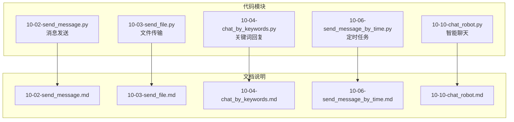
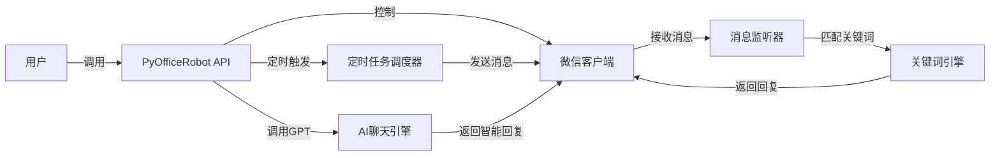
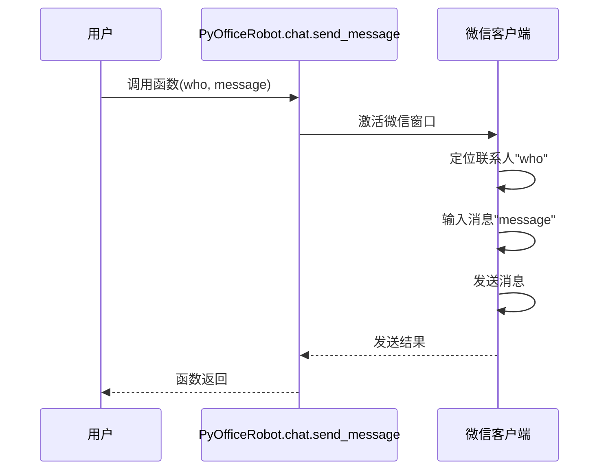
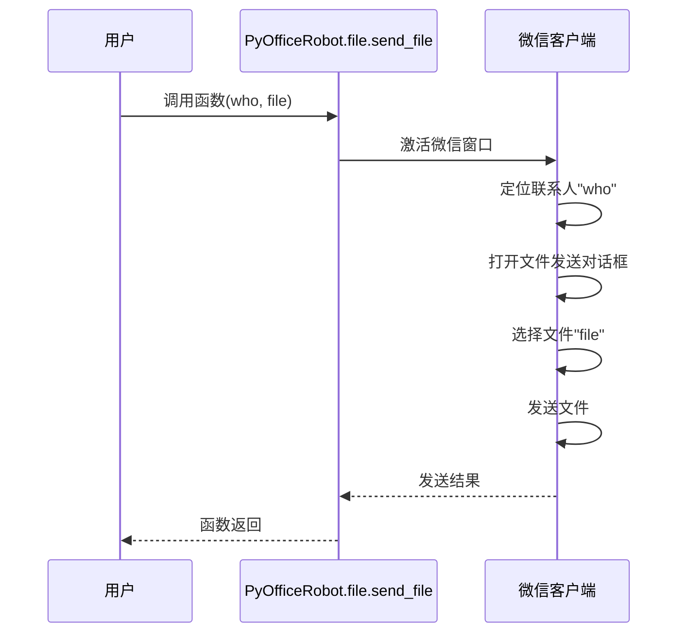
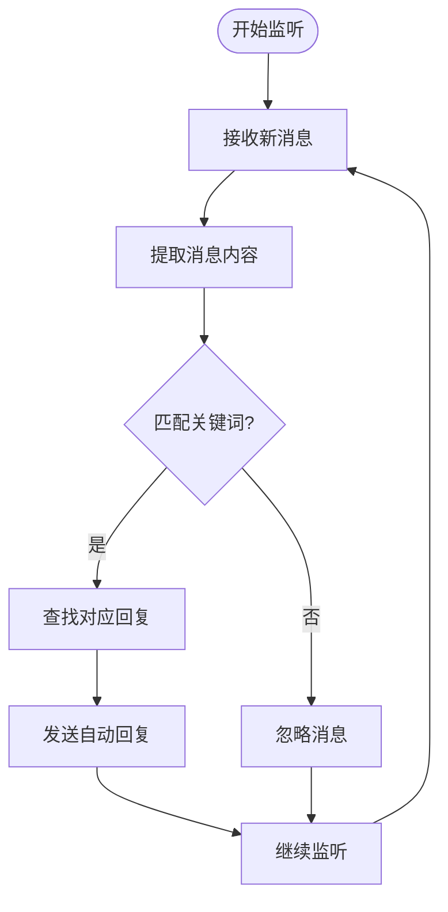
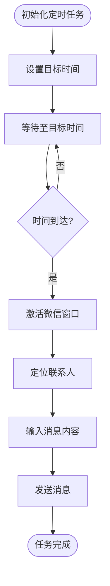
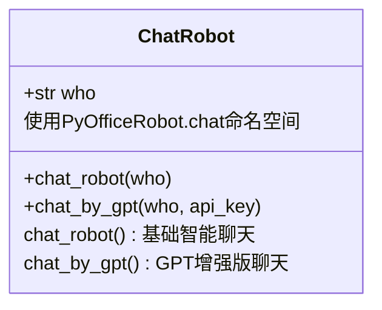
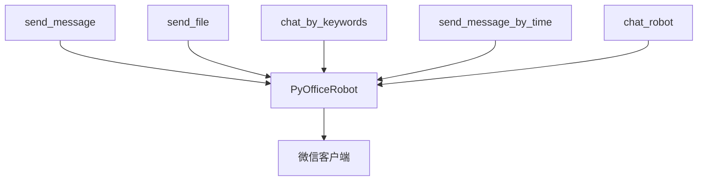

# 自动化机器人

<cite>
**本文档引用文件**  
- [10-02-send_message.py](file://docs-pages\vuepress\course-002\10-PyOfficeRobot\code\10-02-send_message.py)
- [10-03-send_file.py](file://docs-pages\vuepress\course-002\10-PyOfficeRobot\code\10-03-send_file.py)
- [10-04-chat_by_keywords.py](file://docs-pages\vuepress\course-002\10-PyOfficeRobot\code\10-04-chat_by_keywords.py)
- [10-06-send_message_by_time.py](file://docs-pages\vuepress\course-002\10-PyOfficeRobot\code\10-06-send_message_by_time.py)
- [10-10-chat_robot.py](file://docs-pages\vuepress\course-002\10-PyOfficeRobot\code\10-10-chat_robot.py)
- [10-02-send_message.md](file://docs-pages\vuepress\course-002\10-PyOfficeRobot\docs\10-02-send_message.md)
- [10-03-send_file.md](file://docs-pages\vuepress\course-002\10-PyOfficeRobot\docs\10-03-send_file.md)
- [10-04-chat_by_keywords.md](file://docs-pages\vuepress\course-002\10-PyOfficeRobot\docs\10-04-chat_by_keywords.md)
- [10-06-send_message_by_time.md](file://docs-pages\vuepress\course-002\10-PyOfficeRobot\docs\10-06-send_message_by_time.md)
- [10-10-chat_robot.md](file://docs-pages\vuepress\course-002\10-PyOfficeRobot\docs\10-10-chat_robot.md)
</cite>

## 目录
1. [简介](#简介)
2. [项目结构](#项目结构)
3. [核心功能组件](#核心功能组件)
4. [系统架构概述](#系统架构概述)
5. [详细组件分析](#详细组件分析)
6. [依赖关系分析](#依赖关系分析)
7. [性能与安全配置](#性能与安全配置)
8. [故障排查指南](#故障排查指南)
9. [模块集成与扩展](#模块集成与扩展)
10. [结论](#结论)

## 简介
本文档详细介绍了基于PyOfficeRobot模块的自动化机器人系统，涵盖微信消息发送、文件传输、关键词自动回复、定时任务等核心办公自动化功能。通过分析实际代码实现，展示如何构建高效、安全的自动化交互流程，并提供与其他模块（如邮件、OCR）集成的方案。

## 项目结构
自动化机器人功能主要集中在`docs-pages/vuepress/course-002/10-PyOfficeRobot/code/`目录下，每个功能模块都有独立的Python脚本文件，遵循清晰的命名规范（如10-02-send_message.py）。文档与代码分离，对应说明文件位于`docs/`目录下。

**图示来源**
- [10-02-send_message.py](file://docs-pages\vuepress\course-002\10-PyOfficeRobot\code\10-02-send_message.py)
- [10-03-send_file.py](file://docs-pages\vuepress\course-002\10-PyOfficeRobot\code\10-03-send_file.py)
- [10-04-chat_by_keywords.py](file://docs-pages\vuepress\course-002\10-PyOfficeRobot\code\10-04-chat_by_keywords.py)
- [10-06-send_message_by_time.py](file://docs-pages\vuepress\course-002\10-PyOfficeRobot\code\10-06-send_message_by_time.py)
- [10-10-chat_robot.py](file://docs-pages\vuepress\course-002\10-PyOfficeRobot\code\10-10-chat_robot.py)

**章节来源**
- [10-02-send_message.py](file://docs-pages\vuepress\course-002\10-PyOfficeRobot\code\10-02-send_message.py)
- [10-03-send_file.py](file://docs-pages\vuepress\course-002\10-PyOfficeRobot\code\10-03-send_file.py)

## 核心功能组件

本文档涵盖的自动化机器人核心功能包括：即时消息发送、文件传输、关键词触发自动回复、定时消息发送以及基于AI的智能聊天。所有功能均通过PyOfficeRobot库的简洁API实现，降低了开发门槛。

**章节来源**
- [10-02-send_message.py](file://docs-pages\vuepress\course-002\10-PyOfficeRobot\code\10-02-send_message.py#L13-L21)
- [10-03-send_file.py](file://docs-pages\vuepress\course-002\10-PyOfficeRobot\code\10-03-send_file.py#L12-L16)
- [10-04-chat_by_keywords.py](file://docs-pages\vuepress\course-002\10-PyOfficeRobot\code\10-04-chat_by_keywords.py#L13-L24)
- [10-06-send_message_by_time.py](file://docs-pages\vuepress\course-002\10-PyOfficeRobot\code\10-06-send_message_by_time.py#L12-L14)
- [10-10-chat_robot.py](file://docs-pages\vuepress\course-002\10-PyOfficeRobot\code\10-10-chat_robot.py#L15-L22)

## 系统架构概述
自动化机器人系统采用模块化设计，以PyOfficeRobot为核心库，封装了与微信客户端交互的底层逻辑。上层应用通过调用简洁的函数接口，实现各种自动化功能，系统架构清晰，易于维护和扩展。

**图示来源**
- [10-04-chat_by_keywords.py](file://docs-pages\vuepress\course-002\10-PyOfficeRobot\code\10-04-chat_by_keywords.py)
- [10-06-send_message_by_time.py](file://docs-pages\vuepress\course-002\10-PyOfficeRobot\code\10-06-send_message_by_time.py)
- [10-10-chat_robot.py](file://docs-pages\vuepress\course-002\10-PyOfficeRobot\code\10-10-chat_robot.py)

## 详细组件分析

### 消息发送组件分析
该组件实现了向指定微信联系人发送文本消息的功能。支持在消息中插入特殊字符（如`{ctrl}{ENTER}`）实现换行，满足复杂消息格式的需求。

**图示来源**
- [10-02-send_message.py](file://docs-pages\vuepress\course-002\10-PyOfficeRobot\code\10-02-send_message.py#L15-L21)

**章节来源**
- [10-02-send_message.py](file://docs-pages\vuepress\course-002\10-PyOfficeRobot\code\10-02-send_message.py#L1-L22)
- [10-02-send_message.md](file://docs-pages\vuepress\course-002\10-PyOfficeRobot\docs\10-02-send_message.md)

### 文件传输组件分析
该组件实现了向指定微信联系人发送文件的功能，支持发送各种类型的文件，如文档、图片、软件等。

**图示来源**
- [10-03-send_file.py](file://docs-pages\vuepress\course-002\10-PyOfficeRobot\code\10-03-send_file.py#L14-L16)

**章节来源**
- [10-03-send_file.py](file://docs-pages\vuepress\course-002\10-PyOfficeRobot\code\10-03-send_file.py#L1-L17)
- [10-03-send_file.md](file://docs-pages\vuepress\course-002\10-PyOfficeRobot\docs\10-03-send_file.md)

### 关键词自动回复组件分析
该组件实现了监听微信消息并根据预设关键词自动回复的功能。通过字典结构定义关键词与回复内容的映射关系，配置灵活。

**图示来源**
- [10-04-chat_by_keywords.py](file://docs-pages\vuepress\course-002\10-PyOfficeRobot\code\10-04-chat_by_keywords.py#L15-L24)

**章节来源**
- [10-04-chat_by_keywords.py](file://docs-pages\vuepress\course-002\10-PyOfficeRobot\code\10-04-chat_by_keywords.py#L1-L25)
- [10-04-chat_by_keywords.md](file://docs-pages\vuepress\course-002\10-PyOfficeRobot\docs\10-04-chat_by_keywords.md)

### 定时任务组件分析
该组件实现了在指定时间向微信联系人发送消息的功能，适用于生日祝福、会议提醒等场景。

**图示来源**
- [10-06-send_message_by_time.py](file://docs-pages\vuepress\course-002\10-PyOfficeRobot\code\10-06-send_message_by_time.py#L14-L15)

**章节来源**
- [10-06-send_message_by_time.py](file://docs-pages\vuepress\course-002\10-PyOfficeRobot\code\10-06-send_message_by_time.py#L1-L15)
- [10-06-send_message_by_time.md](file://docs-pages\vuepress\course-002\10-PyOfficeRobot\docs\10-06-send_message_by_time.md)

### 智能聊天组件分析
该组件提供了两种智能聊天模式：基础版和基于ChatGPT的增强版，可实现更自然的对话交互。

**图示来源**
- [10-10-chat_robot.py](file://docs-pages\vuepress\course-002\10-PyOfficeRobot\code\10-10-chat_robot.py#L18-L22)

**章节来源**
- [10-10-chat_robot.py](file://docs-pages\vuepress\course-002\10-PyOfficeRobot\code\10-10-chat_robot.py#L1-L23)
- [10-10-chat_robot.md](file://docs-pages\vuepress\course-002\10-PyOfficeRobot\docs\10-10-chat_robot.md)

## 依赖关系分析
自动化机器人模块主要依赖PyOfficeRobot库，该库封装了与微信客户端交互所需的所有功能。各功能模块之间相互独立，通过统一的API接口与微信交互，降低了模块间的耦合度。

**图示来源**
- [10-02-send_message.py](file://docs-pages\vuepress\course-002\10-PyOfficeRobot\code\10-02-send_message.py#L13)
- [10-03-send_file.py](file://docs-pages\vuepress\course-002\10-PyOfficeRobot\code\10-03-send_file.py#L12)
- [10-04-chat_by_keywords.py](file://docs-pages\vuepress\course-002\10-PyOfficeRobot\code\10-04-chat_by_keywords.py#L13)
- [10-06-send_message_by_time.py](file://docs-pages\vuepress\course-002\10-PyOfficeRobot\code\10-06-send_message_by_time.py#L12)
- [10-10-chat_robot.py](file://docs-pages\vuepress\course-002\10-PyOfficeRobot\code\10-10-chat_robot.py#L15)

**章节来源**
- [10-02-send_message.py](file://docs-pages\vuepress\course-002\10-PyOfficeRobot\code\10-02-send_message.py#L13)
- [10-03-send_file.py](file://docs-pages\vuepress\course-002\10-PyOfficeRobot\code\10-03-send_file.py#L12)
- [10-04-chat_by_keywords.py](file://docs-pages\vuepress\course-002\10-PyOfficeRobot\code\10-04-chat_by_keywords.py#L13)
- [10-06-send_message_by_time.py](file://docs-pages\vuepress\course-002\10-PyOfficeRobot\code\10-06-send_message_by_time.py#L12)
- [10-10-chat_robot.py](file://docs-pages\vuepress\course-002\10-PyOfficeRobot\code\10-10-chat_robot.py#L15)

## 性能与安全配置
机器人运行机制基于模拟键盘和鼠标操作与微信客户端交互。为避免账号被封，建议：
1. 避免高频次、无规律的消息发送
2. 设置合理的发送间隔
3. 不要用于大规模群发营销
4. 定期检查微信客户端状态

消息监听原理是通过轮询或事件监听机制捕获微信窗口的消息变化，然后进行关键词匹配处理。

## 故障排查指南
### 连接失败
- **检查微信客户端是否已启动并登录**
- **确认PyOfficeRobot库已正确安装** (`pip install PyOfficeRobot`)
- **检查代码中的联系人名称是否准确**

### 消息延迟
- **降低发送频率，增加发送间隔**
- **检查系统资源占用情况**
- **确保微信客户端处于激活状态**

### 文件发送失败
- **确认文件路径正确且文件存在**
- **检查文件大小是否超出微信限制**
- **确保目标联系人在线**

**章节来源**
- [10-02-send_message.py](file://docs-pages\vuepress\course-002\10-PyOfficeRobot\code\10-02-send_message.py)
- [10-03-send_file.py](file://docs-pages\vuepress\course-002\10-PyOfficeRobot\code\10-03-send_file.py)
- [10-06-send_message_by_time.py](file://docs-pages\vuepress\course-002\10-PyOfficeRobot\code\10-06-send_message_by_time.py)

## 模块集成与扩展
自动化机器人可与其他模块组合使用，构建完整自动化流程：
- **与邮件模块集成**：收到重要邮件时，自动通过微信通知用户
- **与OCR模块集成**：自动识别收到的图片内容，并根据内容进行智能回复
- **与Excel模块集成**：定时从Excel读取数据，并通过微信发送报表摘要

## 结论
本文档详细介绍了PyOfficeRobot自动化机器人的核心功能、实现原理和使用方法。该系统为办公自动化提供了高效解决方案，通过简单的API调用即可实现复杂的微信交互任务。合理配置和使用，可显著提升工作效率，但需注意遵守微信使用规范，避免账号风险。