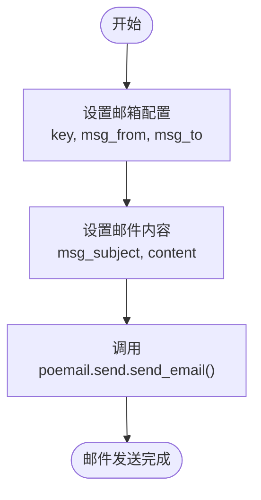
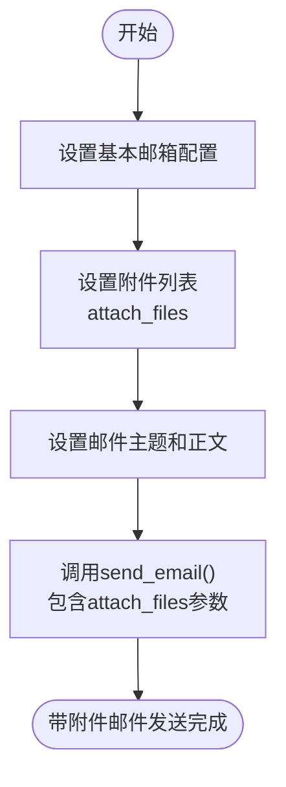
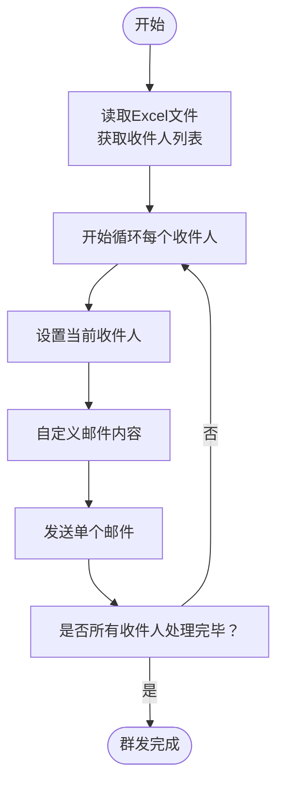
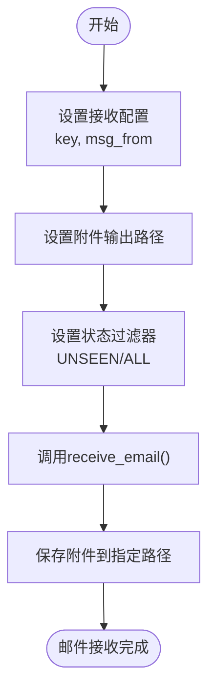
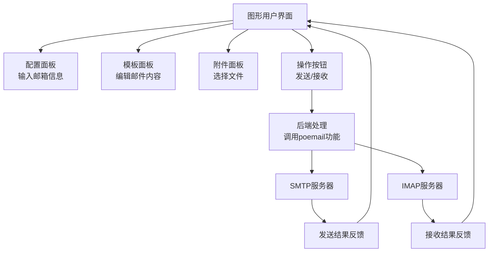
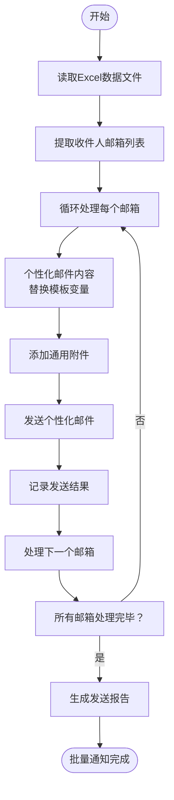

# 邮件自动化

<cite>
**本文档引用的文件**   
- [3-send_mail_content.py](file://docs-pages\vuepress\course-002\poemail\code\3-send_mail_content.py)
- [4-send_mail_content_file.py](file://docs-pages\vuepress\course-002\poemail\code\4-send_mail_content_file.py)
- [5-batch_send_mail_content_file.py](file://docs-pages\vuepress\course-002\poemail\code\5-batch_send_mail_content_file.py)
- [6-receive_mail_attchment.py](file://docs-pages\vuepress\course-002\poemail\code\6-receive_mail_attchment.py)
- [poemail.md](file://docs-pages\vuepress\course-002\poemail\poemail.md)
- [pogui\3-send_mail_content.py](file://docs-pages\vuepress\course-002\pogui\code\3-send_mail_content.py)
- [pogui\5-batch_send_mail_content_file.py](file://docs-pages\vuepress\course-002\pogui\code\5-batch_send_mail_content_file.py)
- [pogui\6-receive_mail_attchment.py](file://docs-pages\vuepress\course-002\pogui\code\6-receive_mail_attchment.py)
- [email.md](file://docs-pages\vuepress\office\email.md)
</cite>

## 目录
1. [简介](#简介)
2. [邮件发送功能](#邮件发送功能)
3. [邮件接收与附件下载](#邮件接收与附件下载)
4. [SMTP/IMAP配置与认证](#smtpimap配置与认证)
5. [常见问题处理](#常见问题处理)
6. [GUI模块集成](#gui模块集成)
7. [Excel数据结合批量邮件通知案例](#excel数据结合批量邮件通知案例)
8. [总结](#总结)

## 简介
本文档详细介绍了Python Office项目中的邮件自动化功能，涵盖邮件发送（单发、群发、带附件）、内容模板、邮件接收与附件下载等核心功能。文档结合代码示例说明SMTP/IMAP配置方法和认证流程，解释如何处理常见问题，并提供与GUI模块（pogui）的集成说明。

## 邮件发送功能

### 单邮件发送
通过`poemail.send.send_email()`函数实现单邮件发送功能，支持设置发件人、收件人、抄送人、主题、正文等参数。



**代码示例路径**
- [3-send_mail_content.py](file://docs-pages\vuepress\course-002\poemail\code\3-send_mail_content.py#L11-L25)

### 带附件邮件发送
支持发送带一个或多个附件的邮件，通过`attach_files`参数指定附件文件路径列表。



**代码示例路径**
- [4-send_mail_content_file.py](file://docs-pages\vuepress\course-002\poemail\code\4-send_mail_content_file.py#L13-L30)

### 群发邮件功能
实现批量邮件发送功能，可以从Excel文件读取收件人列表，逐个发送个性化邮件。



**代码示例路径**
- [5-batch_send_mail_content_file.py](file://docs-pages\vuepress\course-002\poemail\code\5-batch_send_mail_content_file.py#L13-L40)

## 邮件接收与附件下载

### 邮件接收功能
通过`poemail.receive.receive_email()`函数实现邮件接收功能，支持过滤已读/未读邮件。



**代码示例路径**
- [6-receive_mail_attchment.py](file://docs-pages\vuepress\course-002\poemail\code\6-receive_mail_attchment.py#L13-L19)

## SMTP/IMAP配置与认证

### 配置方法
邮件自动化功能基于SMTP协议发送邮件和IMAP协议接收邮件，需要配置相应的授权码和邮箱地址。

#### 环境变量配置
推荐使用环境变量存储敏感信息，如授权码、邮箱地址等。

```python
key = os.getenv('EMAIL_KEY')  # 从环境变量获取授权码
msg_from = "your_email@domain.com"  # 发件人邮箱
```

#### 直接配置
也可以直接在代码中配置，但不推荐用于生产环境。

### 认证流程
1. 获取邮箱授权码（非登录密码）
2. 配置SMTP/IMAP服务器信息
3. 建立安全连接（SSL/TLS）
4. 身份验证
5. 执行邮件操作

**配置示例路径**
- [3-send_mail_content.py](file://docs-pages\vuepress\course-002\poemail\code\3-send_mail_content.py#L11-L13)

## 常见问题处理

### 被识别为垃圾邮件
- **问题原因**：邮件内容、发送频率、发件人信誉等因素可能导致邮件被识别为垃圾邮件
- **解决方案**：
  - 使用正规邮箱服务提供商
  - 避免使用敏感词汇
  - 逐步增加发送量，建立发件人信誉
  - 添加邮件认证（SPF、DKIM、DMARC）

### 附件大小限制
- **问题原因**：不同邮箱服务商对附件大小有限制
- **解决方案**：
  - 压缩大文件
  - 使用云存储链接代替大附件
  - 分割大文件为多个小文件发送
  - 检查目标邮箱的附件大小限制

### 连接超时
- **问题原因**：网络问题或服务器限制
- **解决方案**：
  - 添加重试机制
  - 调整超时设置
  - 避开高峰期发送

## GUI模块集成

### pogui模块集成
邮件自动化功能与pogui GUI模块集成，支持图形化操作。



**集成示例路径**
- [pogui\3-send_mail_content.py](file://docs-pages\vuepress\course-002\pogui\code\3-send_mail_content.py)
- [pogui\5-batch_send_mail_content_file.py](file://docs-pages\vuepress\course-002\pogui\code\5-batch_send_mail_content_file.py)

## Excel数据结合批量邮件通知案例

### 完整实现流程
结合Excel数据实现批量邮件通知的完整案例，适用于学生通知、员工通知等场景。



### 实现步骤
1. 准备Excel文件，包含收件人邮箱和其他个性化信息
2. 读取Excel文件数据
3. 遍历数据行，为每个收件人生成个性化邮件
4. 发送邮件并记录结果
5. 生成发送报告

**案例代码路径**
- [5-batch_send_mail_content_file.py](file://docs-pages\vuepress\course-002\poemail\code\5-batch_send_mail_content_file.py#L15-L40)
- [pogui\5-batch_send_mail_content_file.py](file://docs-pages\vuepress\course-002\pogui\code\5-batch_send_mail_content_file.py)

## 总结
本文档全面介绍了Python Office项目的邮件自动化功能，包括邮件发送、接收、附件处理、配置认证、问题处理和GUI集成等方面。通过简单的API调用，用户可以快速实现各种邮件自动化需求，大大提高工作效率。建议在实际使用中注意邮件安全和合规性，合理使用自动化功能。