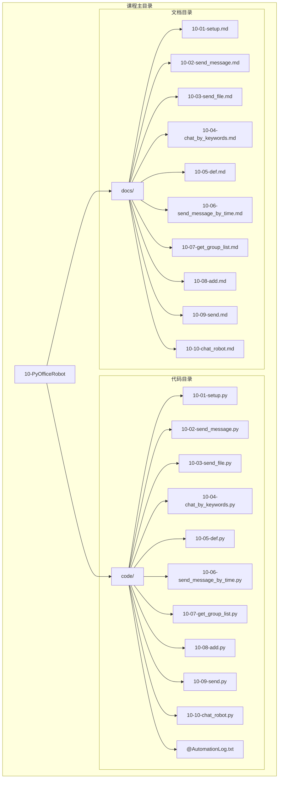
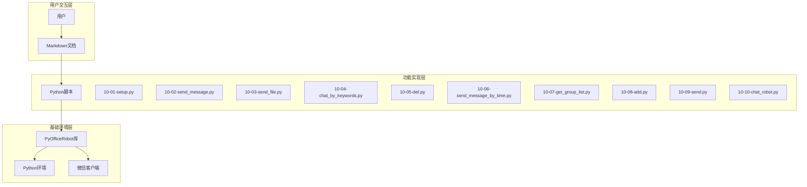
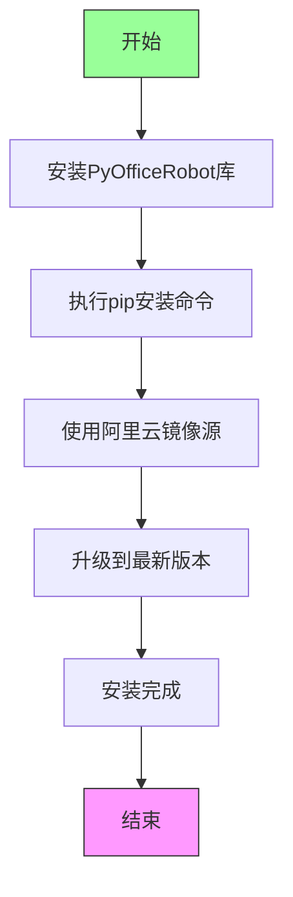
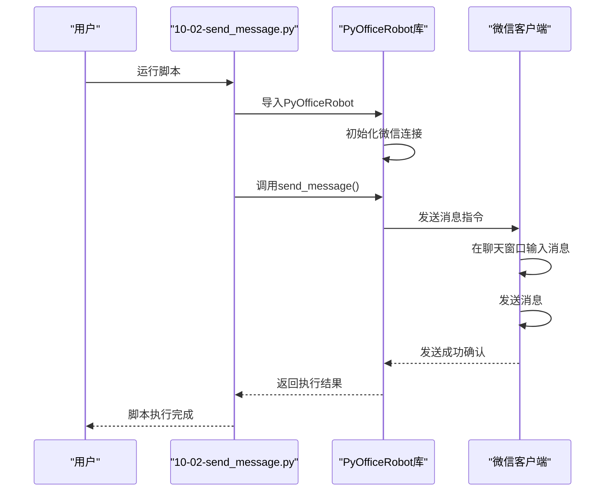
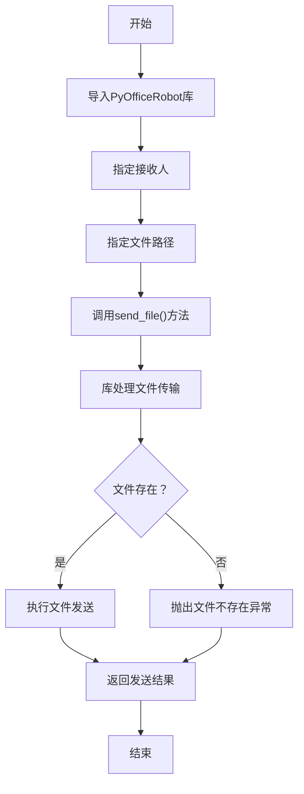
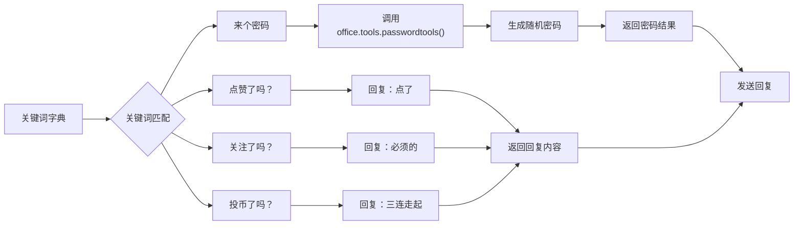
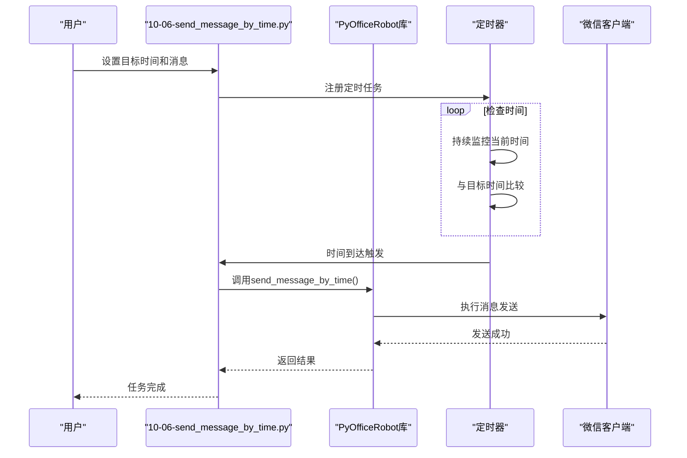
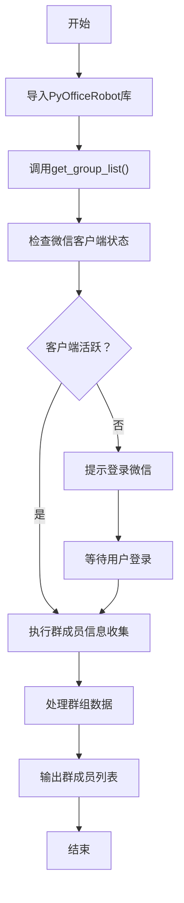
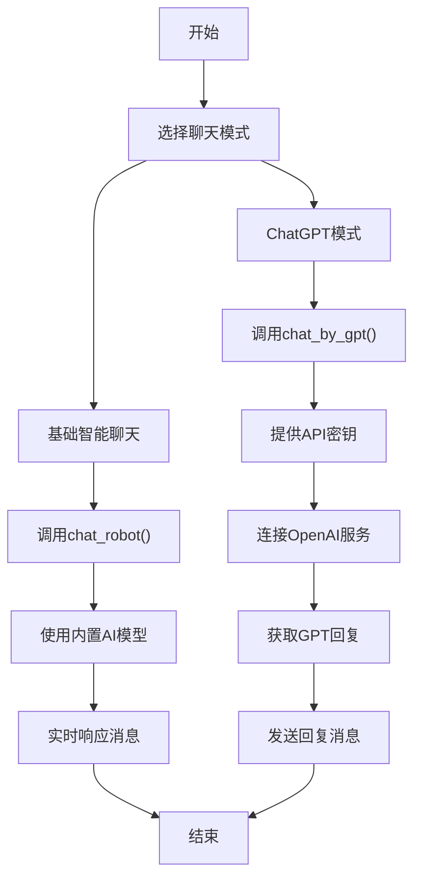
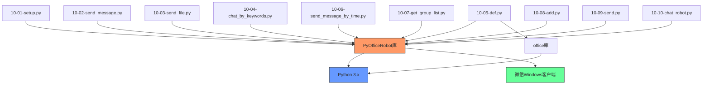

# PyOfficeRobot微信机器人课程

<cite>
**本文档中引用的文件**   
- [10-01-setup.py](file://docs-pages/vuepress/course-002/10-PyOfficeRobot/code/10-01-setup.py)
- [10-02-send_message.py](file://docs-pages/vuepress/course-002/10-PyOfficeRobot/code/10-02-send_message.py)
- [10-03-send_file.py](file://docs-pages/vuepress/course-002/10-PyOfficeRobot/code/10-03-send_file.py)
- [10-04-chat_by_keywords.py](file://docs-pages/vuepress/course-002/10-PyOfficeRobot/code/10-04-chat_by_keywords.py)
- [10-05-def.py](file://docs-pages/vuepress/course-002/10-PyOfficeRobot/code/10-05-def.py)
- [10-06-send_message_by_time.py](file://docs-pages/vuepress/course-002/10-PyOfficeRobot/code/10-06-send_message_by_time.py)
- [10-07-get_group_list.py](file://docs-pages/vuepress/course-002/10-PyOfficeRobot/code/10-07-get_group_list.py)
- [10-08-add.py](file://docs-pages/vuepress/course-002/10-PyOfficeRobot/code/10-08-add.py)
- [10-09-send.py](file://docs-pages/vuepress/course-002/10-PyOfficeRobot/code/10-09-send.py)
- [10-10-chat_robot.py](file://docs-pages/vuepress/course-002/10-PyOfficeRobot/code/10-10-chat_robot.py)
- [10-01-setup.md](file://docs-pages/vuepress/course-002/10-PyOfficeRobot/docs/10-01-setup.md)
- [10-02-send_message.md](file://docs-pages/vuepress/course-002/10-PyOfficeRobot/docs/10-02-send_message.md)
- [10-03-send_file.md](file://docs-pages/vuepress/course-002/10-PyOfficeRobot/docs/10-03-send_file.md)
- [10-04-chat_by_keywords.md](file://docs-pages/vuepress/course-002/10-PyOfficeRobot/docs/10-04-chat_by_keywords.md)
- [10-05-def.md](file://docs-pages/vuepress/course-002/10-PyOfficeRobot/docs/10-05-def.md)
- [10-06-send_message_by_time.md](file://docs-pages/vuepress/course-002/10-PyOfficeRobot/docs/10-06-send_message_by_time.md)
- [10-07-get_group_list.md](file://docs-pages/vuepress/course-002/10-PyOfficeRobot/docs/10-07-get_group_list.md)
- [10-08-add.md](file://docs-pages/vuepress/course-002/10-PyOfficeRobot/docs/10-08-add.md)
- [10-09-send.md](file://docs-pages/vuepress/course-002/10-PyOfficeRobot/docs/10-09-send.md)
- [10-10-chat_robot.md](file://docs-pages/vuepress/course-002/10-PyOfficeRobot/docs/10-10-chat_robot.md)
</cite>

## 目录
1. [简介](#简介)
2. [项目结构](#项目结构)
3. [核心组件](#核心组件)
4. [架构概述](#架构概述)
5. [详细组件分析](#详细组件分析)
6. [依赖分析](#依赖分析)
7. [性能考虑](#性能考虑)
8. [故障排除指南](#故障排除指南)
9. [结论](#结论)

## 简介
PyOfficeRobot微信机器人课程是一套完整的Python自动化微信操作教学体系，旨在帮助用户通过python-office库实现微信的自动化功能。本课程覆盖了从环境配置、账号登录到消息发送、文件传输、关键词自动回复、定时消息、群组管理及好友添加等完整的功能链。课程内容以10个核心脚本文件为基础，每个文件对应一个特定功能模块，通过简单易懂的代码示例和详细的文档说明，指导用户构建自己的微信自动化机器人。本课程特别强调安全使用规范，提醒用户注意避免因频繁操作导致的账号封禁风险。

## 项目结构
PyOfficeRobot微信机器人课程的文件组织结构清晰，分为代码和文档两大目录，便于学习和使用。



**图示来源**
- [10-01-setup.py](file://docs-pages/vuepress/course-002/10-PyOfficeRobot/code/10-01-setup.py)
- [10-02-send_message.py](file://docs-pages/vuepress/course-002/10-PyOfficeRobot/code/10-02-send_message.py)
- [10-03-send_file.py](file://docs-pages/vuepress/course-002/10-PyOfficeRobot/code/10-03-send_file.py)
- [10-04-chat_by_keywords.py](file://docs-pages/vuepress/course-002/10-PyOfficeRobot/code/10-04-chat_by_keywords.py)
- [10-01-setup.md](file://docs-pages/vuepress/course-002/10-PyOfficeRobot/docs/10-01-setup.md)
- [10-02-send_message.md](file://docs-pages/vuepress/course-002/10-PyOfficeRobot/docs/10-02-send_message.md)

**本节来源**
- [10-01-setup.py](file://docs-pages/vuepress/course-002/10-PyOfficeRobot/code/10-01-setup.py)
- [10-02-send_message.py](file://docs-pages/vuepress/course-002/10-PyOfficeRobot/code/10-02-send_message.py)
- [10-03-send_file.py](file://docs-pages/vuepress/course-002/10-PyOfficeRobot/code/10-03-send_file.py)
- [10-04-chat_by_keywords.py](file://docs-pages/vuepress/course-002/10-PyOfficeRobot/code/10-04-chat_by_keywords.py)
- [10-01-setup.md](file://docs-pages/vuepress/course-002/10-PyOfficeRobot/docs/10-01-setup.md)
- [10-02-send_message.md](file://docs-pages/vuepress/course-002/10-PyOfficeRobot/docs/10-02-send_message.md)

## 核心组件
PyOfficeRobot微信机器人课程的核心组件由10个Python脚本文件构成，每个文件实现一个特定的微信自动化功能。这些组件通过PyOfficeRobot库提供的统一接口，实现了对微信客户端的自动化控制。

**本节来源**
- [10-01-setup.py](file://docs-pages/vuepress/course-002/10-PyOfficeRobot/code/10-01-setup.py)
- [10-02-send_message.py](file://docs-pages/vuepress/course-002/10-PyOfficeRobot/code/10-02-send_message.py)
- [10-03-send_file.py](file://docs-pages/vuepress/course-002/10-PyOfficeRobot/code/10-03-send_file.py)
- [10-04-chat_by_keywords.py](file://docs-pages/vuepress/course-002/10-PyOfficeRobot/code/10-04-chat_by_keywords.py)
- [10-05-def.py](file://docs-pages/vuepress/course-002/10-PyOfficeRobot/code/10-05-def.py)

## 架构概述
PyOfficeRobot微信机器人课程采用模块化架构设计，每个功能模块独立实现，通过统一的PyOfficeRobot库进行调用。系统架构分为三层：基础环境层、功能实现层和用户交互层。



**图示来源**
- [10-01-setup.py](file://docs-pages/vuepress/course-002/10-PyOfficeRobot/code/10-01-setup.py)
- [10-02-send_message.py](file://docs-pages/vuepress/course-002/10-PyOfficeRobot/code/10-02-send_message.py)
- [10-03-send_file.py](file://docs-pages/vuepress/course-002/10-PyOfficeRobot/code/10-03-send_file.py)
- [10-04-chat_by_keywords.py](file://docs-pages/vuepress/course-002/10-PyOfficeRobot/code/10-04-chat_by_keywords.py)

## 详细组件分析
PyOfficeRobot微信机器人课程的每个组件都实现了特定的微信自动化功能，通过简单的API调用即可实现复杂操作。

### 环境配置组件分析
环境配置组件是使用PyOfficeRobot库的第一步，负责安装必要的依赖和配置运行环境。



**图示来源**
- [10-01-setup.py](file://docs-pages/vuepress/course-002/10-PyOfficeRobot/code/10-01-setup.py)

**本节来源**
- [10-01-setup.py](file://docs-pages/vuepress/course-002/10-PyOfficeRobot/code/10-01-setup.py)
- [10-01-setup.md](file://docs-pages/vuepress/course-002/10-PyOfficeRobot/docs/10-01-setup.md)

### 消息发送组件分析
消息发送组件实现了向指定联系人自动发送文本消息的功能，支持换行等特殊格式。



**图示来源**
- [10-02-send_message.py](file://docs-pages/vuepress/course-002/10-PyOfficeRobot/code/10-02-send_message.py)

**本节来源**
- [10-02-send_message.py](file://docs-pages/vuepress/course-002/10-PyOfficeRobot/code/10-02-send_message.py)
- [10-02-send_message.md](file://docs-pages/vuepress/course-002/10-PyOfficeRobot/docs/10-02-send_message.md)

### 文件发送组件分析
文件发送组件实现了向指定联系人自动发送文件的功能，支持各种类型的文件传输。



**图示来源**
- [10-03-send_file.py](file://docs-pages/vuepress/course-002/10-PyOfficeRobot/code/10-03-send_file.py)

**本节来源**
- [10-03-send_file.py](file://docs-pages/vuepress/course-002/10-PyOfficeRobot/code/10-03-send_file.py)
- [10-03-send_file.md](file://docs-pages/vuepress/course-002/10-PyOfficeRobot/docs/10-03-send_file.md)

### 关键词回复组件分析
关键词回复组件实现了智能应答功能，当收到特定关键词时自动回复预设内容。

```mermaid
classDiagram
class KeywordsReply
KeywordsReply : +dict keywords
KeywordsReply : +str who
KeywordsReply : +chat_by_keywords(who, keywords)
KeywordsReply : +handle_message(message)
KeywordsReply : +match_keyword(message)
class MessageHandler
MessageHandler : +receive_message()
MessageHandler : +process_message()
MessageHandler : +send_response()
KeywordsReply --> MessageHandler : "使用"
KeywordsReply : keywords = {"我要报名" : "报名链接", "你好" : "你也好"}
```

**图示来源**
- [10-04-chat_by_keywords.py](file://docs-pages/vuepress/course-002/10-PyOfficeRobot/code/10-04-chat_by_keywords.py)

**本节来源**
- [10-04-chat_by_keywords.py](file://docs-pages/vuepress/course-002/10-PyOfficeRobot/code/10-04-chat_by_keywords.py)
- [10-04-chat_by_keywords.md](file://docs-pages/vuepress/course-002/10-PyOfficeRobot/docs/10-04-chat_by_keywords.md)

### 自定义功能组件分析
自定义功能组件展示了如何将其他功能集成到关键词回复系统中，实现更复杂的功能。



**图示来源**
- [10-05-def.py](file://docs-pages/vuepress/course-002/10-PyOfficeRobot/code/10-05-def.py)

**本节来源**
- [10-05-def.py](file://docs-pages/vuepress/course-002/10-PyOfficeRobot/code/10-05-def.py)
- [10-05-def.md](file://docs-pages/vuepress/course-002/10-PyOfficeRobot/docs/10-05-def.md)

### 定时消息组件分析
定时消息组件实现了在指定时间自动发送消息的功能，适用于提醒、问候等场景。



**图示来源**
- [10-06-send_message_by_time.py](file://docs-pages/vuepress/course-002/10-PyOfficeRobot/code/10-06-send_message_by_time.py)

**本节来源**
- [10-06-send_message_by_time.py](file://docs-pages/vuepress/course-002/10-PyOfficeRobot/code/10-06-send_message_by_time.py)
- [10-06-send_message_by_time.md](file://docs-pages/vuepress/course-002/10-PyOfficeRobot/docs/10-06-send_message_by_time.md)

### 群组管理组件分析
群组管理组件提供了收集群成员信息的功能，为群组管理和分析提供数据支持。



**图示来源**
- [10-07-get_group_list.py](file://docs-pages/vuepress/course-002/10-PyOfficeRobot/code/10-07-get_group_list.py)

**本节来源**
- [10-07-get_group_list.py](file://docs-pages/vuepress/course-002/10-PyOfficeRobot/code/10-07-get_group_list.py)
- [10-07-get_group_list.md](file://docs-pages/vuepress/course-002/10-PyOfficeRobot/docs/10-07-get_group_list.md)

### 好友添加组件分析
好友添加组件实现了批量添加好友的功能，通过预设的备注信息自动化好友请求流程。

```mermaid
classDiagram
class FriendAdder
FriendAdder : +str msg
FriendAdder : +dict num_notes
FriendAdder : +add(msg, num_notes)
FriendAdder : +validate_input()
FriendAdder : +send_friend_request()
FriendAdder : +set_remark_name()
class ContactInfo
ContactInfo : +str wechat_id
ContactInfo : +str phone_number
ContactInfo : +str remark_name
FriendAdder --> ContactInfo : "包含"
FriendAdder : msg = "你好，我是程序员晚枫"
FriendAdder : num_notes = {"python-office" : "公众号-晚枫"}
```

**图示来源**
- [10-08-add.py](file://docs-pages/vuepress/course-002/10-PyOfficeRobot/code/10-08-add.py)

**本节来源**
- [10-08-add.py](file://docs-pages/vuepress/course-002/10-PyOfficeRobot/code/10-08-add.py)
- [10-08-add.md](file://docs-pages/vuepress/course-002/10-PyOfficeRobot/docs/10-08-add.md)

### 智能聊天组件分析
智能聊天组件提供了两种聊天模式：基础智能聊天和基于ChatGPT的高级聊天。



**图示来源**
- [10-10-chat_robot.py](file://docs-pages/vuepress/course-002/10-PyOfficeRobot/code/10-10-chat_robot.py)

**本节来源**
- [10-10-chat_robot.py](file://docs-pages/vuepress/course-002/10-PyOfficeRobot/code/10-10-chat_robot.py)
- [10-10-chat_robot.md](file://docs-pages/vuepress/course-002/10-PyOfficeRobot/docs/10-10-chat_robot.md)

## 依赖分析
PyOfficeRobot微信机器人课程的各个组件之间存在清晰的依赖关系，所有功能都依赖于PyOfficeRobot库的核心功能。



**图示来源**
- [10-01-setup.py](file://docs-pages/vuepress/course-002/10-PyOfficeRobot/code/10-01-setup.py)
- [10-02-send_message.py](file://docs-pages/vuepress/course-002/10-PyOfficeRobot/code/10-02-send_message.py)
- [10-03-send_file.py](file://docs-pages/vuepress/course-002/10-PyOfficeRobot/code/10-03-send_file.py)

**本节来源**
- [10-01-setup.py](file://docs-pages/vuepress/course-002/10-PyOfficeRobot/code/10-01-setup.py)
- [10-02-send_message.py](file://docs-pages/vuepress/course-002/10-PyOfficeRobot/code/10-02-send_message.py)
- [10-03-send_file.py](file://docs-pages/vuepress/course-002/10-PyOfficeRobot/code/10-03-send_file.py)
- [10-04-chat_by_keywords.py](file://docs-pages/vuepress/course-002/10-PyOfficeRobot/code/10-04-chat_by_keywords.py)
- [10-05-def.py](file://docs-pages/vuepress/course-002/10-PyOfficeRobot/code/10-05-def.py)

## 性能考虑
PyOfficeRobot微信机器人课程的性能主要受微信客户端响应速度和网络状况影响。由于所有操作都需要通过模拟用户界面来实现，因此执行速度相对较慢。建议在使用时注意以下几点：避免过于频繁的操作以防止触发微信的反自动化机制；确保网络连接稳定以保证消息发送的可靠性；在批量操作时适当添加延迟以模拟真实用户行为。此外，定时任务的精度受系统时钟影响，建议在关键时间点前进行测试验证。

## 故障排除指南
使用PyOfficeRobot微信机器人时可能遇到的常见问题及解决方案：

**本节来源**
- [10-01-setup.py](file://docs-pages/vuepress/course-002/10-PyOfficeRobot/code/10-01-setup.py)
- [10-02-send_message.py](file://docs-pages/vuepress/course-002/10-PyOfficeRobot/code/10-02-send_message.py)
- [10-03-send_file.py](file://docs-pages/vuepress/course-002/10-PyOfficeRobot/code/10-03-send_file.py)

## 结论
PyOfficeRobot微信机器人课程提供了一套完整、易用的微信自动化解决方案。通过10个精心设计的脚本文件，用户可以轻松实现从基础消息发送到智能聊天的各种功能。课程采用模块化设计，每个组件独立且功能明确，便于学习和扩展。文档与代码紧密结合，为用户提供了清晰的学习路径。值得注意的是，由于微信的反自动化策略，使用此类工具时应谨慎操作，避免频繁或大规模的自动化行为，以防账号被封禁。建议将此工具用于个人效率提升而非商业用途，并始终遵守微信的使用条款。