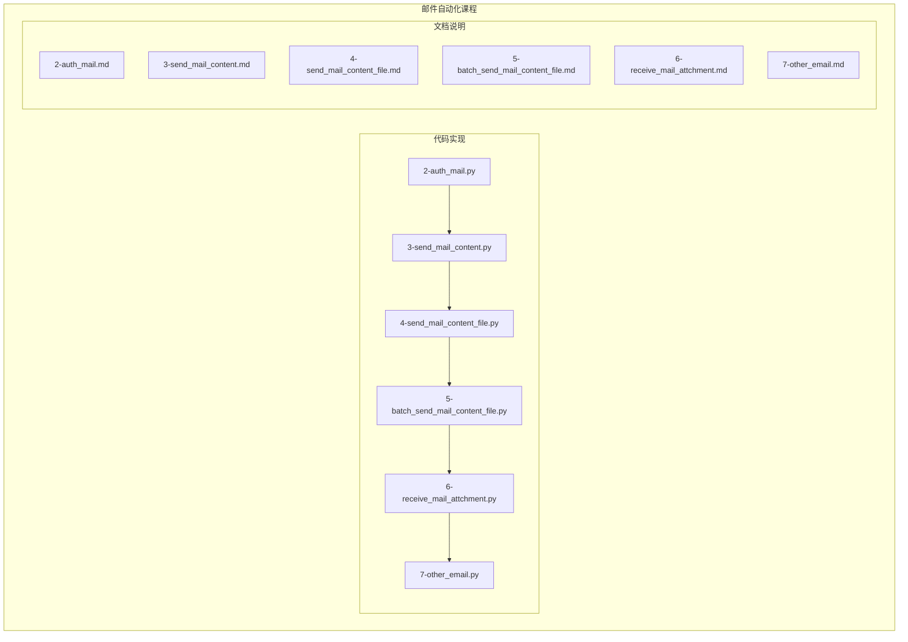
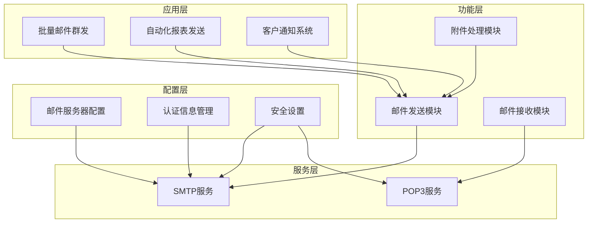
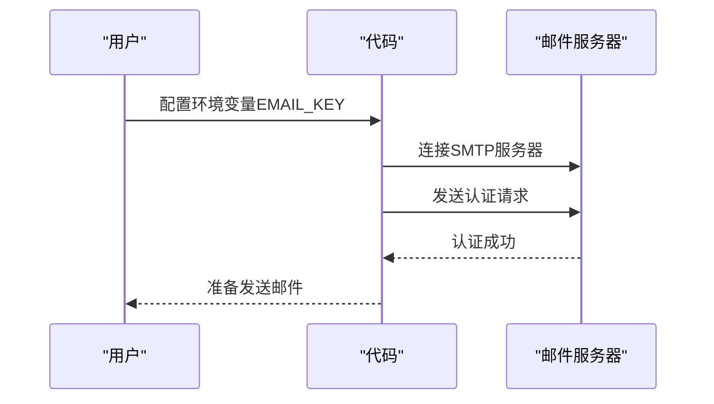
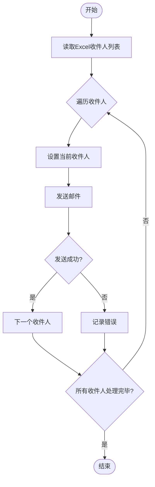
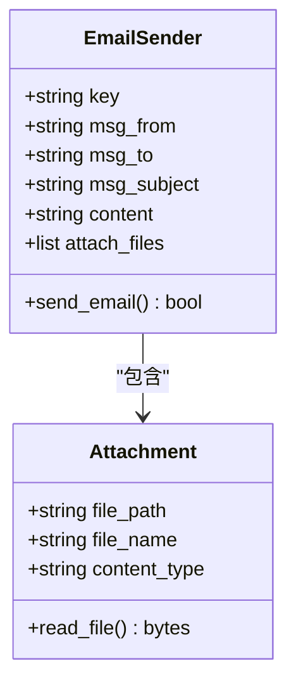
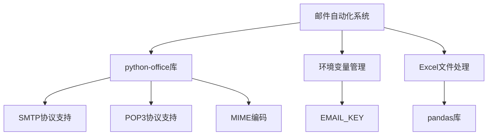

# poemail邮件自动化课程

<cite>
**本文档中引用的文件**   
- [2-auth_mail.py](file://docs-pages\vuepress\course-002\poemail\code\2-auth_mail.py)
- [3-send_mail_content.py](file://docs-pages\vuepress\course-002\poemail\code\3-send_mail_content.py)
- [4-send_mail_content_file.py](file://docs-pages\vuepress\course-002\poemail\code\4-send_mail_content_file.py)
- [5-batch_send_mail_content_file.py](file://docs-pages\vuepress\course-002\poemail\code\5-batch_send_mail_content_file.py)
- [6-receive_mail_attchment.py](file://docs-pages\vuepress\course-002\poemail\code\6-receive_mail_attchment.py)
- [7-other_email.py](file://docs-pages\vuepress\course-002\poemail\code\7-other_email.py)
- [2-auth_mail.md](file://docs-pages\vuepress\course-002\poemail\docs\2-auth_mail.md)
- [3-send_mail_content.md](file://docs-pages\vuepress\course-002\poemail\docs\3-send_mail_content.md)
- [4-send_mail_content_file.md](file://docs-pages\vuepress\course-002\poemail\docs\4-send_mail_content_file.md)
- [5-batch_send_mail_content_file.md](file://docs-pages\vuepress\course-002\poemail\docs\5-batch_send_mail_content_file.md)
- [6-receive_mail_attchment.md](file://docs-pages\vuepress\course-002\poemail\docs\6-receive_mail_attchment.md)
- [7-other_email.md](file://docs-pages\vuepress\course-002\poemail\docs\7-other_email.md)
</cite>

## 目录
1. [简介](#简介)
2. [项目结构](#项目结构)
3. [核心组件](#核心组件)
4. [架构概述](#架构概述)
5. [详细组件分析](#详细组件分析)
6. [依赖分析](#依赖分析)
7. [性能考虑](#性能考虑)
8. [故障排除指南](#故障排除指南)
9. [结论](#结论)

## 简介
本课程系统讲解使用python-office库实现邮件自动化的完整技术体系。课程涵盖从SMTP/POP3协议配置、邮件认证到单邮件发送、带附件邮件发送、批量邮件群发、邮件接收与附件下载等核心功能。通过代码实例深入分析每个脚本的工作原理，提供企业级应用示例，并包含安全最佳实践和常见问题解决方案。

## 项目结构
邮件自动化课程位于`docs-pages\vuepress\course-002\poemail`目录下，包含代码实现和文档说明两个主要部分。代码文件以数字前缀命名，按学习顺序组织，从基础认证到高级批量处理功能逐步深入。

**Diagram sources**
- [2-auth_mail.py](file://docs-pages\vuepress\course-002\poemail\code\2-auth_mail.py)
- [3-send_mail_content.py](file://docs-pages\vuepress\course-002\poemail\code\3-send_mail_content.py)
- [4-send_mail_content_file.py](file://docs-pages\vuepress\course-002\poemail\code\4-send_mail_content_file.py)
- [5-batch_send_mail_content_file.py](file://docs-pages\vuepress\course-002\poemail\code\5-batch_send_mail_content_file.py)
- [6-receive_mail_attchment.py](file://docs-pages\vuepress\course-002\poemail\code\6-receive_mail_attchment.py)
- [7-other_email.py](file://docs-pages\vuepress\course-002\poemail\code\7-other_email.py)

**Section sources**
- [2-auth_mail.py](file://docs-pages\vuepress\course-002\poemail\code\2-auth_mail.py)
- [3-send_mail_content.py](file://docs-pages\vuepress\course-002\poemail\code\3-send_mail_content.py)
- [4-send_mail_content_file.py](file://docs-pages\vuepress\course-002\poemail\code\4-send_mail_content_file.py)

## 核心组件

邮件自动化课程的核心组件包括邮件认证、单邮件发送、带附件邮件发送、批量邮件群发、邮件接收与附件下载等功能模块。每个组件都通过简洁的API设计实现复杂的功能，降低了邮件自动化开发的门槛。

**Section sources**
- [2-auth_mail.py](file://docs-pages\vuepress\course-002\poemail\code\2-auth_mail.py#L1-L10)
- [3-send_mail_content.py](file://docs-pages\vuepress\course-002\poemail\code\3-send_mail_content.py#L1-L20)
- [4-send_mail_content_file.py](file://docs-pages\vuepress\course-002\poemail\code\4-send_mail_content_file.py#L1-L25)

## 架构概述

邮件自动化系统的架构基于python-office库的模块化设计，通过分层抽象简化了SMTP/POP3协议的复杂性。系统架构分为配置层、认证层、发送层、接收层和应用层，各层之间通过清晰的接口进行通信。

**Diagram sources**
- [2-auth_mail.py](file://docs-pages\vuepress\course-002\poemail\code\2-auth_mail.py#L1-L10)
- [5-batch_send_mail_content_file.py](file://docs-pages\vuepress\course-002\poemail\code\5-batch_send_mail_content_file.py#L1-L41)
- [6-receive_mail_attchment.py](file://docs-pages\vuepress\course-002\poemail\code\6-receive_mail_attchment.py#L1-L30)

## 详细组件分析

### 邮件认证机制分析
邮件认证是邮件自动化系统的安全基础，通过App密码和环境变量管理敏感信息，确保认证过程的安全性。

**Diagram sources**
- [2-auth_mail.py](file://docs-pages\vuepress\course-002\poemail\code\2-auth_mail.py#L1-L10)

**Section sources**
- [2-auth_mail.py](file://docs-pages\vuepress\course-002\poemail\code\2-auth_mail.py#L1-L10)
- [2-auth_mail.md](file://docs-pages\vuepress\course-002\poemail\docs\2-auth_mail.md#L1-L55)

### 批量邮件发送逻辑分析
批量邮件群发功能通过读取Excel文件中的收件人列表，实现高效的邮件群发。该功能特别适用于企业级应用，如自动化报表发送和客户通知系统。

**Diagram sources**
- [5-batch_send_mail_content_file.py](file://docs-pages\vuepress\course-002\poemail\code\5-batch_send_mail_content_file.py#L1-L41)
- [5-batch_send_mail_content_file.md](file://docs-pages\vuepress\course-002\poemail\docs\5-batch_send_mail_content_file.md#L1-L57)

**Section sources**
- [5-batch_send_mail_content_file.py](file://docs-pages\vuepress\course-002\poemail\code\5-batch_send_mail_content_file.py#L1-L41)
- [5-batch_send_mail_content_file.md](file://docs-pages\vuepress\course-002\poemail\docs\5-batch_send_mail_content_file.md#L1-L57)

### 带附件邮件发送分析
带附件邮件发送功能支持多个附件的批量添加，通过简洁的API设计简化了复杂的MIME编码过程。

**Diagram sources**
- [4-send_mail_content_file.py](file://docs-pages\vuepress\course-002\poemail\code\4-send_mail_content_file.py#L1-L30)
- [4-send_mail_content_file.md](file://docs-pages\vuepress\course-002\poemail\docs\4-send_mail_content_file.md#L1-L57)

**Section sources**
- [4-send_mail_content_file.py](file://docs-pages\vuepress\course-002\poemail\code\4-send_mail_content_file.py#L1-L30)
- [4-send_mail_content_file.md](file://docs-pages\vuepress\course-002\poemail\docs\4-send_mail_content_file.md#L1-L57)

## 依赖分析

邮件自动化系统依赖于python-office库提供的核心功能，通过环境变量管理敏感信息，确保系统的安全性和可配置性。

**Diagram sources**
- [5-batch_send_mail_content_file.py](file://docs-pages\vuepress\course-002\poemail\code\5-batch_send_mail_content_file.py#L1-L41)
- [6-receive_mail_attchment.py](file://docs-pages\vuepress\course-002\poemail\code\6-receive_mail_attchment.py#L1-L30)

**Section sources**
- [5-batch_send_mail_content_file.py](file://docs-pages\vuepress\course-002\poemail\code\5-batch_send_mail_content_file.py#L1-L41)
- [6-receive_mail_attchment.py](file://docs-pages\vuepress\course-002\poemail\code\6-receive_mail_attchment.py#L1-L30)

## 性能考虑

在批量邮件发送场景中，性能优化至关重要。建议采用批量处理、连接复用和错误重试机制来提高系统性能和可靠性。

**Section sources**
- [5-batch_send_mail_content_file.py](file://docs-pages\vuepress\course-002\poemail\code\5-batch_send_mail_content_file.py#L1-L41)

## 故障排除指南

常见问题包括邮件被拦截、附件大小限制和编码乱码等。解决方案包括使用App密码、分批发送大附件和统一编码格式。

**Section sources**
- [2-auth_mail.py](file://docs-pages\vuepress\course-002\poemail\code\2-auth_mail.py#L1-L10)
- [5-batch_send_mail_content_file.py](file://docs-pages\vuepress\course-002\poemail\code\5-batch_send_mail_content_file.py#L1-L41)

## 结论

poemail邮件自动化课程提供了完整的邮件自动化解决方案，从基础认证到高级批量处理功能一应俱全。通过python-office库的简洁API，开发者可以快速实现各种邮件自动化场景，提高工作效率。