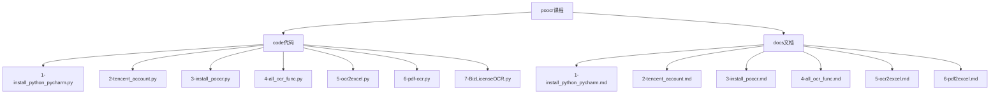
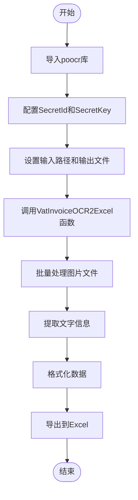
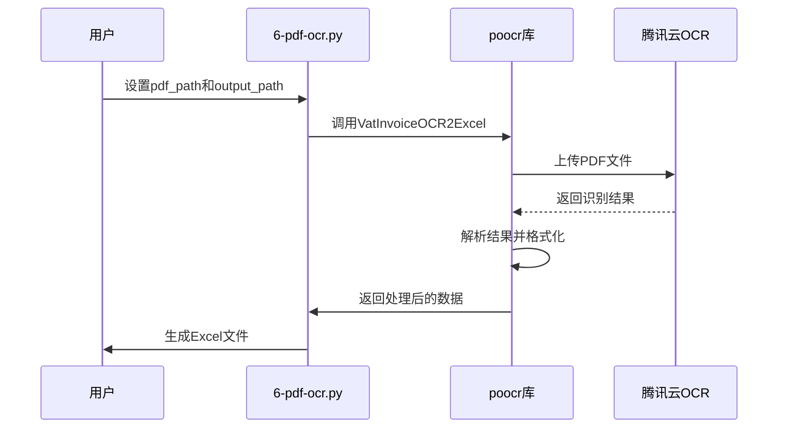

# poocr文字批量识别课程

<cite>
**本文档中引用的文件**   
- [5-ocr2excel.py](file://docs-pages\vuepress\course-002\5-poocr\code\5-ocr2excel.py)
- [6-pdf-ocr.py](file://docs-pages\vuepress\course-002\5-poocr\code\6-pdf-ocr.py)
- [7-BizLicenseOCR.py](file://docs-pages\vuepress\course-002\5-poocr\code\7-BizLicenseOCR.py)
- [3-install_poocr.py](file://docs-pages\vuepress\course-002\5-poocr\code\3-install_poocr.py)
- [5-ocr2excel.md](file://docs-pages\vuepress\course-002\5-poocr\docs\5-ocr2excel.md)
- [6-pdf2excel.md](file://docs-pages\vuepress\course-002\5-poocr\docs\6-pdf2excel.md)
- [5-poocr.md](file://docs-pages\vuepress\course-002\5-poocr\5-poocr.md)
</cite>

## 目录
1. [简介](#简介)
2. [项目结构](#项目结构)
3. [环境搭建与配置](#环境搭建与配置)
4. [poocr库核心功能](#poocr库核心功能)
5. [批量文字识别导出Excel](#批量文字识别导出excel)
6. [PDF文件OCR处理](#pdf文件ocr处理)
7. [高级OCR应用场景](#高级ocr应用场景)
8. [错误处理与优化策略](#错误处理与优化策略)
9. [总结与扩展](#总结与扩展)

## 简介

本课程旨在系统性地指导用户掌握使用poocr库进行文字批量识别的完整流程。poocr是一个基于腾讯云OCR技术的Python第三方库，能够实现高达99%准确率的文字识别，支持100多种场景的文字识别需求，包括发票、身份证、营业执照、银行卡、车牌号等常见文档类型。

课程从环境搭建开始，逐步深入到实际应用，重点讲解如何将图片或PDF文件中的文字批量提取并自动导出到Excel文件中。通过学习本课程，用户无需深入了解复杂的编程知识，只需掌握简单的代码调用即可实现高效的OCR批量处理功能。

**本课程特点：**
- 面向初学者，无需深厚编程基础
- 每个功能仅需1-3行代码即可实现
- 支持多种文档类型的批量识别
- 提供完整的错误处理和优化策略

## 项目结构

poocr文字识别课程的项目结构清晰，按照功能模块进行组织，便于学习和使用。



**Diagram sources**
- [5-poocr.md](file://docs-pages\vuepress\course-002\5-poocr\5-poocr.md)

**Section sources**
- [5-poocr.md](file://docs-pages\vuepress\course-002\5-poocr\5-poocr.md)

## 环境搭建与配置

### 安装Python和PyCharm

首先需要安装Python环境和PyCharm开发工具。课程提供了详细的安装指南，确保初学者能够顺利搭建开发环境。

### 配置腾讯云OCR服务

poocr库底层依赖腾讯云的OCR服务，因此需要配置腾讯云账号的SecretId和SecretKey。每个新用户都有1000次免费调用额度，足以满足初步学习和测试需求。

```python
# 示例配置
SecretId = 'AKIDztbwHThnrtr7IHUm3Pugeq0vpfbeq4GY'
SecretKey = 'Hi3KgI0b1FNes7Qlx5JnGg3jIm7HMZ2W'
```

### 安装poocr库

安装poocr库非常简单，只需执行以下命令：

```bash
pip install poocr -U
```

安装完成后，即可在Python代码中导入并使用poocr库的各种OCR功能。

**Section sources**
- [3-install_poocr.py](file://docs-pages\vuepress\course-002\5-poocr\code\3-install_poocr.py)
- [5-poocr.md](file://docs-pages\vuepress\course-002\5-poocr\5-poocr.md)

## poocr库核心功能

poocr库提供了丰富的OCR识别功能，涵盖了日常办公中的多种场景需求。

### 支持的OCR功能类型

| 调用方法 | 功能说明 |
|---------|---------|
| VatInvoiceOCR2Excel | 发票识别 |
| IDCardOCR2Excel | 身份证识别 |
| TrainTicketOCR2Excel | 火车票识别 |
| BankCardOCR2Excel | 银行卡识别 |
| LicensePlateOCR2Excel | 车牌号识别 |
| BizLicenseOCR2Excel | 营业执照识别 |

### 功能调用方式

所有功能的调用方式都非常简单，通常只需要三步：
1. 导入poocr库
2. 配置腾讯云SecretId和SecretKey
3. 调用相应的OCR函数

```python
import poocr

# 配置密钥
SecretId = 'your_secret_id'
SecretKey = 'your_secret_key'

# 调用发票识别功能
poocr.ocr2excel.VatInvoiceOCR2Excel(
    input_path=r'path/to/your/invoice/files',
    output_excel='output.xlsx',
    id=SecretId, 
    key=SecretKey
)
```

**Section sources**
- [4-all_ocr_func.py](file://docs-pages\vuepress\course-002\5-poocr\code\4-all_ocr_func.py)
- [5-poocr.md](file://docs-pages\vuepress\course-002\5-poocr\5-poocr.md)

## 批量文字识别导出Excel

### 5-ocr2excel.py实现机制

`5-ocr2excel.py`是课程中的核心文件之一，实现了将图片中的文字识别后批量导出到Excel的功能。

#### 核心功能流程



**Diagram sources**
- [5-ocr2excel.py](file://docs-pages\vuepress\course-002\5-poocr\code\5-ocr2excel.py)

#### 代码实现要点

- **输入路径设置**：可以是单个文件路径或包含多个文件的目录路径
- **输出文件配置**：指定生成的Excel文件名和保存路径
- **API密钥传递**：通过id和key参数传递腾讯云OCR服务的认证信息
- **批量处理**：自动遍历指定目录下的所有图片文件进行识别

```python
# 示例代码结构
poocr.ocr2excel.VatInvoiceOCR2Excel(
    input_path=r'D:\test\py310\poocr_test\程序员晚枫的发票\3、滴滴发票-鼠标垫滴滴送过来的.pdf',
    output_excel='./test_files/发票识别结果（程序员晚枫）-多个.xlsx',
    id=SecretId, 
    key=SecretKey
)
```

**Section sources**
- [5-ocr2excel.py](file://docs-pages\vuepress\course-002\5-poocr\code\5-ocr2excel.py)
- [5-ocr2excel.md](file://docs-pages\vuepress\course-002\5-poocr\docs\5-ocr2excel.md)

## PDF文件OCR处理

### 6-pdf-ocr.py实现机制

`6-pdf-ocr.py`文件专门用于处理PDF格式文件的OCR识别，扩展了poocr库的功能范围。

#### PDF处理流程



**Diagram sources**
- [6-pdf-ocr.py](file://docs-pages\vuepress\course-002\5-poocr\code\6-pdf-ocr.py)

#### 关键参数说明

- `pdf_path`: PDF文件的输入路径，支持单个文件或目录
- `output_path`: 识别结果的输出目录
- `file_name=False`: 控制是否在输出文件名中包含原始文件名

#### 实现特点

1. **PDF格式支持**：能够直接处理PDF文件，无需预先转换为图片
2. **批量处理能力**：可一次性处理多个PDF文件
3. **灵活输出配置**：支持自定义输出路径和文件命名规则
4. **无缝集成**：与图片OCR处理保持一致的API接口

```python
# PDF处理示例
poocr.ocr2excel.VatInvoiceOCR2Excel(
    input_path=pdf_path,
    output_path=output_path,
    id=SecretId, 
    key=SecretKey,
    file_name=False
)
```

**Section sources**
- [6-pdf-ocr.py](file://docs-pages\vuepress\course-002\5-poocr\code\6-pdf-ocr.py)
- [6-pdf2excel.md](file://docs-pages\vuepress\course-002\5-poocr\docs\6-pdf2excel.md)

## 高级OCR应用场景

### 营业执照识别

`7-BizLicenseOCR.py`文件展示了如何使用poocr库进行营业执照识别的特殊应用场景。

#### 营业执照识别特点

- 专门针对营业执照的版式和内容进行优化
- 能够准确识别企业名称、注册号、法定代表人等关键信息
- 支持多种营业执照格式

```python
# 营业执照识别示例
poocr.ocr2excel.BizLicenseOCR2Excel(
    r'./test_files/7-营业执照识别/demo1.png',
    output_excel='BizLicenseOCR2Excel.xlsx',
    id=SecretId, 
    key=SecretKey
)
```

### 其他高级功能

poocr库还支持更多高级OCR功能，包括：
- 社保卡识别
- 驾驶证识别
- 护照识别
- 户口本识别

这些功能的调用方式与基础功能类似，体现了poocr库设计的一致性和易用性。

**Section sources**
- [7-BizLicenseOCR.py](file://docs-pages\vuepress\course-002\5-poocr\code\7-BizLicenseOCR.py)
- [5-poocr.md](file://docs-pages\vuepress\course-002\5-poocr\5-poocr.md)

## 错误处理与优化策略

### 常见错误及解决方案

#### API调用频率限制

腾讯云OCR服务对免费用户的调用频率有一定限制，建议：
- 合理安排批量处理任务的时间间隔
- 在代码中添加适当的延迟
- 考虑升级到付费套餐以获得更高的调用配额

#### 图片质量要求

OCR识别效果与图片质量密切相关，建议：
- 确保图片清晰，分辨率不低于300dpi
- 避免图片过暗或过亮
- 尽量保持文档平整，减少褶皱和阴影
- 图片格式推荐使用PNG或高质量JPEG

### 识别准确率优化

#### 预处理建议

- 对模糊图片进行锐化处理
- 调整对比度和亮度以增强文字清晰度
- 去除背景噪声
- 确保文档边缘对齐

#### 参数调优

- 根据文档类型选择最合适的OCR功能
- 对于复杂文档，可尝试多次识别取最优结果
- 合理设置输出格式，便于后续数据处理

### 性能优化

- 批量处理时采用多线程或异步方式提高效率
- 对于大量文件，建议分批处理
- 合理利用缓存机制，避免重复识别相同文件

**Section sources**
- [5-ocr2excel.py](file://docs-pages\vuepress\course-002\5-poocr\code\5-ocr2excel.py)
- [6-pdf-ocr.py](file://docs-pages\vuepress\course-002\5-poocr\code\6-pdf-ocr.py)

## 总结与扩展

### 课程总结

本课程系统地介绍了使用poocr库进行文字批量识别的完整流程，从环境搭建到高级应用，涵盖了实际工作中可能遇到的各种场景。通过学习本课程，用户可以：

1. 快速搭建OCR识别环境
2. 掌握多种文档类型的批量识别方法
3. 实现识别结果自动导出到Excel
4. 处理PDF格式文件的OCR需求
5. 应对实际应用中的各种问题

### 实际应用建议

- **财务场景**：批量处理发票、报销单等财务文档
- **人事管理**：快速录入员工身份证、学历证书等信息
- **档案数字化**：将纸质文档批量转换为电子格式
- **数据采集**：从各种文档中提取结构化数据

### 未来发展

poocr库持续更新，未来可能会支持更多类型的文档识别功能。用户可以根据实际需求，向开发者反馈需要的新功能，共同推动项目发展。

对于不需要编程的用户，课程还提供了exe软件版本，通过简单的鼠标操作即可完成批量OCR识别任务，真正实现了"拿来就用"的目标。

**Section sources**
- [5-poocr.md](file://docs-pages\vuepress\course-002\5-poocr\5-poocr.md)