# popdf PDF自动化办公课程

<cite>
**本文档引用的文件**
- [50-04-pdf2docx.py](file://docs-pages/vuepress/course/code/50-04-pdf2docx.py)
- [50-38-encrypt4pdf.py](file://docs-pages/vuepress/course/code/50-38-encrypt4pdf.py)
- [50-39-decrypt4pdf.py](file://docs-pages/vuepress/course/code/50-39-decrypt4pdf.py)
- [50-41-pdf2imgs.py](file://docs-pages/vuepress/course/code/50-41-pdf2imgs.py)
- [50-37-add_watermark_by_parameters.py](file://docs-pages/vuepress/course/code/50-37-add_watermark_by_parameters.py)
- [50-42-add_watermark.py](file://docs-pages/vuepress/course/code/50-42-add_watermark.py)
- [50-17-del_watermark.py](file://docs-pages/vuepress/course/code/50-17-del_watermark.py)
- [50-40-merge2pdf.py](file://docs-pages/vuepress/course/code/50-40-merge2pdf.py)
- [50-09-search4content.py](file://docs-pages/vuepress/course/code/50-09-search4content.py)
- [50-01-python.md](file://docs-pages/vuepress/course/docs/50-01-python.md)
- [50-03-pip.md](file://docs-pages/vuepress/course/docs/50-03-pip.md)
- [50-04-pdf2docx.md](file://docs-pages/vuepress/course/docs/50-04-pdf2docx.md)
- [50-38-encrypt4pdf.md](file://docs-pages/vuepress/course/docs/50-38-encrypt4pdf.md)
- [50-39-decrypt4pdf.md](file://docs-pages/vuepress/course/docs/50-39-decrypt4pdf.md)
- [50-41-pdf2imgs.md](file://docs-pages/vuepress/course/docs/50-41-pdf2imgs.md)
- [pdf.md](file://docs-pages/vuepress/office/pdf.md)
- [10-popdf.md](file://docs-pages/vuepress/course-002/10-popdf/10-popdf.md)
</cite>

## 目录
1. [课程概述](#课程概述)
2. [环境准备](#环境准备)
3. [核心功能模块](#核心功能模块)
4. [PDF转换技术](#pdf转换技术)
5. [水印处理技术](#水印处理技术)
6. [安全加密技术](#安全加密技术)
7. [批量处理流程](#批量处理流程)
8. [实际应用场景](#实际应用场景)
9. [最佳实践指南](#最佳实践指南)
10. [故障排除](#故障排除)

## 课程概述

popdf PDF自动化办公课程是专门为Python初学者设计的PDF处理技术专项课程。该课程基于专门处理PDF的开源项目popdf，提供了一套完整的PDF自动化解决方案，涵盖了PDF文件处理的所有核心场景。

### 课程特色

- **简单易用**：所有功能只需1-3行代码即可实现
- **实用性强**：涵盖热门的PDF办公需求
- **零基础友好**：无需复杂编程知识，拿来即用
- **内容丰富**：包含10个独立的功能模块

### 核心技术栈

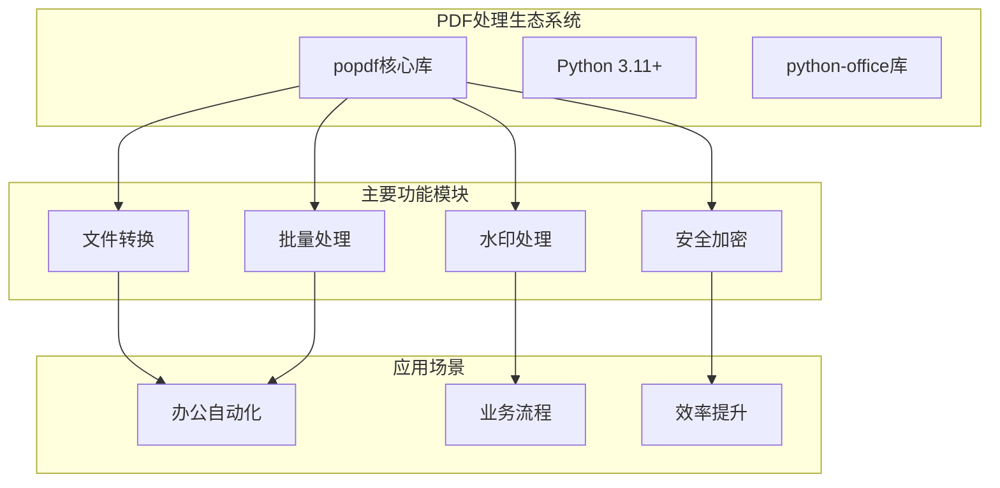
```mermaid
graph TB
subgraph "PDF处理生态系统"
POPDF[popdf核心库]
PYTHON[Python 3.11+]
OFFICE[python-office库]
end
subgraph "主要功能模块"
CONVERSION[文件转换]
WATERMARK[水印处理]
SECURITY[安全加密]
BATCH[批量处理]
end
subgraph "应用场景"
AUTOMATION[办公自动化]
WORKFLOW[业务流程]
PRODUCTIVITY[效率提升]
end
POPDF --> CONVERSION
POPDF --> WATERMARK
POPDF --> SECURITY
POPDF --> BATCH
CONVERSION --> AUTOMATION
WATERMARK --> WORKFLOW
SECURITY --> PRODUCTIVITY
BATCH --> AUTOMATION
```

**图表来源**
- [pdf.md](file://docs-pages/vuepress/office/pdf.md#L1-L112)
- [10-popdf.md](file://docs-pages/vuepress/course-002/10-popdf/10-popdf.md#L1-L54)

## 环境准备

### Python环境配置

在开始学习popdf之前，需要确保Python环境已经正确配置：

#### Windows系统安装

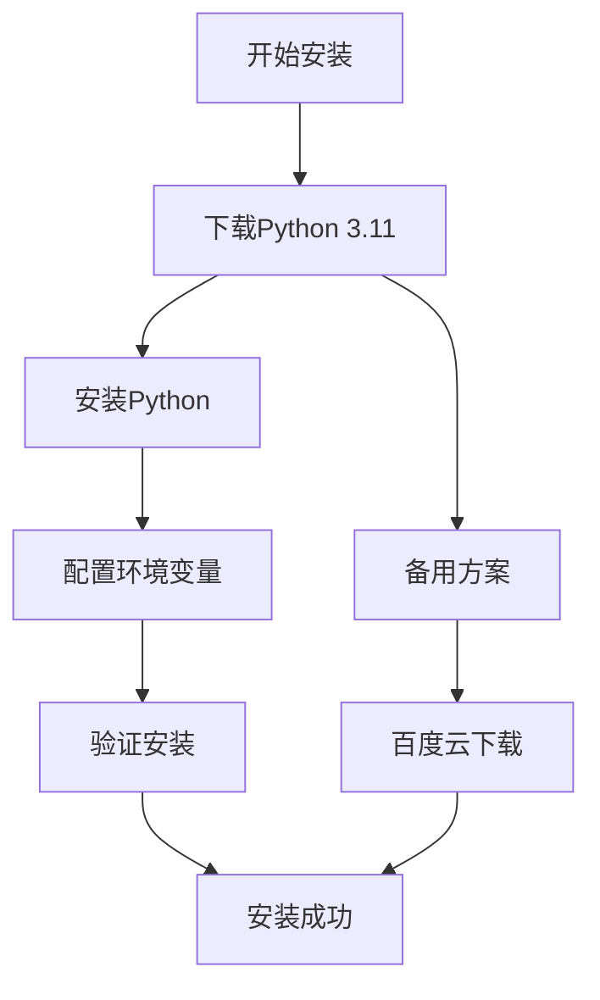
```mermaid
flowchart TD
START[开始安装] --> DOWNLOAD[下载Python 3.11]
DOWNLOAD --> INSTALL[安装Python]
INSTALL --> CONFIGURE[配置环境变量]
CONFIGURE --> VERIFY[验证安装]
VERIFY --> SUCCESS[安装成功]
DOWNLOAD --> ALTERNATIVE[备用方案]
ALTERNATIVE --> CLOUD[百度云下载]
CLOUD --> SUCCESS
```

**图表来源**
- [50-01-python.md](file://docs-pages/vuepress/course/docs/50-01-python.md#L1-L62)

#### pip包管理器配置

pip是Python的包管理工具，用于安装和管理第三方库：

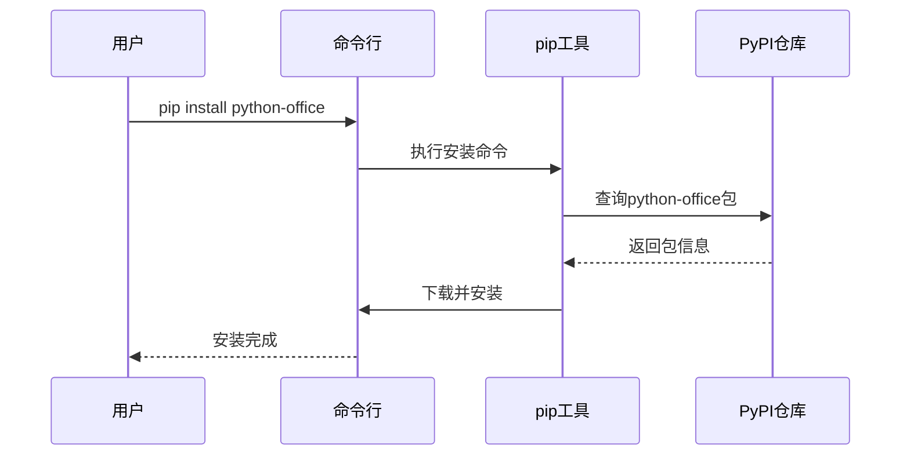
```mermaid
sequenceDiagram
participant USER as 用户
participant CMD as 命令行
participant PIP as pip工具
participant PYPI as PyPI仓库
USER->>CMD : pip install python-office
CMD->>PIP : 执行安装命令
PIP->>PYPI : 查询python-office包
PYPI-->>PIP : 返回包信息
PIP->>CMD : 下载并安装
CMD-->>USER : 安装完成
```

**图表来源**
- [50-03-pip.md](file://docs-pages/vuepress/course/docs/50-03-pip.md#L1-L117)

**章节来源**
- [50-01-python.md](file://docs-pages/vuepress/course/docs/50-01-python.md#L1-L62)
- [50-03-pip.md](file://docs-pages/vuepress/course/docs/50-03-pip.md#L1-L117)

## 核心功能模块

popdf提供了10个核心功能模块，每个模块都是独立的案例，可以按需学习：

### 功能模块概览

| 序号 | 功能名称 | 主要用途 | 代码行数 |
|------|----------|----------|----------|
| 1 | PDF转Word | 文档格式转换 | 1行 |
| 2 | PDF转图片 | 内容提取展示 | 1行 |
| 3 | TXT转PDF | 文本内容生成 | 1行 |
| 4 | PDF分割 | 文件拆分处理 | 1行 |
| 5 | PDF加密 | 文件安全保护 | 1行 |
| 6 | PDF解密 | 访问权限恢复 | 1行 |
| 7 | PDF加水印 | 版权保护标识 | 1行 |
| 8 | PDF合并 | 多文件整合 | 1行 |
| 9 | PDF删除 | 文件清理优化 | 1行 |

### 技术架构设计

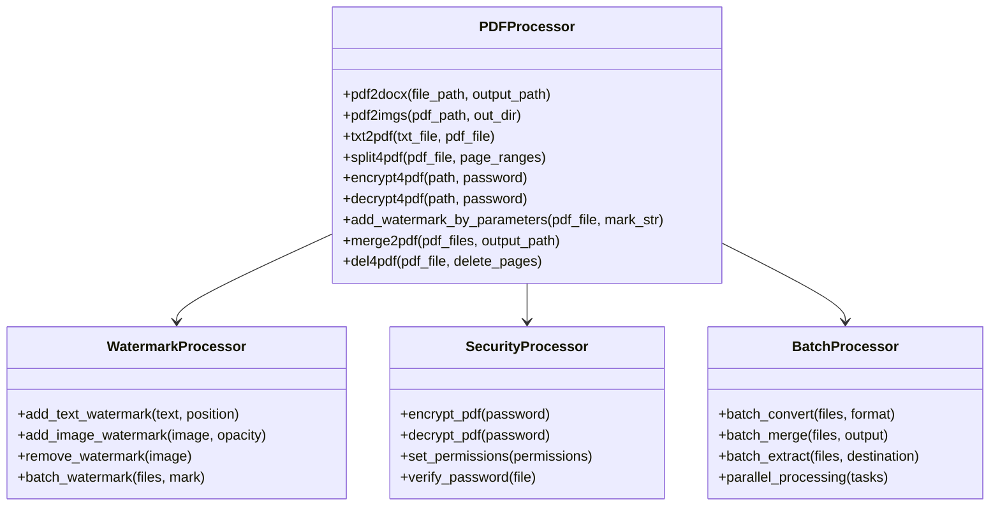
```mermaid
classDiagram
class PDFProcessor {
+pdf2docx(file_path, output_path)
+pdf2imgs(pdf_path, out_dir)
+txt2pdf(txt_file, pdf_file)
+split4pdf(pdf_file, page_ranges)
+encrypt4pdf(path, password)
+decrypt4pdf(path, password)
+add_watermark_by_parameters(pdf_file, mark_str)
+merge2pdf(pdf_files, output_path)
+del4pdf(pdf_file, delete_pages)
}
class WatermarkProcessor {
+add_text_watermark(text, position)
+add_image_watermark(image, opacity)
+remove_watermark(image)
+batch_watermark(files, mark)
}
class SecurityProcessor {
+encrypt_pdf(password)
+decrypt_pdf(password)
+set_permissions(permissions)
+verify_password(file)
}
class BatchProcessor {
+batch_convert(files, format)
+batch_merge(files, output)
+batch_extract(files, destination)
+parallel_processing(tasks)
}
PDFProcessor --> WatermarkProcessor
PDFProcessor --> SecurityProcessor
PDFProcessor --> BatchProcessor
```

**图表来源**
- [pdf.md](file://docs-pages/vuepress/office/pdf.md#L59-L70)

**章节来源**
- [pdf.md](file://docs-pages/vuepress/office/pdf.md#L59-L70)

## PDF转换技术

PDF转换是办公自动化中最常用的功能之一，popdf提供了多种转换方式：

### PDF转Word转换

PDF转Word是最基础也是最常用的功能，支持保持原始格式：

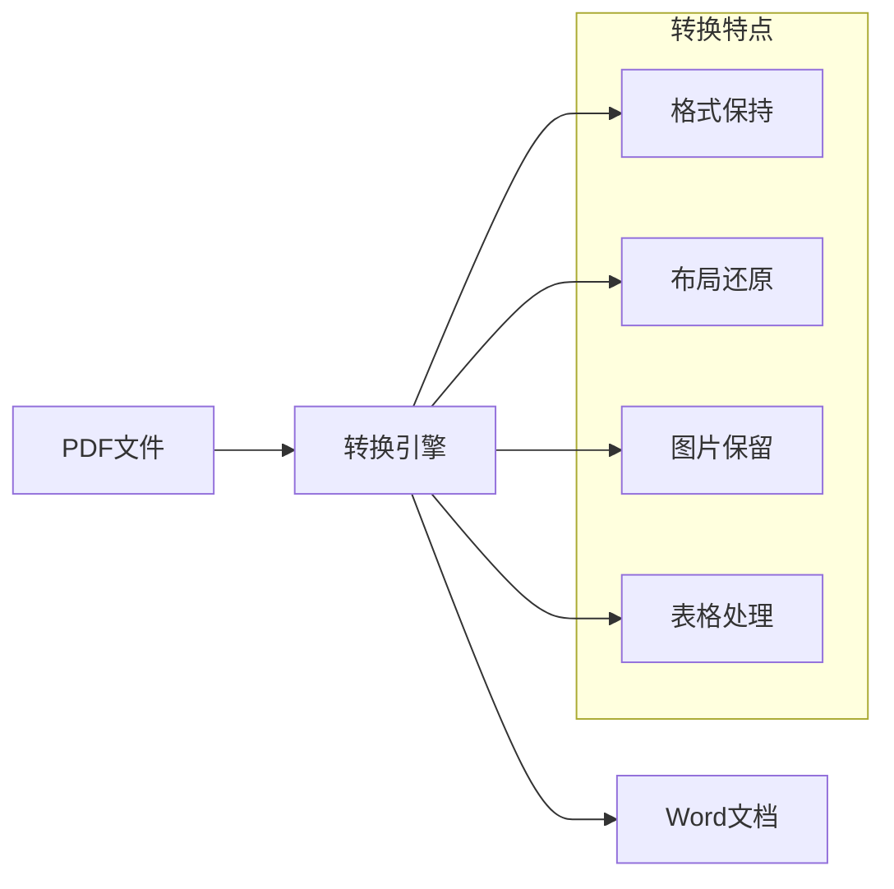
```mermaid
flowchart LR
PDF[PDF文件] --> CONVERT[转换引擎]
CONVERT --> WORD[Word文档]
subgraph "转换特点"
FORMAT[格式保持]
LAYOUT[布局还原]
IMAGES[图片保留]
TABLES[表格处理]
end
CONVERT --> FORMAT
CONVERT --> LAYOUT
CONVERT --> IMAGES
CONVERT --> TABLES
```

**图表来源**
- [50-04-pdf2docx.py](file://docs-pages/vuepress/course/code/50-04-pdf2docx.py#L1-L33)

### PDF转图片转换

PDF转图片功能可以将PDF页面转换为高质量图片：

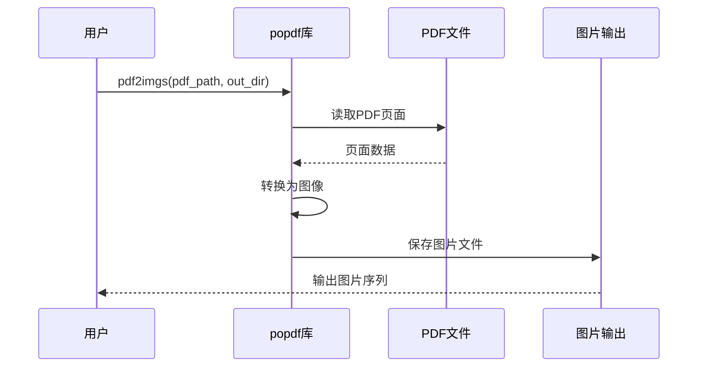
```mermaid
sequenceDiagram
participant USER as 用户
participant POPDF as popdf库
participant PDF as PDF文件
participant IMG as 图片输出
USER->>POPDF : pdf2imgs(pdf_path, out_dir)
POPDF->>PDF : 读取PDF页面
PDF-->>POPDF : 页面数据
POPDF->>POPDF : 转换为图像
POPDF->>IMG : 保存图片文件
IMG-->>USER : 输出图片序列
```

**图表来源**
- [50-41-pdf2imgs.py](file://docs-pages/vuepress/course/code/50-41-pdf2imgs.py#L1-L27)

### TXT转PDF转换

文本文件转PDF功能支持将纯文本内容生成专业的PDF文档：

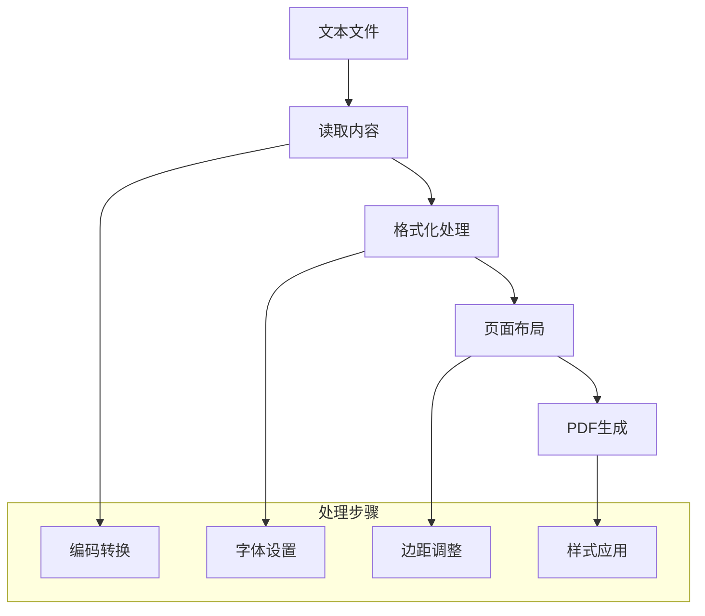
```mermaid
flowchart TD
TXT[文本文件] --> READ[读取内容]
READ --> FORMAT[格式化处理]
FORMAT --> LAYOUT[页面布局]
LAYOUT --> PDF[PDF生成]
subgraph "处理步骤"
ENCODING[编码转换]
FONT[字体设置]
MARGIN[边距调整]
STYLE[样式应用]
end
READ --> ENCODING
FORMAT --> FONT
LAYOUT --> MARGIN
PDF --> STYLE
```

**章节来源**
- [50-04-pdf2docx.py](file://docs-pages/vuepress/course/code/50-04-pdf2docx.py#L1-L33)
- [50-41-pdf2imgs.py](file://docs-pages/vuepress/course/code/50-41-pdf2imgs.py#L1-L27)

## 水印处理技术

水印处理是PDF安全和版权保护的重要手段，popdf提供了强大的水印处理功能：

### 文本水印添加

文本水印是最常用的水印类型，可以添加公司名称、版权声明等信息：

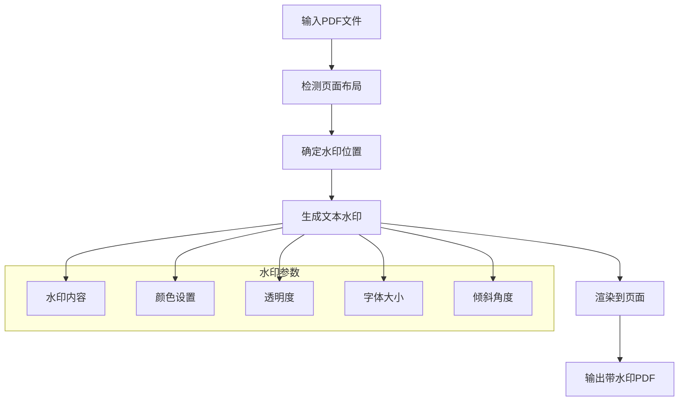
```mermaid
flowchart TD
PDF_INPUT[输入PDF文件] --> DETECT[检测页面布局]
DETECT --> POSITION[确定水印位置]
POSITION --> TEXT[生成文本水印]
TEXT --> RENDER[渲染到页面]
RENDER --> OUTPUT[输出带水印PDF]
subgraph "水印参数"
CONTENT[水印内容]
COLOR[颜色设置]
OPACITY[透明度]
SIZE[字体大小]
ANGLE[倾斜角度]
end
TEXT --> CONTENT
TEXT --> COLOR
TEXT --> OPACITY
TEXT --> SIZE
TEXT --> ANGLE
```

**图表来源**
- [50-37-add_watermark_by_parameters.py](file://docs-pages/vuepress/course/code/50-37-add_watermark_by_parameters.py#L1-L37)
- [50-42-add_watermark.py](file://docs-pages/vuepress/course/code/50-42-add_watermark.py#L1-L17)

### 图片水印处理

图片水印可以添加公司Logo、品牌标识等视觉元素：

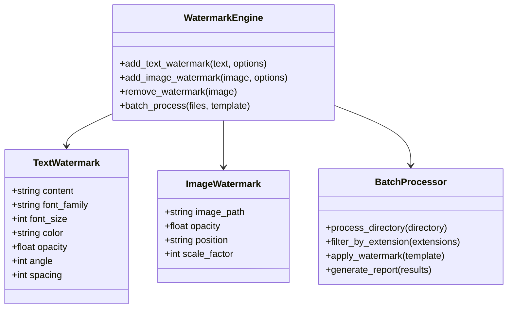
```mermaid
classDiagram
class WatermarkEngine {
+add_text_watermark(text, options)
+add_image_watermark(image, options)
+remove_watermark(image)
+batch_process(files, template)
}
class TextWatermark {
+string content
+string font_family
+int font_size
+string color
+float opacity
+int angle
+int spacing
}
class ImageWatermark {
+string image_path
+float opacity
+string position
+int scale_factor
}
class BatchProcessor {
+process_directory(directory)
+filter_by_extension(extensions)
+apply_watermark(template)
+generate_report(results)
}
WatermarkEngine --> TextWatermark
WatermarkEngine --> ImageWatermark
WatermarkEngine --> BatchProcessor
```

**图表来源**
- [50-42-add_watermark.py](file://docs-pages/vuepress/course/code/50-42-add_watermark.py#L1-L17)

### 水印移除技术

高级的水印移除功能可以自动识别和移除PDF中的水印：

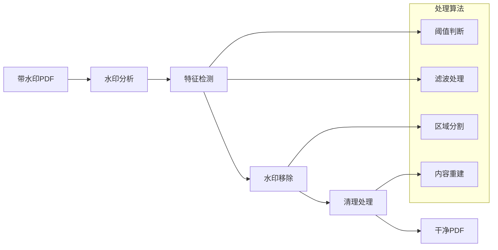
```mermaid
flowchart LR
INPUT[带水印PDF] --> ANALYZE[水印分析]
ANALYZE --> DETECT[特征检测]
DETECT --> REMOVE[水印移除]
REMOVE --> CLEAN[清理处理]
CLEAN --> OUTPUT[干净PDF]
subgraph "处理算法"
THRESHOLD[阈值判断]
FILTER[滤波处理]
SEGMENT[区域分割]
RECONSTRUCT[内容重建]
end
DETECT --> THRESHOLD
DETECT --> FILTER
REMOVE --> SEGMENT
CLEAN --> RECONSTRUCT
```

**图表来源**
- [50-17-del_watermark.py](file://docs-pages/vuepress/course/code/50-17-del_watermark.py#L1-L18)

**章节来源**
- [50-37-add_watermark_by_parameters.py](file://docs-pages/vuepress/course/code/50-37-add_watermark_by_parameters.py#L1-L37)
- [50-42-add_watermark.py](file://docs-pages/vuepress/course/code/50-42-add_watermark.py#L1-L17)
- [50-17-del_watermark.py](file://docs-pages/vuepress/course/code/50-17-del_watermark.py#L1-L18)

## 安全加密技术

PDF安全是企业办公中的重要需求，popdf提供了完整的加密解密解决方案：

### PDF加密机制

PDF加密通过设置访问密码来保护文件内容：

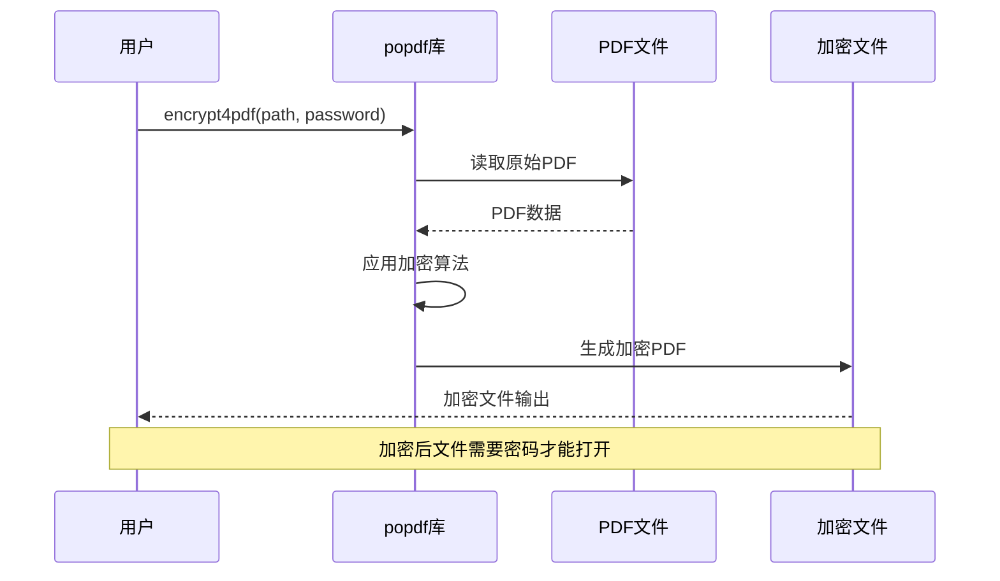
```mermaid
sequenceDiagram
participant USER as 用户
participant POPDF as popdf库
participant FILE as PDF文件
participant SECURE as 加密文件
USER->>POPDF : encrypt4pdf(path, password)
POPDF->>FILE : 读取原始PDF
FILE-->>POPDF : PDF数据
POPDF->>POPDF : 应用加密算法
POPDF->>SECURE : 生成加密PDF
SECURE-->>USER : 加密文件输出
Note over USER,SECURE : 加密后文件需要密码才能打开
```

**图表来源**
- [50-38-encrypt4pdf.py](file://docs-pages/vuepress/course/code/50-38-encrypt4pdf.py#L1-L40)

### PDF解密技术

解密功能允许授权用户访问加密的PDF文件：

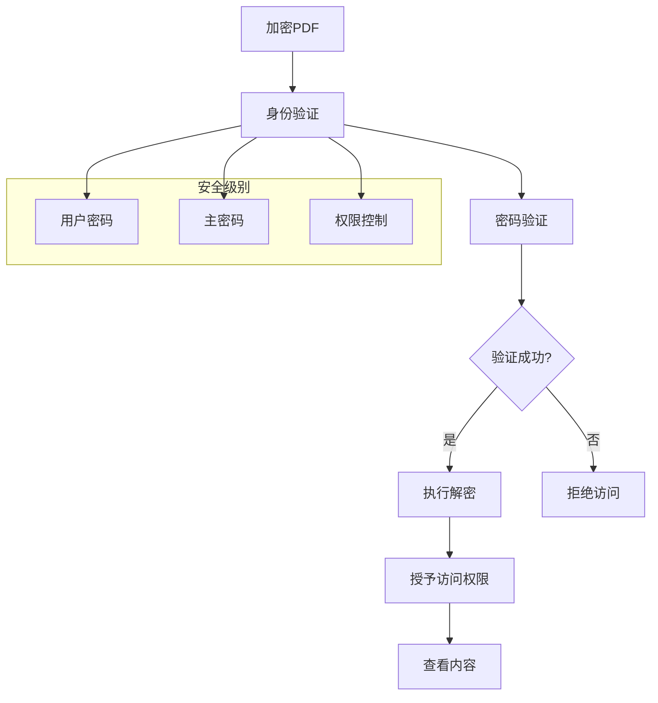
```mermaid
flowchart TD
ENCRYPTED[加密PDF] --> AUTH[身份验证]
AUTH --> VALIDATE[密码验证]
VALIDATE --> SUCCESS{验证成功?}
SUCCESS --> |是| DECRYPT[执行解密]
SUCCESS --> |否| ERROR[拒绝访问]
DECRYPT --> ACCESS[授予访问权限]
ACCESS --> VIEW[查看内容]
subgraph "安全级别"
USER_PASSWORD[用户密码]
MASTER_PASSWORD[主密码]
PERMISSIONS[权限控制]
end
AUTH --> USER_PASSWORD
AUTH --> MASTER_PASSWORD
AUTH --> PERMISSIONS
```

**图表来源**
- [50-39-decrypt4pdf.py](file://docs-pages/vuepress/course/code/50-39-decrypt4pdf.py#L1-L54)

### 权限控制机制

高级的权限控制可以限制PDF的各种操作：

| 权限类型 | 功能描述 | 默认状态 |
|----------|----------|----------|
| 复制内容 | 允许复制文本内容 | 受限 |
| 打印文件 | 控制打印权限 | 受限 |
| 修改文档 | 允许编辑内容 | 受限 |
| 注释添加 | 允许添加注释 | 受限 |
| 表单填写 | 允许填写表单 | 受限 |

**章节来源**
- [50-38-encrypt4pdf.py](file://docs-pages/vuepress/course/code/50-38-encrypt4pdf.py#L1-L40)
- [50-39-decrypt4pdf.py](file://docs-pages/vuepress/course/code/50-39-decrypt4pdf.py#L1-L54)

## 批量处理流程

批量处理是提高工作效率的关键技术，popdf提供了完整的批量处理解决方案：

### 批量转换流程

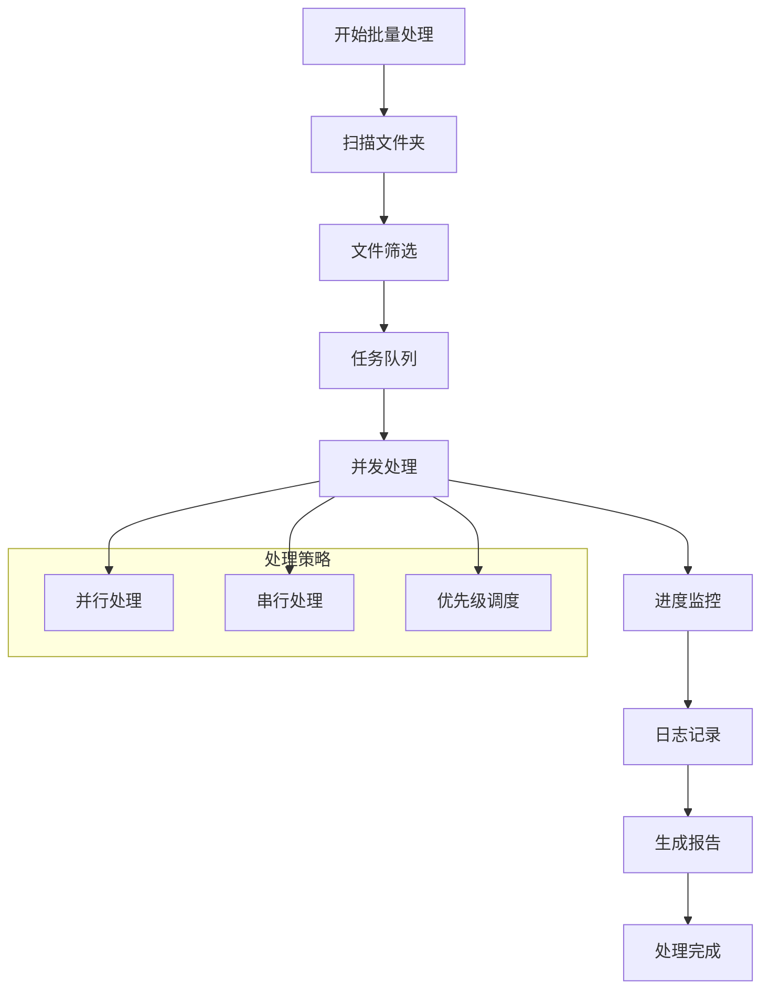
```mermaid
flowchart TD
START[开始批量处理] --> SCAN[扫描文件夹]
SCAN --> FILTER[文件筛选]
FILTER --> QUEUE[任务队列]
QUEUE --> PROCESS[并发处理]
PROCESS --> MONITOR[进度监控]
MONITOR --> LOG[日志记录]
LOG --> REPORT[生成报告]
REPORT --> END[处理完成]
subgraph "处理策略"
PARALLEL[并行处理]
SEQUENTIAL[串行处理]
PRIORITY[优先级调度]
end
PROCESS --> PARALLEL
PROCESS --> SEQUENTIAL
PROCESS --> PRIORITY
```

### 批量合并技术

批量合并功能可以将多个PDF文件整合为一个：

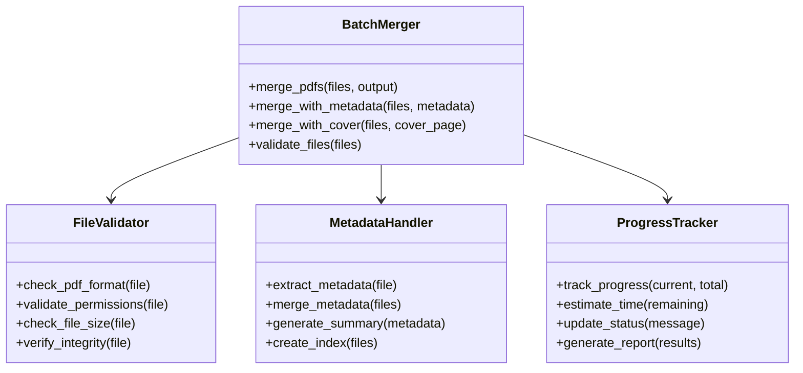
```mermaid
classDiagram
class BatchMerger {
+merge_pdfs(files, output)
+merge_with_metadata(files, metadata)
+merge_with_cover(files, cover_page)
+validate_files(files)
}
class FileValidator {
+check_pdf_format(file)
+validate_permissions(file)
+check_file_size(file)
+verify_integrity(file)
}
class MetadataHandler {
+extract_metadata(file)
+merge_metadata(files)
+generate_summary(metadata)
+create_index(files)
}
class ProgressTracker {
+track_progress(current, total)
+estimate_time(remaining)
+update_status(message)
+generate_report(results)
}
BatchMerger --> FileValidator
BatchMerger --> MetadataHandler
BatchMerger --> ProgressTracker
```

**图表来源**
- [50-40-merge2pdf.py](file://docs-pages/vuepress/course/code/50-40-merge2pdf.py#L1-L45)

### 并发处理优化

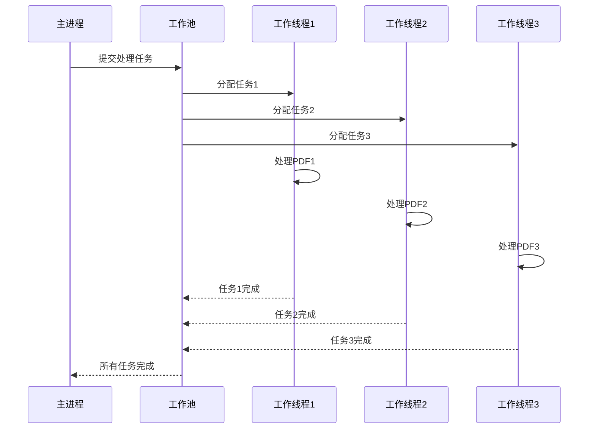
```mermaid
sequenceDiagram
participant MAIN as 主进程
participant POOL as 工作池
participant WORKER1 as 工作线程1
participant WORKER2 as 工作线程2
participant WORKER3 as 工作线程3
MAIN->>POOL : 提交处理任务
POOL->>WORKER1 : 分配任务1
POOL->>WORKER2 : 分配任务2
POOL->>WORKER3 : 分配任务3
WORKER1->>WORKER1 : 处理PDF1
WORKER2->>WORKER2 : 处理PDF2
WORKER3->>WORKER3 : 处理PDF3
WORKER1-->>POOL : 任务1完成
WORKER2-->>POOL : 任务2完成
WORKER3-->>POOL : 任务3完成
POOL-->>MAIN : 所有任务完成
```

**图表来源**
- [50-40-merge2pdf.py](file://docs-pages/vuepress/course/code/50-40-merge2pdf.py#L1-L45)

**章节来源**
- [50-40-merge2pdf.py](file://docs-pages/vuepress/course/code/50-40-merge2pdf.py#L1-L45)

## 实际应用场景

popdf在实际工作中有着广泛的应用场景：

### 企业文档管理

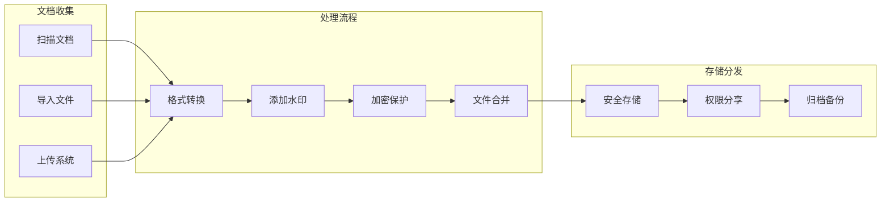
```mermaid
flowchart LR
subgraph "文档收集"
SCAN[扫描文档]
IMPORT[导入文件]
UPLOAD[上传系统]
end
subgraph "处理流程"
CONVERT[格式转换]
WATERMARK[添加水印]
ENCRYPT[加密保护]
MERGE[文件合并]
end
subgraph "存储分发"
STORE[安全存储]
SHARE[权限分享]
ARCHIVE[归档备份]
end
SCAN --> CONVERT
IMPORT --> CONVERT
UPLOAD --> CONVERT
CONVERT --> WATERMARK
WATERMARK --> ENCRYPT
ENCRYPT --> MERGE
MERGE --> STORE
STORE --> SHARE
SHARE --> ARCHIVE
```

### 教育培训领域

在教育培训中，PDF处理技术可以大大提高教学资源的管理效率：

| 应用场景 | 技术方案 | 效率提升 |
|----------|----------|----------|
| 课件制作 | TXT转PDF + 水印 | 80% |
| 成绩单处理 | 批量PDF转换 | 70% |
| 资料归档 | 自动化合并 | 60% |
| 版权保护 | 智能水印添加 | 90% |

### 政府机关办公

政府部门的公文处理对安全性要求极高：

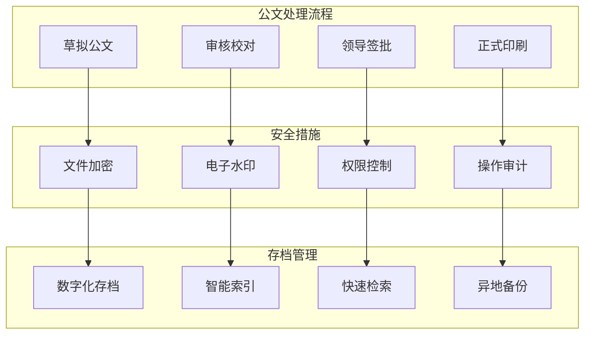
```mermaid
graph TB
subgraph "公文处理流程"
DRAFT[草拟公文]
REVIEW[审核校对]
SIGN[领导签批]
PRINT[正式印刷]
end
subgraph "安全措施"
ENCRYPT[文件加密]
WATERMARK[电子水印]
ACCESS[权限控制]
LOG[操作审计]
end
subgraph "存档管理"
DIGITAL[数字化存档]
INDEX[智能索引]
SEARCH[快速检索]
BACKUP[异地备份]
end
DRAFT --> ENCRYPT
REVIEW --> WATERMARK
SIGN --> ACCESS
PRINT --> LOG
ENCRYPT --> DIGITAL
WATERMARK --> INDEX
ACCESS --> SEARCH
LOG --> BACKUP
```

## 最佳实践指南

基于实际使用经验，以下是popdf使用的最佳实践建议：

### 性能优化策略

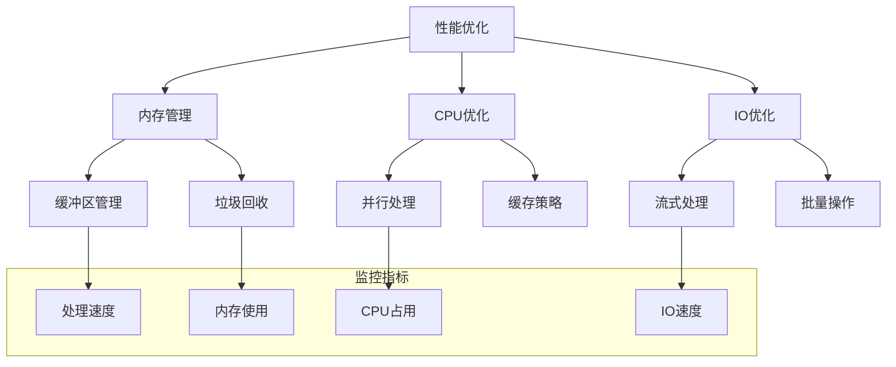
```mermaid
flowchart TD
OPTIMIZE[性能优化] --> MEMORY[内存管理]
OPTIMIZE --> CPU[CPU优化]
OPTIMIZE --> IO[IO优化]
MEMORY --> BUFFER[缓冲区管理]
MEMORY --> GARBAGE[垃圾回收]
CPU --> PARALLEL[并行处理]
CPU --> CACHE[缓存策略]
IO --> STREAM[流式处理]
IO --> BATCH[批量操作]
subgraph "监控指标"
SPEED[处理速度]
MEMORY_USAGE[内存使用]
CPU_USAGE[CPU占用]
IO_SPEED[IO速度]
end
BUFFER --> SPEED
GARBAGE --> MEMORY_USAGE
PARALLEL --> CPU_USAGE
STREAM --> IO_SPEED
```

### 错误处理机制

完善的错误处理是保证系统稳定性的关键：

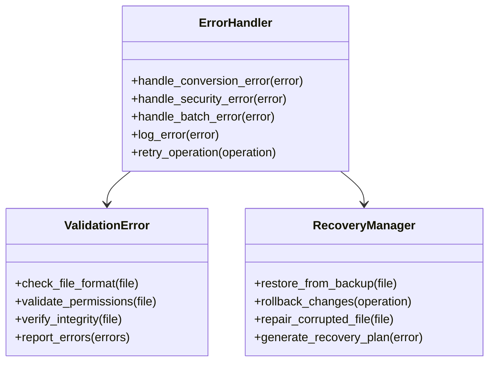
```mermaid
classDiagram
class ErrorHandler {
+handle_conversion_error(error)
+handle_security_error(error)
+handle_batch_error(error)
+log_error(error)
+retry_operation(operation)
}
class ValidationError {
+check_file_format(file)
+validate_permissions(file)
+verify_integrity(file)
+report_errors(errors)
}
class RecoveryManager {
+restore_from_backup(file)
+rollback_changes(operation)
+repair_corrupted_file(file)
+generate_recovery_plan(error)
}
ErrorHandler --> ValidationError
ErrorHandler --> RecoveryManager
```

### 代码组织规范

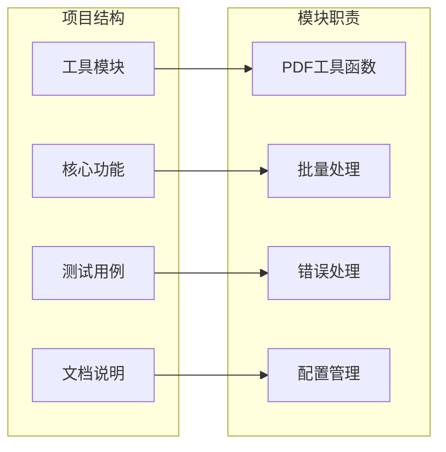
```mermaid
graph LR
subgraph "项目结构"
UTILS[工具模块]
CORE[核心功能]
TESTS[测试用例]
DOCS[文档说明]
end
subgraph "模块职责"
PDF_UTILS[PDF工具函数]
BATCH_PROCESS[批量处理]
ERROR_HANDLING[错误处理]
CONFIGURATION[配置管理]
end
UTILS --> PDF_UTILS
CORE --> BATCH_PROCESS
TESTS --> ERROR_HANDLING
DOCS --> CONFIGURATION
```

## 故障排除

常见问题及解决方案：

### 安装问题

| 问题类型 | 症状描述 | 解决方案 |
|----------|----------|----------|
| pip安装失败 | 网络连接超时 | 使用国内镜像源 |
| 权限不足 | 安装被拒绝 | 使用管理员权限 |
| 版本冲突 | 依赖包冲突 | 创建虚拟环境 |
| 缺少依赖 | 运行时报错 | 安装缺失库 |

### 运行时错误

```mermaid
flowchart TD
ERROR[运行时错误] --> CLASSIFY[错误分类]
CLASSIFY --> FILE_ERROR[文件错误]
CLASSIFY --> MEMORY_ERROR[内存错误]
CLASSIFY --> PERMISSION_ERROR[权限错误]
FILE_ERROR --> CHECK_FORMAT[检查文件格式]
FILE_ERROR --> VERIFY_SIZE[验证文件大小]
FILE_ERROR --> TEST_INTEGRITY[测试文件完整性]
MEMORY_ERROR --> REDUCE_SIZE[减少文件大小]
MEMORY_ERROR --> OPTIMIZE_CODE[优化代码]
MEMORY_ERROR --> UPGRADE_HARDWARE[升级硬件]
PERMISSION_ERROR --> CHECK_ACCESS[检查访问权限]
PERMISSION_ERROR --> SET_PERMISSIONS[设置正确权限]
PERMISSION_ERROR --> RUN_AS_ADMIN[以管理员运行]
```

### 性能问题诊断

```mermaid
sequenceDiagram
participant USER as 用户
participant MONITOR as 性能监控
participant ANALYZER as 问题分析
participant FIX as 修复方案
USER->>MONITOR : 报告性能问题
MONITOR->>ANALYZER : 收集性能数据
ANALYZER->>ANALYZER : 分析瓶颈点
ANALYZER->>FIX : 提出优化建议
FIX->>USER : 实施解决方案
USER-->>MONITOR : 验证改进效果
```

**章节来源**
- [50-03-pip.md](file://docs-pages/vuepress/course/docs/50-03-pip.md#L1-L117)

## 总结

popdf PDF自动化办公课程为Python初学者提供了一个完整的PDF处理技术体系。通过10个独立的功能模块，涵盖了PDF处理的所有核心场景，从简单的格式转换到复杂的批量处理，从基础的水印添加到高级的安全加密。

### 核心价值

- **技术先进性**：基于最新的popdf开源项目，采用现代化的Python技术栈
- **实用性强**：所有功能都针对实际办公需求设计，即学即用
- **易于扩展**：模块化设计便于二次开发和功能扩展
- **社区支持**：活跃的开源社区提供持续的技术支持

### 发展前景

随着数字化办公的不断发展，PDF处理技术将在以下方面继续演进：

- **AI集成**：结合人工智能技术实现智能化的PDF处理
- **云端服务**：提供云端PDF处理服务，支持大规模并发处理
- **移动适配**：优化移动端的PDF处理体验
- **标准统一**：推动PDF处理技术的标准化进程

通过系统学习popdf课程，用户不仅能够掌握PDF自动化处理的核心技能，更能建立起完整的办公自动化思维，为未来的数字化转型奠定坚实基础。