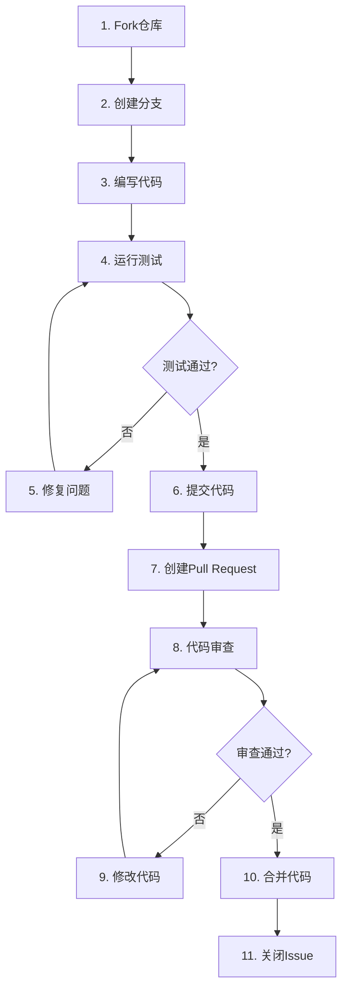
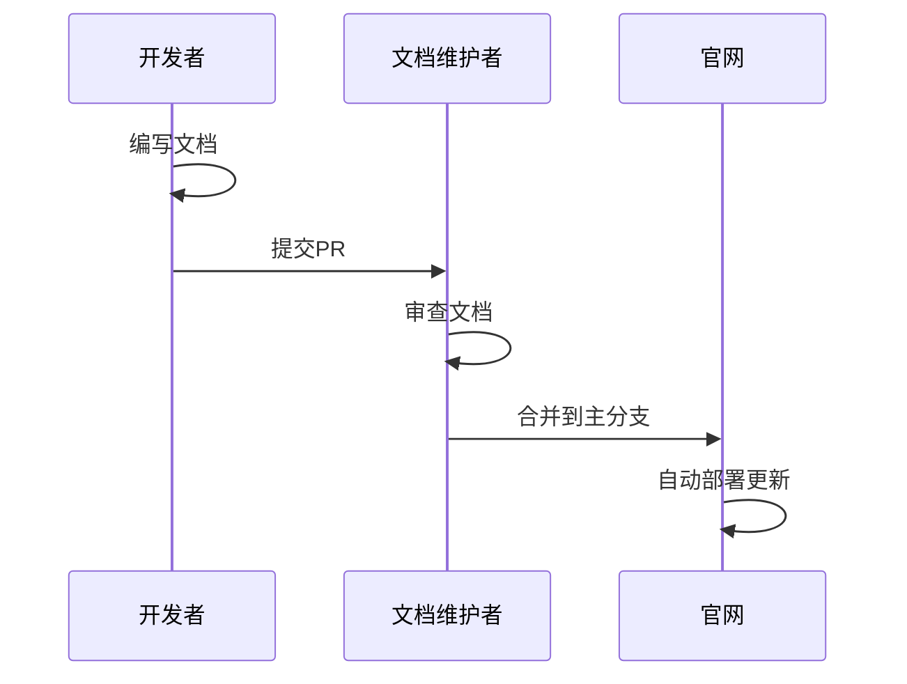

# 贡献指南

<cite>
**本文档引用的文件**
- [contributor.md](file://docs-pages/vuepress/contributor/contributor.md)
- [qaq.md](file://docs-pages/vuepress/ref/qaq.md)
- [README.md](file://README.md)
- [introduction.md](file://docs-pages/vuepress/guide/introduction.md)
- [allFunc.md](file://docs-pages/vuepress/guide/allFunc.md)
- [git.md](file://docs-pages/vuepress/ref/git.md)
- [pdf.md](file://docs-pages/vuepress/office/pdf.md)
- [excel.md](file://docs-pages/vuepress/office/excel.md)
- [word.md](file://docs-pages/vuepress/office/word.md)
- [50-04-pdf2docx.py](file://docs-pages/vuepress/course/code/50-04-pdf2docx.py)
- [50-01-python.py](file://docs-pages/vuepress/course/code/50-01-python.py)
</cite>

## 目录
1. [项目简介](#项目简介)
2. [参与贡献的形式](#参与贡献的形式)
3. [开发环境准备](#开发环境准备)
4. [代码贡献流程](#代码贡献流程)
5. [代码风格规范](#代码风格规范)
6. [文档贡献指南](#文档贡献指南)
7. [测试策略](#测试策略)
8. [常见问题解答](#常见问题解答)
9. [联系我们](#联系我们)
10. [社区资源](#社区资源)

## 项目简介

Python-office是一个功能强大的Python自动化办公第三方库，致力于解决大部分自动化办公问题。每个功能只需一行代码，无需小白用户学习Python知识，真正做到开箱即用。

### 核心特性
- **一键搭建**：所有Python + 自动化办公编程环境
- **极简编程**：使用一行代码解决大部分自动化办公问题
- **贴合需求**：紧密贴合职场办公需求
- **高效提升**：学习成本极低，工作效率显著提升

### 支持的功能模块
- **PDF处理**：PDF转Word、PDF转图片、TXT转PDF、PDF加密解密、PDF加水印等
- **Excel处理**：Excel合并拆分、关联查询、数据模拟等
- **Word处理**：Word批量转PDF、格式互转、批量合并等
- **其他功能**：OCR文字识别、邮件收发、微信机器人等

**章节来源**
- [introduction.md](file://docs-pages/vuepress/guide/introduction.md#L28-L46)
- [pdf.md](file://docs-pages/vuepress/office/pdf.md#L1-L50)
- [excel.md](file://docs-pages/vuepress/office/excel.md#L1-L20)
- [word.md](file://docs-pages/vuepress/office/word.md#L1-L20)

## 参与贡献的形式

### 1. 报告Bug
- 发现代码缺陷或功能异常
- 提交详细的bug报告，包括重现步骤
- 提供系统环境信息和错误日志

### 2. 提出功能建议
- 分享您在使用过程中的痛点
- 提出改进现有功能的建议
- 建议新增功能的需求分析

### 3. 提交代码补丁
- 修复已知bug
- 实现新功能
- 优化现有代码性能

### 4. 编写文档
- 更新使用文档
- 制作教程和示例
- 完善API参考文档

### 5. 制作教程
- 录制视频教程
- 编写博客文章
- 创建演示代码

**章节来源**
- [qaq.md](file://docs-pages/vuepress/ref/qaq.md#L86-L96)

## 开发环境准备

### 系统要求
- **操作系统**：Windows 7+/macOS/Linux
- **Python版本**：Python 3.7+
- **IDE推荐**：PyCharm、VS Code

### 快速开始
1. **克隆仓库**
   ```bash
   # GitHub
   git clone https://github.com/CoderWanFeng/python-office.git
   
   # 或Gitee
   git clone https://gitee.com/CoderWanFeng/python-office.git
   ```

2. **安装依赖**
   ```bash
   pip install -r requirements.txt
   ```

3. **环境配置**
   - 配置Python解释器
   - 安装必要的开发工具
   - 设置代码格式化工具

**章节来源**
- [qaq.md](file://docs-pages/vuepress/ref/qaq.md#L38-L55)
- [git.md](file://docs-pages/vuepress/ref/git.md#L7-L10)

## 代码贡献流程

### 完整贡献流程



### 详细步骤说明

#### 1. Fork项目仓库
- 访问项目主页：[GitHub](https://github.com/CoderWanFeng/python-office) | [Gitee](https://gitee.com/CoderWanFeng/python-office)
- 点击"Fork"按钮创建个人副本

#### 2. 克隆到本地
```bash
# 克隆您的Fork
git clone https://github.com/YOUR_USERNAME/python-office.git
cd python-office

# 添加上游仓库
git remote add upstream https://github.com/CoderWanFeng/python-office.git
```

#### 3. 创建功能分支
```bash
# 创建新分支
git checkout -b feature/your-feature-name

# 或创建修复分支
git checkout -b fix/issue-description
```

#### 4. 编写代码
- 遵循项目代码风格
- 添加必要的注释
- 编写单元测试

#### 5. 提交更改
```bash
# 添加更改
git add .

# 提交更改
git commit -m "feat: 添加新功能描述"

# 推送到远程
git push origin feature/your-feature-name
```

#### 6. 创建Pull Request
- 在GitHub/Gitee上创建PR
- 填写详细的描述信息
- 关联相关Issue

**章节来源**
- [git.md](file://docs-pages/vuepress/ref/git.md#L4-L10)
- [contributor.md](file://docs-pages/vuepress/contributor/contributor.md#L29-L33)

## 代码风格规范

### Python代码规范
- **缩进**：使用4个空格，不使用Tab
- **命名**：变量使用snake_case，类使用PascalCase
- **注释**：为公共接口添加docstring
- **类型注解**：推荐使用类型注解

### 示例代码风格
```python
# -*- coding: UTF-8 -*-
"""
@作者  ：B站/抖音/微博/小红书/公众号，都叫：程序员晚枫
@微信     ：python-office : http://www.python4office.cn/wechat-qrcode/
@个人网站      ：www.python-office.com
@代码日期    ：2023/8/22 23:24 
@本段代码的视频说明     ：https://www.bilibili.com/video/BV118411R7bB/?spm_id_from=333.999.0.0
"""

def example_function(param1: str, param2: int) -> str:
    """
    示例函数说明
    
    Args:
        param1: 参数1说明
        param2: 参数2说明
        
    Returns:
        返回值说明
    """
    result = f"{param1} processed with {param2}"
    return result
```

### 文档规范
- 使用Markdown格式
- 保持一致性
- 包含使用示例

**章节来源**
- [50-01-python.py](file://docs-pages/vuepress/course/code/50-01-python.py#L1-L14)
- [50-04-pdf2docx.py](file://docs-pages/vuepress/course/code/50-04-pdf2docx.py#L1-L33)

## 文档贡献指南

### 文档类型
- **功能文档**：详细说明每个功能的使用方法
- **API参考**：完整的函数和类的API文档
- **教程文档**：分步骤的操作指南
- **FAQ文档**：常见问题解答

### 文档编写规范
1. **结构清晰**：使用层次化的标题结构
2. **示例丰富**：提供可运行的代码示例
3. **图文并茂**：适当添加截图和图表
4. **语言简洁**：使用通俗易懂的语言

### 文档提交流程


**章节来源**
- [README.md](file://README.md#L41-L48)

## 测试策略

### 测试原则
- **单元测试**：测试单个函数和方法
- **集成测试**：测试模块间的交互
- **端到端测试**：测试完整的工作流程

### 测试执行
```bash
# 运行所有测试
python -m pytest tests/

# 运行特定测试
python -m pytest tests/test_pdf.py

# 生成测试覆盖率报告
python -m pytest --cov=office tests/
```

### 测试用例编写
```python
import pytest
from office import pdf

def test_pdf_conversion():
    """测试PDF转Word功能"""
    input_path = "./test_files/sample.pdf"
    output_path = "./test_files/output.docx"
    
    # 执行转换
    pdf.pdf2docx(input_path, output_path)
    
    # 验证结果
    assert os.path.exists(output_path)
    assert os.path.getsize(output_path) > 0
```

**章节来源**
- [50-04-pdf2docx.py](file://docs-pages/vuepress/course/code/50-04-pdf2docx.py#L11-L22)

## 常见问题解答

### 安装相关问题

#### Q: Windows 7无法安装Python和PyCharm怎么办？
A: 建议升级到Windows 10或更高版本，或者使用虚拟机。

#### Q: pip list命令报错怎么办？
A: 重新安装Python，确保安装过程中勾选"Add Python to PATH"选项。

#### Q: 下载python-office速度太慢怎么办？
A: 使用清华大学的国内镜像：`pip install python-office -i https://pypi.tuna.tsinghua.edu.cn/simple`

#### Q: 运行程序报错：ModuleNotFoundError怎么办？
A: 确保已正确安装python-office，使用`pip install python-office`重新安装。

### 开发相关问题

#### Q: 如何参与项目的开发？
A: 参考视频教程：[如何参与开源项目？](https://www.bilibili.com/video/BV1EP411d7Np)

#### Q: 不会Git但想贡献代码怎么办？
A: 学习视频教程或直接联系开发者获取帮助。

#### Q: AttributeError: module 'office' has no attribute 'xxx'怎么办？
A: 
1. 确保已安装最新版python-office
2. 检查是否使用了正确的Python解释器
3. 确认函数名称拼写正确

### 功能使用问题

#### Q: PDF转Word后不能编辑怎么办？
A: 如果PDF是扫描件，则无法直接编辑，需要使用OCR功能先进行文字识别。

#### Q: 如何获取更多学习资源？
A: 参考课程：[50讲 · Python自动化办公](https://www.python-office.com/course/50-python-office.html)

**章节来源**
- [qaq.md](file://docs-pages/vuepress/ref/qaq.md#L26-L122)

## 联系我们

### 开发者信息
- **姓名**：程序员晚枫
- **微信**：[python-office](http://www.python4office.cn/wechat-qrcode/)
- **B站**：[程序员晚枫](https://space.bilibili.com/1989702333)
- **邮箱**：[开发者邮箱](mailto:developer@example.com)

### 交流渠道
- **QQ群**：[163434413](https://mp.weixin.qq.com/s/yaSmFKO3RrBpyanW3nvRAQ)
- **微信群**：[加入交流群](http://www.python4office.cn/wechat-group/)
- **公众号**：关注公众号获取最新资讯

### 社区支持
- **GitHub Issues**：[项目Issues](https://github.com/CoderWanFeng/python-office/issues)
- **Gitee Issues**：[项目Issues](https://gitee.com/CoderWanFeng/python-office/issues)
- **技术问答**：[Stack Overflow标签](https://stackoverflow.com/questions/tagged/python-office)

**章节来源**
- [contributor.md](file://docs-pages/vuepress/contributor/contributor.md#L19-L33)
- [introduction.md](file://docs-pages/vuepress/guide/introduction.md#L47-L57)

## 社区资源

### 官方资源
- **官方网站**：[https://www.python-office.com](https://www.python-office.com)
- **官方课程**：[50讲 · Python自动化办公](https://www.python-office.com/course/50-python-office.html)
- **视频教程**：[B站视频](https://www.bilibili.com/video/BV1pT4y1k7FH)

### 学习资源
- **入门课程**：[15讲 Python入门课](https://mp.weixin.qq.com/s/ZxJZimZYSvtBSK80tpZbNQ)
- **微信机器人**：[10讲 Python微信机器人](https://mp.weixin.qq.com/s/-oR2dUakXEY3vmPbzVtrnA)
- **数据分析**：[30讲 Python数据分析](https://www.python-office.com/course-002/30-Excel/30-Excel.html)

### 社区活动
- **技术分享**：定期举办技术分享会
- **开源活动**：参与开源贡献活动
- **学习小组**：组建学习交流小组

**章节来源**
- [allFunc.md](file://docs-pages/vuepress/guide/allFunc.md#L1-L50)
- [pdf.md](file://docs-pages/vuepress/office/pdf.md#L73-L85)

---

**感谢您对Python-office项目的关注和支持！我们期待您的宝贵贡献，让我们一起让自动化办公变得更简单、更高效！**