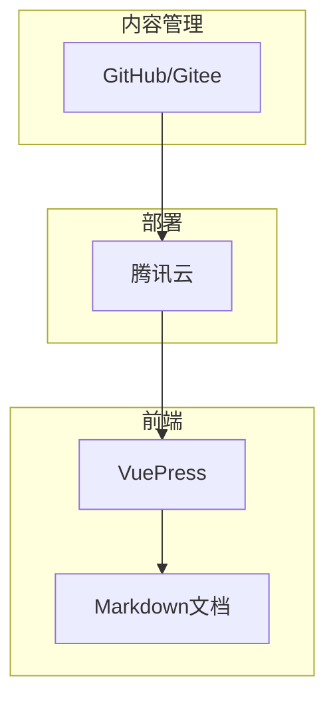

# 项目概述

<cite>
**本文档引用的文件**  
- [README.md](file://README.md)
- [docs-pages/README.md](file://docs-pages/README.md)
- [docs-pages/vuepress/.vuepress/config.js](file://docs-pages/vuepress/.vuepress/config.js)
- [docs-pages/vuepress/guide/introduction.md](file://docs-pages/vuepress/guide/introduction.md)
- [docs-pages/vuepress/guide/allFunc.md](file://docs-pages/vuepress/guide/allFunc.md)
- [docs-pages/vuepress/office/excel.md](file://docs-pages/vuepress/office/excel.md)
- [docs-pages/vuepress/office/pdf.md](file://docs-pages/vuepress/office/pdf.md)
- [docs-pages/vuepress/office/word.md](file://docs-pages/vuepress/office/word.md)
- [docs-pages/vuepress/office/robot.md](file://docs-pages/vuepress/office/robot.md)
- [docs-pages/vuepress/office/tools.md](file://docs-pages/vuepress/office/tools.md)
- [docs-pages/vuepress/course/code/50-05-docx2pdf.py](file://docs-pages/vuepress/course/code/50-05-docx2pdf.py)
- [docs-pages/vuepress/course/code/50-10-excel2pdf.py](file://docs-pages/vuepress/course/code/50-10-excel2pdf.py)
- [docs-pages/vuepress/course/code/50-25-merge4docx.py](file://docs-pages/vuepress/course/code/50-25-merge4docx.py)
- [docs-pages/vuepress/course/code/50-40-merge2pdf.py](file://docs-pages/vuepress/course/code/50-40-merge2pdf.py)
</cite>

## 目录
1. [项目简介](#项目简介)
2. [核心目标与价值主张](#核心目标与价值主张)
3. [主要特点](#主要特点)
4. [项目架构](#项目架构)
5. [功能示例](#功能示例)
6. [用户群体](#用户群体)
7. [项目生态](#项目生态)
8. [愿景与未来发展方向](#愿景与未来发展方向)
9. [社区参与](#社区参与)

## 项目简介

python-office 是一个专为自动化办公设计的 Python 第三方库，旨在通过极简的编程方式解决日常工作中的各种办公自动化问题。该项目的核心理念是“一行代码解决办公问题”，让即使是编程初学者也能轻松上手，实现高效办公。

**文档来源**  
- [README.md](file://README.md#L27-L48)
- [docs-pages/README.md](file://docs-pages/README.md#L1-L7)
- [docs-pages/vuepress/guide/introduction.md](file://docs-pages/vuepress/guide/introduction.md#L1-L57)

## 核心目标与价值主张

python-office 的核心目标是降低自动化办公的技术门槛，使非程序员也能利用 Python 提升工作效率。其价值主张体现在以下几个方面：

- **极简编程**：每个功能只需一行代码即可实现，无需深入学习 Python 知识。
- **开箱即用**：提供完整的编程环境搭建方案，用户可以快速开始使用。
- **贴合职场需求**：功能设计紧密围绕实际办公场景，解决常见问题。

**文档来源**  
- [docs-pages/vuepress/guide/introduction.md](file://docs-pages/vuepress/guide/introduction.md#L28-L45)

## 主要特点

python-office 具有以下显著特点：

- **一键搭建环境**：简化了 Python 和自动化办公工具的安装配置过程。
- **极低学习成本**：无需掌握复杂的编程知识，适合零基础用户。
- **高效工作流**：显著提升工作效率，减少重复性劳动。

**文档来源**  
- [docs-pages/vuepress/guide/introduction.md](file://docs-pages/vuepress/guide/introduction.md#L34-L39)

## 项目架构

python-office.com 网站采用 VuePress 驱动的静态文档网站架构，具体技术栈如下：

- **前端框架**：VuePress
- **部署平台**：腾讯云
- **后端服务**：无后端，纯静态页面

该架构确保了网站的高性能和易维护性，同时便于社区贡献者通过 PR（Pull Request）直接修改和更新文档内容。



**图表来源**  
- [docs-pages/vuepress/.vuepress/config.js](file://docs-pages/vuepress/.vuepress/config.js#L1-L139)
- [README.md](file://README.md#L35-L39)

## 功能示例

python-office 提供了丰富的功能模块，涵盖办公自动化的各个方面。以下是几个典型的功能示例：

### Word 文档处理

将 Word 文档批量转换为 PDF 格式：
```python
import office
office.word.docx2pdf(path=r'./input', output_path=r'./output')
```

**文档来源**  
- [docs-pages/vuepress/office/word.md](file://docs-pages/vuepress/office/word.md#L8-L18)
- [docs-pages/vuepress/course/code/50-05-docx2pdf.py](file://docs-pages/vuepress/course/code/50-05-docx2pdf.py#L10-L14)

### Excel 表格处理

将 Excel 文件转换为 PDF：
```python
import office
office.excel.excel2pdf(excel_path=r'./data.xlsx', pdf_path=r'./output.pdf')
```

**文档来源**  
- [docs-pages/vuepress/office/excel.md](file://docs-pages/vuepress/office/excel.md#L29-L38)
- [docs-pages/vuepress/course/code/50-10-excel2pdf.py](file://docs-pages/vuepress/course/code/50-10-excel2pdf.py#L10-L12)

### 文档合并

批量合并多个 Word 文档：
```python
import office
office.word.merge4docx(input_path=r'./docs', output_path=r'./merged', new_word_name='合并文档.docx')
```

**文档来源**  
- [docs-pages/vuepress/office/word.md](file://docs-pages/vuepress/office/word.md#L36-L47)
- [docs-pages/vuepress/course/code/50-25-merge4docx.py](file://docs-pages/vuepress/course/code/50-25-merge4docx.py#L10-L13)

### PDF 处理

合并多个 PDF 文件：
```python
import office
office.pdf.merge2pdf(one_by_one=[r'file1.pdf', r'file2.pdf'], output=r'merged.pdf')
```

**文档来源**  
- [docs-pages/vuepress/course/code/50-40-merge2pdf.py](file://docs-pages/vuepress/course/code/50-40-merge2pdf.py#L60-L63)

## 用户群体

python-office 主要服务于以下几类用户：

- **编程初学者**：希望通过简单的方式学习并应用 Python。
- **职场人士**：希望利用自动化工具提高工作效率。
- **教育工作者**：用于教学和演示自动化办公的实际应用。

**文档来源**  
- [docs-pages/vuepress/guide/allFunc.md](file://docs-pages/vuepress/guide/allFunc.md#L32-L37)

## 项目生态

python-office 拥有完善的项目生态系统，包括多个开源平台和资源渠道：

- **GitHub**：[https://github.com/CoderWanFeng/python-office](https://github.com/CoderWanFeng/python-office)
- **Gitee**：[https://gitee.com/CoderWanFeng/python-office](https://gitee.com/CoderWanFeng/python-office)
- **PyPI**：[https://pypi.org/project/python-office](https://pypi.org/project/python-office)

这些平台分别承担着代码托管、版本发布和技术交流的功能，形成了一个完整的开源社区。

**文档来源**  
- [docs-pages/vuepress/guide/introduction.md](file://docs-pages/vuepress/guide/introduction.md#L40-L46)
- [README.md](file://README.md#L12-L17)

## 愿景与未来发展方向

python-office 的愿景是成为最易用的 Python 自动化办公库，持续扩展功能模块，覆盖更多办公场景。未来的发展方向包括：

- **功能扩展**：增加更多实用的办公自动化功能。
- **用户体验优化**：进一步简化使用流程，提升用户友好性。
- **社区建设**：鼓励更多开发者参与贡献，共同推动项目发展。

**文档来源**  
- [docs-pages/vuepress/guide/introduction.md](file://docs-pages/vuepress/guide/introduction.md#L49-L57)

## 社区参与

用户可以通过多种方式参与 python-office 的社区建设：

- **交流群**：加入微信或 QQ 交流群，与其他用户分享经验和解决问题。
- **开发者微信**：联系项目作者，获取技术支持或提出功能建议。
- **PR 贡献**：直接在 GitHub 或 Gitee 上提交 Pull Request，参与文档或代码的改进。

**文档来源**  
- [README.md](file://README.md#L18-L23)
- [docs-pages/vuepress/guide/introduction.md](file://docs-pages/vuepress/guide/introduction.md#L47-L57)