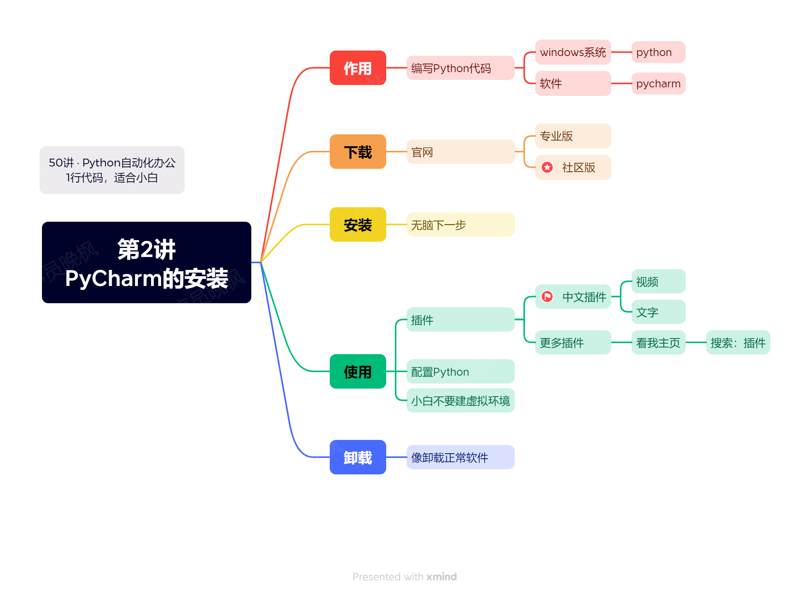

# 【第2讲】正版PyCharm，但是免费！最强Python 编辑器的下载和使用教程，还有中文插件哦~

装完了Python，我们来转**编辑Python**的软件：Pycharm。

我是来学习Python的，安装一个Python不就行了吗？

我先给你看一个Python运行的截图：

黑乎乎的一片，而且没有一个人类能看懂的页面。

如果你的目标是成为程序员，我觉得你可以只装一个Python，但如果你是为了自动化办公的小白，我还是建议你看一下本讲：安装一个普通人能看懂的Python编辑器。如下图所示。👇

图片

## 主要内容

本讲内容，还是通过视频的形式给大家讲解，视频内容主要包含：

- 下载：哪个是免费的？
- 使用：
  - 中文插件怎么安装？
  - 怎么创建项目？
  - 怎么配置Python？
  - 怎么运行代码？
- 其它注意事项

## 付费内容

付费本合集后，下面会自动出现PyCharm的正版下载地址。👇

对于小白来说，Python运行需要2个软件：Python和PyCharm，它们的下载地址分别是：

- Python：[https://www.python.org/](https://www.python.org/)
- PyCharm：[https://www.jetbrains.com/pycharm/](https://www.jetbrains.com/pycharm/)

下载和安装时，请大家注意2点：

- 这些软件都是**完全免费**的，官网就可以下载。不要被付费软件给欺骗了。
- 因为这些软件都是国外开发的，网站也在国外。因为众所周知的原因，国内可能打不开，下载不了。**我都已经下载好了**，放在了文末的百度云网盘里，付费了本套课程的同学，可以自己去领取下载。
- 我了解到很多朋友只是想尝试一下Python，对于小白来说，卸载比安装困难，所以我在这个视频里，加了**卸载的教程**。

下载好了以后，我们开始一步一步的安装，编程是个细活，稍有差错，程序就会运行失败，所以：**请小白务必每一步都和视频中的操作一样。**

## 安装视频

链接：https://www.bilibili.com/video/BV118411R7bB

## 软件下载

合集读者，可以扫码打开下载地址👇

http://python4office.cn/python-download/

