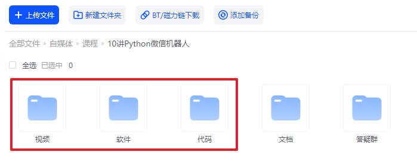

       

	👉 <a target="_blank" href="https://www.python-office.com/office/robot.html">项目官网</a> 👈

	👉 <a target="_blank" href="https://python-office-1300615378.cos.ap-chongqing.myqcloud.com/python-office.jpg">本开源项目的交流群</a> 👈

    
    	
  	
    	

欢迎学习给小白的《10讲 · Python微信机器人》，课程已经更新完毕🚀，每一节课都包含：视频、文档、代码、软件和答疑群，[点我下载](https://mp.weixin.qq.com/s/HIl7ZsldGc9Lp8JtCEzOpg)。

本次课程的特点有以下几个：

1. 适合小白不需要学习复杂的编程知识，拿来就用。
2. 内容丰富，涵盖热门的微信机器人需求。
3. 所有功能，只需要1~3行代码就能实现。

本套课程的代码，全部来自开源项目，Python微信机器人的专用库：``PyOfficeRobot``：[又一个微信聊天机器人横空出世了，人人可用！](https://pypi.org/project/PyOfficeRobot/)

## 1、课程目录
为了方便大家的学习，课程核心部分：每一讲都是一个单独的案例，互相之间没有知识点的关联，你可以不用按顺序学习，用到哪个就点开哪个。

- 第1讲：[软件下载和安装](./docs/10-01-setup.html)
- 第2讲：[发消息](./docs/10-02-send_message.html)
- 第3讲：[发文件](./docs/10-03-send_file.html)
- 第4讲：[关键词回复](./docs/10-04-chat_by_keywords.html)
- 第5讲：[自定义功能](./docs/10-05-def.html)
- 第6讲：[定时群发](./docs/10-06-send_message_by_time.html)
- 第7讲：[获取群信息](./docs/10-07-get_group_list.html)
- 第8讲：[自动加好友](./docs/10-08-add.html)
- 第9讲：[桌面版](./docs/10-09-send.html)
- 第10讲：[智能聊天](./docs/10-10-chat_robot.html)

## 2、获取资料

如需获取本套课程配套的全部:代码、文档、视频、软件、答疑群，可以付费本套合集。👇

- 微信 购买链接：[48元-点我直达](https://mp.weixin.qq.com/s/HIl7ZsldGc9Lp8JtCEzOpg)

付费后，文末会自动出现网盘链接，永久有效。

购买资料 或者 学习过程中有任何问题，也欢迎+我的微信交流👉[CoderWanFeng](https://mp.weixin.qq.com/s/B1V6KeXc7IOEB8DgXLWv3g)

## 3、交流群

       

## 4、读者福利

       

       

       

