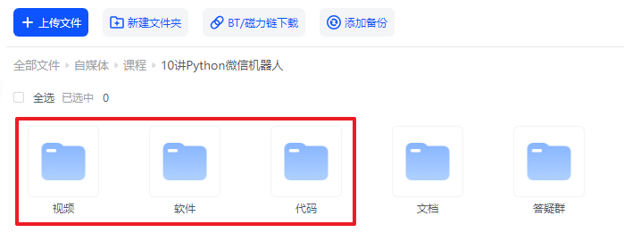

# 【第1讲】微信机器人 · 下载和安装

------
> 点击学习：[10讲 · Python微信机器人](https://www.python-office.com/course-002/10-PyOfficeRobot/10-PyOfficeRobot.html)
------

## 本讲视频

<iframe src="//player.bilibili.com/player.html?bvid=BV1o84y1276T" scrolling="no" border="0" frameborder="no" framespacing="0" allowfullscreen="true" width=100%, height=500> </iframe>

## 下载课程代码

如需获取本套课程配套的全部:代码、文档、视频、软件、答疑群，可以付费本套合集。👇

> 2个付费渠道：B站和微信公众号，2选1就行。悄悄说：B站购买更优惠~

- B站 购买链接：[28元-点我直达](https://mp.weixin.qq.com/s/4-V6iG3QfekRsDlZfAfhYw)
- 微信 购买链接：[78元-点我直达](https://mp.weixin.qq.com/s/tKlzVee4kmJk4dGfKvVnFQ)

付费后，2个平台都会自动出现百度云链接，永久有效。

购买资料 或者 学习过程中有任何问题，也欢迎+我的微信交流👉[CoderWanFeng](https://mp.weixin.qq.com/s/B1V6KeXc7IOEB8DgXLWv3g)

## 读者福利

       

