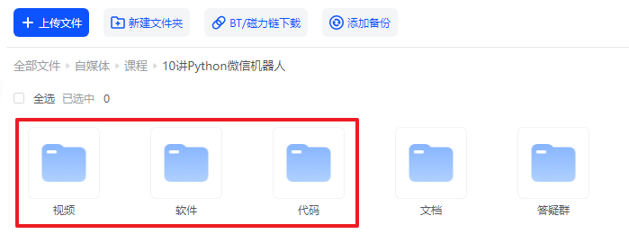

## 给小白的《5讲 · Python + 发票批量识别》

       

	👉 <a target="_blank" href="https://www.python-office.com/">项目官网</a> 👈

	👉 <a target="_blank" href="http://www.python4office.cn/wechat-group/">本开源项目的交流群</a> 👈

    
    	
  	
    	

欢迎学习给小白的《Python实现OCR自动批量识别》，课程已经更新完毕🚀，每一节课都包含：视频、文档、代码、软件和答疑群。

本次课程的特点有以下几个：

1. 适合小白不需要学习复杂的编程知识，拿来就用。
2. 内容丰富，涵盖热门的OCR识别需求。
3. 所有功能，只需要1~3行代码就能实现。

本套课程的代码，全部来自开源项目，Python+OCR识别的专用库：``poocr``：[Python实现图片文字提取，准确率高达99%，100多个功能全给你！](https://www.bilibili.com/video/BV13J4m1s7L7)

## 1、课程目录

以下课程的学习，是为了实现包含发票识别在内的Python+OCR识别的所有功能。

> 如果不需要学习Python，只想使用发票批量识别功能，可以直接使用我们开发的exe软件，鼠标点点就能用。详情看本文的第3部分：exe软件。

为了方便大家的学习，课程核心部分：每一讲都是一个单独的案例，互相之间没有知识点的关联，你可以不用按顺序学习，用到哪个就点开哪个。

- 第0讲：[课程说明](https://www.bilibili.com/video/BV13J4m1s7L7?p=1)
- 第1讲：[软件下载和安装](https://www.bilibili.com/video/BV13J4m1s7L7?p=2)
- 第2讲：[开通腾讯OCR的账号](https://www.bilibili.com/video/BV13J4m1s7L7?p=3)
- 第3讲：[下载poocr](https://www.bilibili.com/video/BV13J4m1s7L7?p=4)
- 第4讲：[OCR识别的所有功能](https://www.bilibili.com/video/BV13J4m1s7L7?p=5)
- 第5讲：[OCR批量识别后，自动保存为Excel](https://www.bilibili.com/video/BV13J4m1s7L7?p=6)
- 第6讲：[支持PDF格式的发票批量识别了](https://www.bilibili.com/video/BV1LT421S7sh)
- 第7讲：[支持社保卡识别了](https://mp.weixin.qq.com/s/ymm9TnQVXTaRknUXdQJRiQ)

## 2、获取资料

如需获取本套课程配套的全部:代码、文档、视频、软件、答疑群，可以付费后下载。👇

- B站 购买链接：[98元-点我直达](https://mall.bilibili.com/neul-next/detailuniversal/detail.html?isMerchant=1&page=detailuniversal_detail&saleType=10&itemsId=11995848&loadingShow=1&noTitleBar=1&msource=merchant_share)

付费后，B站自动出现网盘链接，永久有效。

购买资料 或者 学习过程中有任何问题，也欢迎+我的微信交流👉[python-office](http://www.python4office.cn/wechat-qrcode/)

## 3、exe软件的下载

在课程沟通的过程中，我发现很多朋友并不需要学习Python，只是想使用发票批量识别功能，那你也可以直接下载exe软件使用。

- 💻[发票批量识别.exe，发布了！不用学Python，给财务人的自动化软件](https://www.bilibili.com/video/BV19bmBYWE1t/)

## 4、交流群

       

### 补充知识

- [给小白的《10讲 · Python微信机器人》（完结）](https://mp.weixin.qq.com/s/g9nejIxuitwRzl5NMi177w)
- [给小白的《50讲 · Python自动化办公》](https://www.python-office.com/course/50-python-office.html)
- [Python自动化办公--Pandas玩转Excel（全30集）](https://www.bilibili.com/video/BV1hk4y1C73S/?spm_id_from=333.999.0.0)

## 5、读者福利

       

       

       

