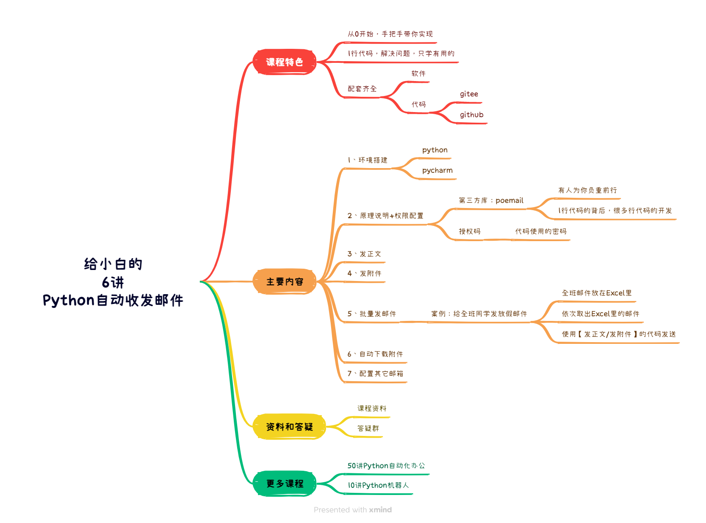

       

	👉 <a target="_blank" href="https://www.python-office.com/office/robot.html">项目官网</a> 👈

	👉 <a target="_blank" href="http://www.python4office.cn/wechat-group/">本开源项目的交流群</a> 👈

    
    	
  	
    	

欢迎学习给小白的《6讲 · Python实现自动发邮件》，课程正在更新中🚀，每一节课都包含：视频、文档、代码、软件和答疑群。

本次课程的特点有以下几个：

1. 适合小白不需要学习复杂的编程知识，拿来就用。
2. 内容丰富，涵盖热门的自动收发邮件的需求。
3. 所有功能，只需要1~3行代码就能实现。

本套课程的代码，全部来自开源项目，Python+Email的专用库：``poemail``：[Python终于能自动收发邮件了！](https://www.bilibili.com/video/BV1pQ4y177nV)

## 1、课程目录

为了方便大家的学习，课程核心部分：每一讲都是一个单独的案例，互相之间没有知识点的关联，你可以不用按顺序学习，用到哪个就点开哪个。

- 第1讲：[Python环境的下载和安装](./docs/1-install_python_pycharm.html)
- 第2讲：[免费开通权限](./docs/2-auth_mail.html)
- 第3讲：[1行代码，自动发正文](./docs/3-send_mail_content.html)
- 第4讲：[1行代码，自动发正文+附件](./docs/4-send_mail_content_file.html)
- 第5讲：[自动批量发送](./docs/5-batch_send_mail_content_file.html)
- 第6讲：[1行代码，自动下载邮件的附件](./docs/6-receive_mail_attchment.html)
- 第7讲：[配置其它邮箱](./docs/7-other_email.html)

### 补充知识

- [给小白的《10讲 · Python微信机器人》（完结）](https://mp.weixin.qq.com/s/g9nejIxuitwRzl5NMi177w)
- [给小白的《50讲Python自动化办公》](https://www.python-office.com/course/50-python-office.html)
- [Python自动化办公--Pandas玩转Excel（全30集）](https://www.bilibili.com/video/BV1hk4y1C73S/?spm_id_from=333.999.0.0)

## 2、课程资料

如需获取本套课程配套的全部:代码、文档、视频、软件、答疑群，可以付费本套合集。👇

> 2个付费渠道：B站和微信公众号，2选1就行。悄悄说：苹果手机，用B站购买更优惠~

- B站 购买链接：[38元-点我直达](https://mall.bilibili.com/neul-next/index.html?page=mall-up_itemDetail&noTitleBar=1&itemsId=1105542099&from=items_share&msource=items_share)
- 微信 购买链接：[48元-点我直达](https://www.python-office.com/course-002/poemail/poemail.html)

付费后，文末会自动出现网盘链接，永久有效。

购买资料 或者 学习过程中有任何问题，也欢迎+我的微信交流👉[CoderWanFeng](http://www.python4office.cn/wechat-qrcode/)

## 3、交流群

       

## 4、读者福利

       

       

       

