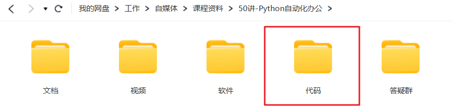

# 【第6讲】把PPT转成1张长图，用Python只需要1行代码，小白入门必学

------
> 点击学习：[50讲 · Python自动化办公](https://mall.bilibili.com/neul-next/index.html?page=mall-up_itemDetail&noTitleBar=1&itemsId=1104200099&from=items_share&msource=items_share)
------

上一讲飞速就达到了20+投币，我赶紧更新了这一讲：把PPT转成长图。

不知道大家有没有这个习惯：拿到PPT，总感觉一页一页的翻看不方便，不如看一张长图。

但又找不到把PPT转换成一张长图的工具。

于是我开发了下面这个功能。👇

## 本讲视频

<iframe src="//player.bilibili.com/player.html?bvid=BV1QG411o7Xb" scrolling="no" border="0" frameborder="no" framespacing="0" allowfullscreen="true" width=100%, height=500> </iframe>

## 下载课程代码

如需获取本套课程配套的全部:代码、文档、视频、软件、答疑群，可以付费本套合集。👇

> 2个付费渠道：B站和微信公众号，2选1就行。悄悄说：我的粉丝，用B站购买更优惠~

- B站 购买链接：[68元-点我直达](https://mall.bilibili.com/neul-next/index.html?page=mall-up_itemDetail&noTitleBar=1&itemsId=1104200099&from=items_share&msource=items_share)
- 微信 购买链接：[78元-点我直达](https://mp.weixin.qq.com/s/tKlzVee4kmJk4dGfKvVnFQ)

付费后，2个平台都会自动出现网盘链接，永久有效。

购买资料 或者 学习过程中有任何问题，也欢迎+我的微信交流👉[CoderWanFeng](http://www.python4office.cn/wechat-qrcode/)

## 读者福利

       

