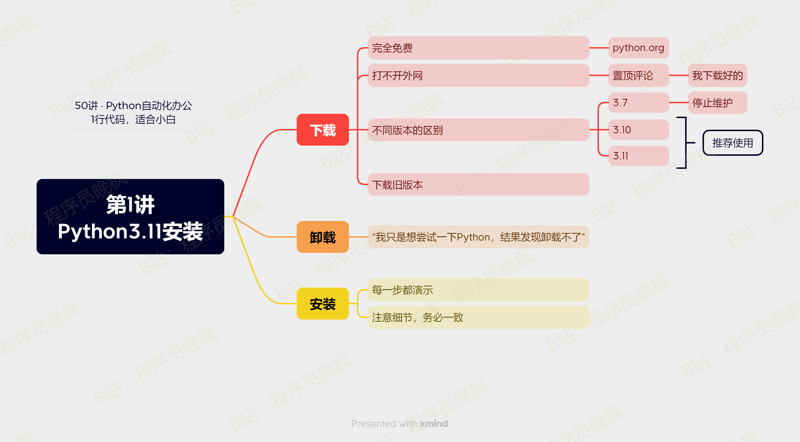

# 【第1讲】Python3.11的下载、安装和卸载，有手就能学会

课程的开始，我们学习如何安装Python运行环境。

## 本讲内容

对于小白来说，Python运行需要2个软件：代码运行的环境Python（水）和编辑代码的PyCharm（水桶）。

本讲我们首先学习Python的下载、安装和卸载，它的下载地址是：

- Python：[https://www.python.org/](https://www.python.org/)（因为众所周知的原因，国内可能打不开，解决方法👇）

>因为Python是国外大佬开发的，网站也在国外。因为众所周知的原因，国内可能打不开，下载不了。**我都已经下载好了，放在了文末的百度云网盘里**，付费了本套合集的同学，可以自己去领取下载。也可以直接加我微信，我微信发给你👉[CoderWanFeng](https://mp.weixin.qq.com/s/yFcocJbfS9Hs375NhE8Gbw)

下载和安装时，请大家注意2点：

- 这些软件都是**完全免费**的，官网就可以下载。不要被付费软件给欺骗了。

- 我了解到很多朋友只是想尝试一下Python，对于小白来说，卸载比安装困难，所以我在这个视频里，加了**卸载的教程**。

下载好了以后，我们开始一步一步的安装，编程是个细活，稍有差错，程序就会运行失败，所以：**请小白务必每一步都和视频中的操作一样。**

## 安装视频

- 打开视频：[https://www.bilibili.com/video/BV118411R7bB/](https://www.bilibili.com/video/BV118411R7bB)

## 软件下载好了

本套合集的读者，可以直接打开下载地址👇

- 百度云链接，永久有效：[http://python4office.cn/python-download/](http://python4office.cn/python-download/)

