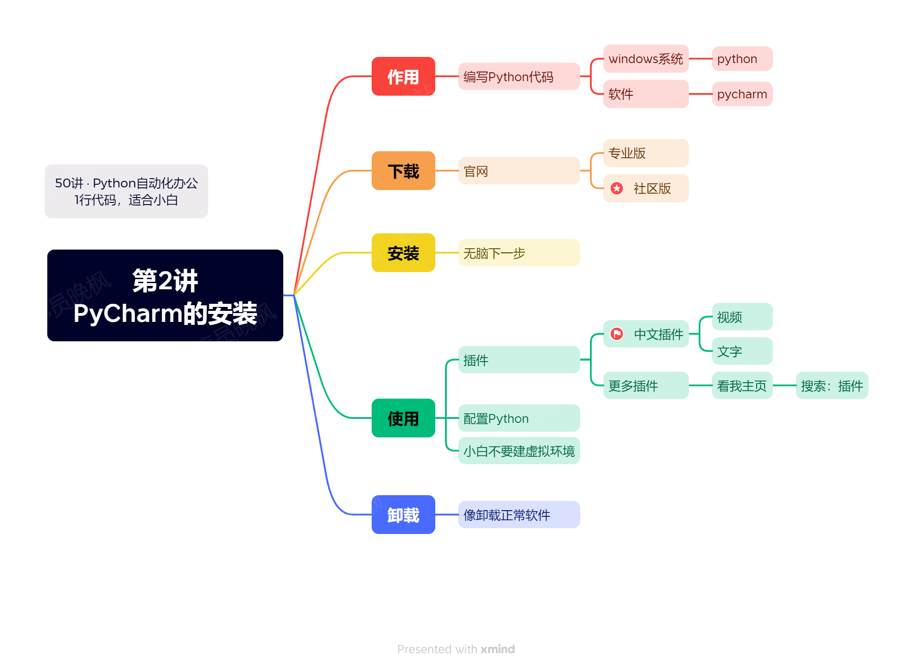
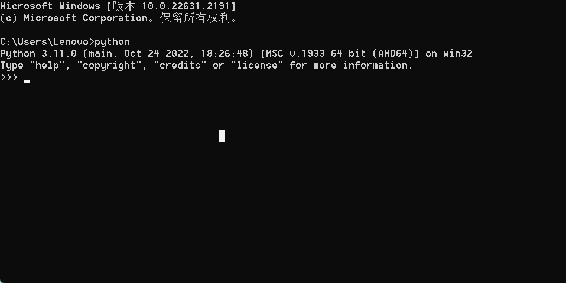
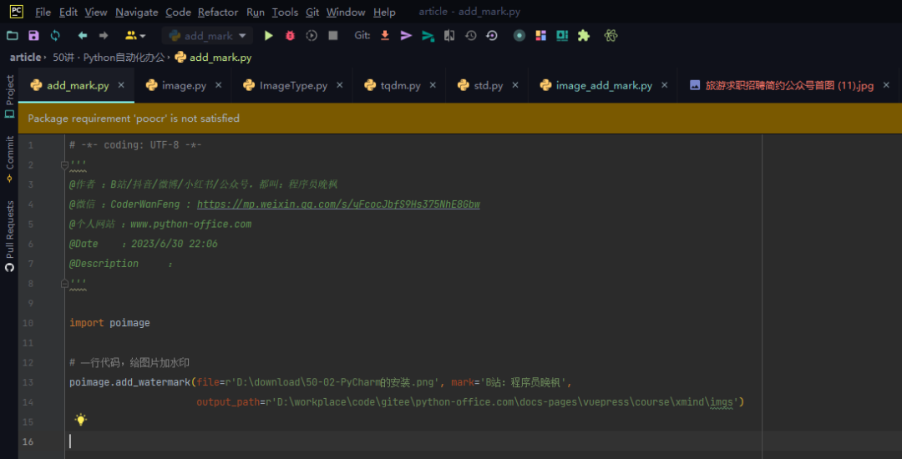

# 【第2讲】正版PyCharm，但是免费！最强Python 编辑器的下载和使用教程，还有中文插件哦~

------
> 点击学习：[50讲 · Python自动化办公](https://mall.bilibili.com/neul-next/index.html?page=mall-up_itemDetail&noTitleBar=1&itemsId=1104200099&from=items_share&msource=items_share)
------

> [PyCharm下载地址，点我直达](https://www.jetbrains.com/pycharm/)

装完了Python，我们来转**编辑Python**的软件：Pycharm。

> 新朋友可能会好奇：我是来学习Python的，安装一个Python不就行了吗？

我先给你看一个Python运行的截图：

黑乎乎的一片，而且没有一个人类能看懂的页面。

如果你的目标是成为程序员，我觉得你可以只装一个Python，但如果你是为了自动化办公的小白，我还是建议你看一下本讲：安装一个普通人能看懂的Python编辑器。如下图所示。👇

## 主要内容

<iframe src="//player.bilibili.com/player.html?bvid=BV1X84y1f76f" scrolling="no" border="0" frameborder="no" framespacing="0" allowfullscreen="true" width=100%, height=500> </iframe>

本讲内容，还是通过视频的形式给大家讲解，视频内容主要包含：

- 下载：哪个是免费的？
- 使用：
  - 中文插件怎么安装？
  - 怎么创建项目？
  - 怎么配置Python？
  - 怎么运行代码？
- 其它注意事项

## 下载课程代码

如需获取本套课程配套的全部:代码、文档、视频、软件、答疑群，可以直接付费下载。👇

> 哪个平台购买都可以，都是一样的资料 + 答疑群。

- B站 购买链接：[178元-点我直达](https://mall.bilibili.com/neul-next/detailuniversal/detail.html?isMerchant=1&page=detailuniversal_detail&saleType=10&itemsId=11995842&loadingShow=1&noTitleBar=1&msource=merchant_share)
- 公众号 购买链接：[178元-点我直达](https://mp.weixin.qq.com/s/VH93du82QMuPz_1V3c5a6w)

付费后，会自动出现网盘链接，永久有效。

购买资料 或者 学习过程中有任何问题，也欢迎+我的微信交流👉[CoderWanFeng](http://www.python4office.cn/wechat-qrcode/)

## 读者福利

       

