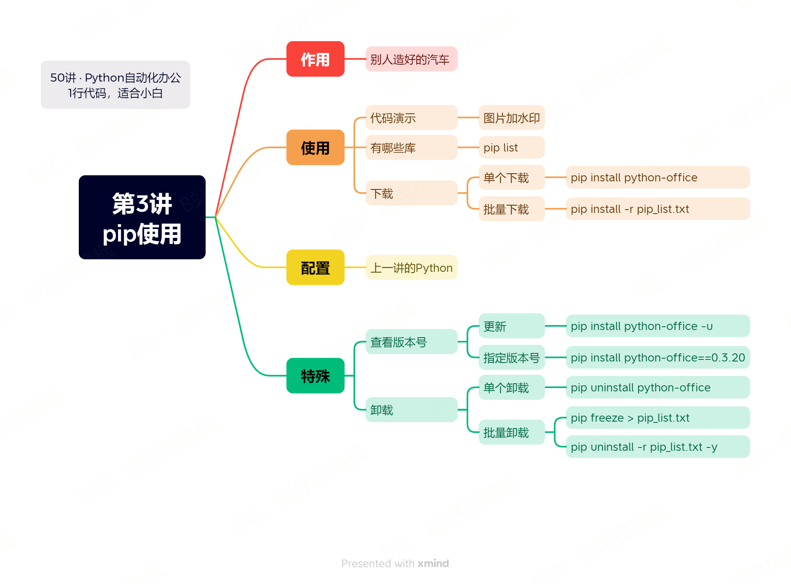
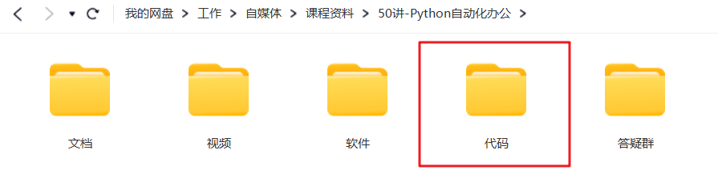

# 【第3讲】不要重复造轮子原来是这个意思！pip的下载、安装和使用，编程准备工作最后一站

------
> 点击学习：[50讲 · Python自动化办公](https://mp.weixin.qq.com/s/6hAgvbcXhdWOh4K9OH73cA)
------




今天学习Python编程准备工作的最后一讲：pip的使用，这是Python好用、流行的精髓。

Python的流行，有一个非常重要的原因，有大量的第三方库。

> 第三方库的意思，就是当我想从重庆到成都的时候，我不用自己造一个火车，我可以直接乘坐别人造好的车。

先来看一段代码。

```python
import office

office.image.add_watermark(file=r'd://程序员晚枫的图片.jpg',mark='全网同名，程序员晚枫')
```

上面这个office，就是别人写好的第三方库：python-office,

<iframe src="//player.bilibili.com/player.html?bvid=BV1m14y1y76g" scrolling="no" border="0" frameborder="no" framespacing="0" allowfullscreen="true" width=100%, height=500> </iframe>

## 1、下载

下载只需要一行命令
```python
pip install python-office
```

### 为了加快速度，可以使用国内镜像

- 清华镜像：百度清华pip
- 阿里镜像：百度阿里pip

## 2、使用细节

- 一定要配置正确python，不然不生效

## 3、更新
不用卸载，直接更新

```python
pip install python-office -U
```


### 查看版本号

```python
pip show python-office
pypi.org/projects/python-office.com
```

### 指定版本号


```python

pip install python-office==0.2.0
```

## 4、卸载

```python
pip uninstall python-office
```

### 批量卸载

卸载全部第三方库

```python
pip freeze > pip_list.txt
pip uninstall -r pip_list.txt -y
```


## 下载课程代码




如需获取本套课程配套的全部:代码、文档、视频、软件、答疑群，可以付费本套合集。👇

> 2个付费渠道：B站和微信公众号，2选1就行，都是一样的价格 10元。


- B站 购买链接：[点我直达](https://mp.weixin.qq.com/s/J47pgSQBwKQxfT0mBBlvSA)
- 微信 购买链接：[点我直达](https://mp.weixin.qq.com/mp/appmsgalbum?__biz=MzI2Nzg5MjgyNg==&action=getalbum&album_id=3056320585091366915#wechat_redirect)

付费后，2个平台都会自动出现百度云链接，永久有效。

购买资料 或者 学习过程中有任何问题，也欢迎+我的微信交流👉[CoderWanFeng](https://mp.weixin.qq.com/s/B1V6KeXc7IOEB8DgXLWv3g)


