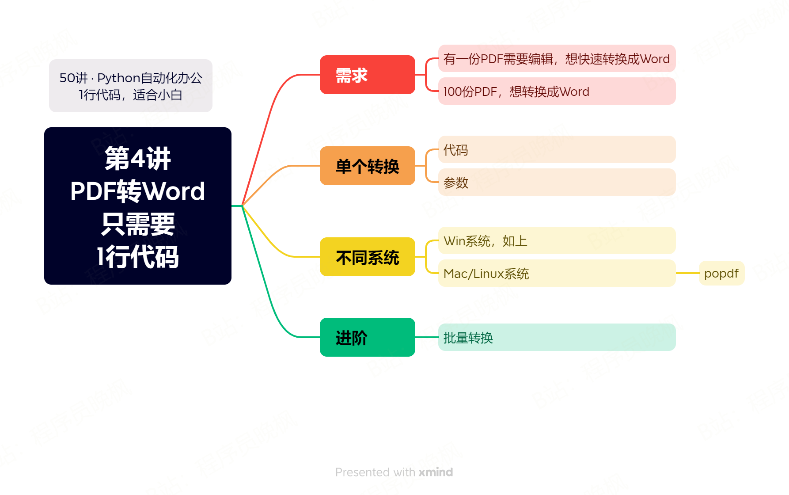

# 【第4讲】PDF转Word，1行代码就够了，Python自动化办公原来这么简单

------
> 点击学习：[50讲 · Python自动化办公](https://mp.weixin.qq.com/s/naqnxjkrhvDtoCnzlRIO1Q)
------

开始课程之前，先说一个悲伤的事情：

> 周末我本想更新一下网站：python-office.com，结果最终因为服务器配置太低，被迫又还原了。又一次被黄金打败了，希望本套课能帮到大家，大家帮我宣传一下，我挣钱升级服务器！

言归正传，今天第一个案例，我们学习一个好玩的需求：如何用1行代码，把PDF转换成Word？

## 1、先看视频

<iframe src="//player.bilibili.com/player.html?bvid=BV1em4y1H7ir" scrolling="no" border="0" frameborder="no" framespacing="0" allowfullscreen="true" width=100%, height=500> </iframe>

## 下载资料

如需获取本套课程配套的全部:代码、文档、视频、软件、答疑群，可以付费本套合集。👇

> 2个付费渠道：B站和微信公众号，2选1就行，都是一样的价格 10元。

- B站 购买链接：[点我直达](https://mp.weixin.qq.com/s/3kUW1BQkQrr9f1L_JVR0iA)
- 微信 购买链接：[点我直达](https://mp.weixin.qq.com/mp/appmsgalbum?__biz=MzI2Nzg5MjgyNg==&action=getalbum&album_id=3056320585091366915#wechat_redirect)

付费后，2个平台都会自动出现百度云链接，永久有效。

购买资料 或者 学习过程中有任何问题，也欢迎+我的微信交流👉[CoderWanFeng](https://mp.weixin.qq.com/s/B1V6KeXc7IOEB8DgXLWv3g)

