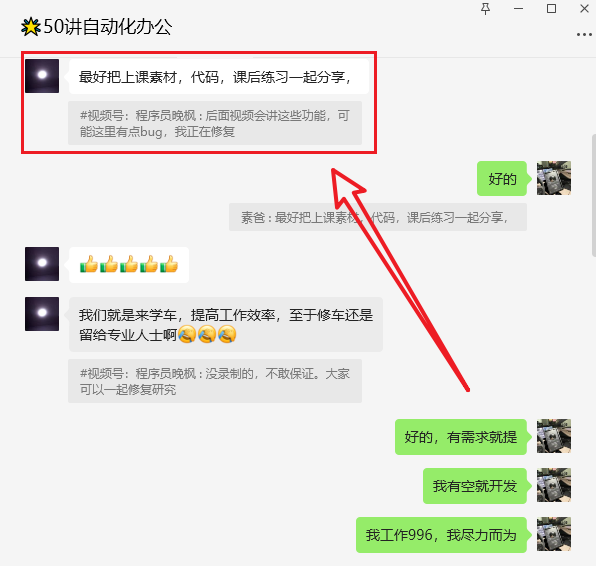

# 【第5讲】100个Word转PDF，Python批量办公自动化，告别无意义加班

------
> 点击学习：[50讲 · Python自动化办公](https://mall.bilibili.com/neul-next/index.html?page=mall-up_itemDetail&noTitleBar=1&itemsId=1104200099&from=items_share&msource=items_share)
------

上一讲我们学习了：[PDF转Word](https://mp.weixin.qq.com/s/n-LyhLaSIKYo3awXuRsRyA)，大家都已经运行成功了吧？

今天我们趁热打铁，学习反向操作：**Word转PDF，而且是100个一起的那种。**

## 课程答疑

学习之前，先回答一个问题：今天在课程配套的答疑群里，看到这样一个提问。👇

> 这里再给大家说明一下，只要付费了本套合集，就可以自动获取本套课程配套的所有资料，包括：代码、文档、软件、视频和答疑群。

怎么个自动法呢？

付费后，每篇文章的最后，你都会看到一个相同的二维码。不付费你是看不到的。付费的同学，赶紧滑倒文末去领取吧~

## 本讲视频

曾经遇到过一个需求：口罩期间，公司需要给大家发放补贴，想给每个人都单独发一个通知。

原始文档是用Word编辑的，为了防止格式错误和篡改内容，需要把它们转换成PDF。

然而全公司有1000多名员工，如何进行高效转换呢？

<iframe src="//player.bilibili.com/player.html?bvid=BV1K84y1Z7n6" scrolling="no" border="0" frameborder="no" framespacing="0" allowfullscreen="true" width=100%, height=500> </iframe>

## 下载课程代码

如需获取本套课程配套的全部:代码、文档、视频、软件、答疑群，可以直接付费下载。👇

> 哪个平台购买都可以，都是一样的资料 + 答疑群。

- B站 购买链接：[198元-点我直达](https://mall.bilibili.com/neul-next/detailuniversal/detail.html?isMerchant=1&page=detailuniversal_detail&saleType=10&itemsId=11995842&loadingShow=1&noTitleBar=1&msource=merchant_share)
- 公众号 购买链接：[198元-点我直达](https://mp.weixin.qq.com/s/9hB7Ghyf_km5ARSBBWt4BQ)

付费后，会自动出现网盘链接，永久有效。

购买资料 或者 学习过程中有任何问题，也欢迎+我的微信交流👉[python-office](http://www.python4office.cn/wechat-qrcode/)

## 读者福利

       

