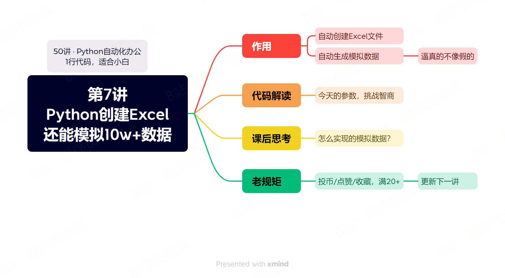

# 【第7讲】是真的！Python可以创建Excel了，1行代码就能模拟真实数据，AI自动化办公还会远吗？

------
> 点击学习：[50讲 · Python自动化办公](https://mp.weixin.qq.com/mp/appmsgalbum?__biz=MzI2Nzg5MjgyNg==&action=getalbum&album_id=3056320585091366915#wechat_redirect)
------




## 视频说明

<iframe src="//player.bilibili.com/player.html?bvid=BV18m4y1u7Kq" scrolling="no" border="0" frameborder="no" framespacing="0" allowfullscreen="true" width=100%, height=500> </iframe>


## 代码演示

```
import officeoffice.excel.fake2excel(columns=['name', 'text'], rows=20)# 参数说明
# columns:list，每列的数据名称，默认是名称
# rows：多少行，默认是1
# language：什么语言，可以填english，默认是中文
# path：输出excel的位置，有默认值
```


## 获取资料

如需获取本套课程配套的全部:代码、文档、视频、软件、答疑群，可以付费本套合集。👇

------
> 点击学习：[50讲 · Python自动化办公](https://mp.weixin.qq.com/mp/appmsgalbum?__biz=MzI2Nzg5MjgyNg==&action=getalbum&album_id=3056320585091366915#wechat_redirect)
------

付费合集后，下方自动出现百度云链接，永久有效。

学习过程中有任何问题，也欢迎+我的微信交流👉[CoderWanFeng](https://mp.weixin.qq.com/s/B1V6KeXc7IOEB8DgXLWv3g)
