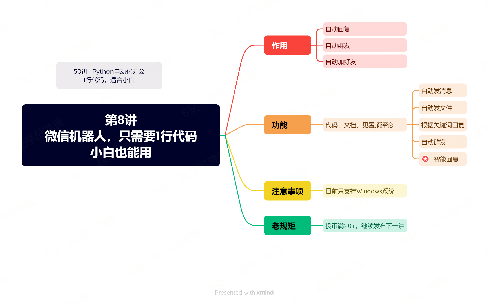

# 【第8讲】免费的微信机器人发布了，只需要1行Python代码，赶紧来试试

# 【第7讲】是真的！Python可以创建Excel了，1行代码就能模拟真实数据，AI自动化办公还会远吗？

------
> 点击学习：[50讲 · Python自动化办公](https://mp.weixin.qq.com/mp/appmsgalbum?__biz=MzI2Nzg5MjgyNg==&action=getalbum&album_id=3056320585091366915#wechat_redirect)
------



微信机器人发布很久了，这次也加入这套课程里。

## 视频说明

<iframe src="//player.bilibili.com/player.html?bvid=BV1Fu4y1v7xH" scrolling="no" border="0" frameborder="no" framespacing="0" allowfullscreen="true" width=100%, height=500> </iframe>


## 代码演示

运行以下代码之前，请一定要升级一下python-office。

升级命令：pip install python-office -U，不会用升级命令的同学，去看一下第3讲的最后：[打开第3讲](https://www.bilibili.com/video/BV1m14y1y76g/)

```
import office

office.wechat.chat_robot(who='每天进步一点点')  # 智能聊天

# 所有代码，在置顶评论，24小时自动获取
# office.wechat.send_message()  # 发消息
# office.wechat.send_file()  # 发文件
# office.wechat.send_message_by_time()  # 定时发送
# office.wechat.chat_by_keywords()  # 根据关键词回复
# # 批量加好友
# #  群发
```
后面的功能，会慢慢给大家讲解，着急的同学，可以先看一下这个合集：[【8讲】用Python制作一个微信机器人，1行代码人人可用](https://mp.weixin.qq.com/s/9aspEHdCiAdXK17AvHlu9Q)

## 获取资料

如需获取本套课程配套的全部:代码、文档、视频、软件、答疑群，可以付费本套合集。👇

------
> 点击学习：[50讲 · Python自动化办公](https://mp.weixin.qq.com/mp/appmsgalbum?__biz=MzI2Nzg5MjgyNg==&action=getalbum&album_id=3056320585091366915#wechat_redirect)
------

付费合集后，下方自动出现百度云链接，永久有效。

学习过程中有任何问题，也欢迎+我的微信交流👉[CoderWanFeng](https://mp.weixin.qq.com/s/B1V6KeXc7IOEB8DgXLWv3g)
