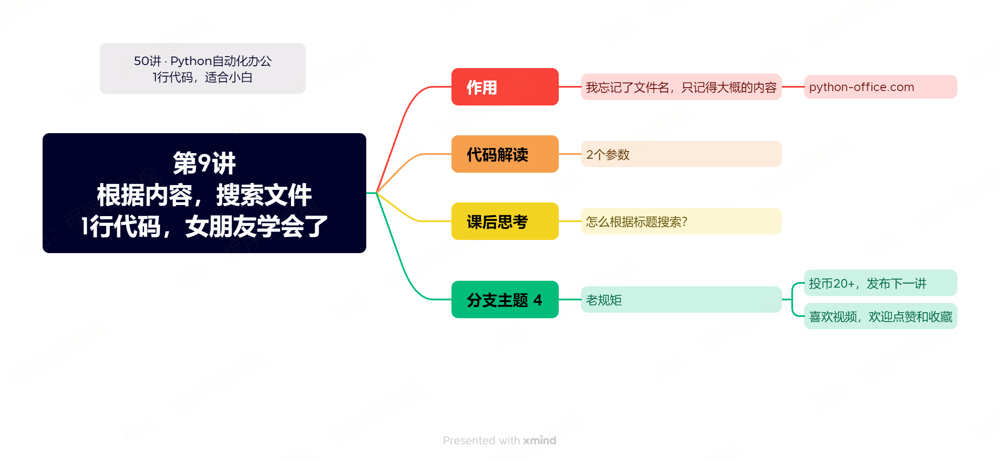

# 【第9讲】根据内容搜索文件，1行Python代码，这是什么黑科技？

------
> 点击学习：[50讲 · Python自动化办公](https://mall.bilibili.com/neul-next/index.html?page=mall-up_itemDetail&noTitleBar=1&itemsId=1104200099&from=items_share&msource=items_share)
------

通过标题搜索文件，已经有很多人用过了。

> 但是通过内容搜索文件，你用过吗？

## 本讲视频

<iframe src="//player.bilibili.com/player.html?bvid=BV1Lm4y1M7Pz" scrolling="no" border="0" frameborder="no" framespacing="0" allowfullscreen="true" width=100%, height=500> </iframe>

## 下载课程代码

如需获取本套课程配套的全部:代码、文档、视频、软件、答疑群，可以直接付费下载。👇

> 哪个平台购买都可以，都是一样的资料 + 答疑群。

- B站 购买链接：[178元-点我直达](https://gf.bilibili.com/item/detail/1104200099)
- 公众号 购买链接：[178元-点我直达](https://mp.weixin.qq.com/s/VH93du82QMuPz_1V3c5a6w)

付费后，会自动出现网盘链接，永久有效。

购买资料 或者 学习过程中有任何问题，也欢迎+我的微信交流👉[CoderWanFeng](http://www.python4office.cn/wechat-qrcode/)

## 读者福利

       

