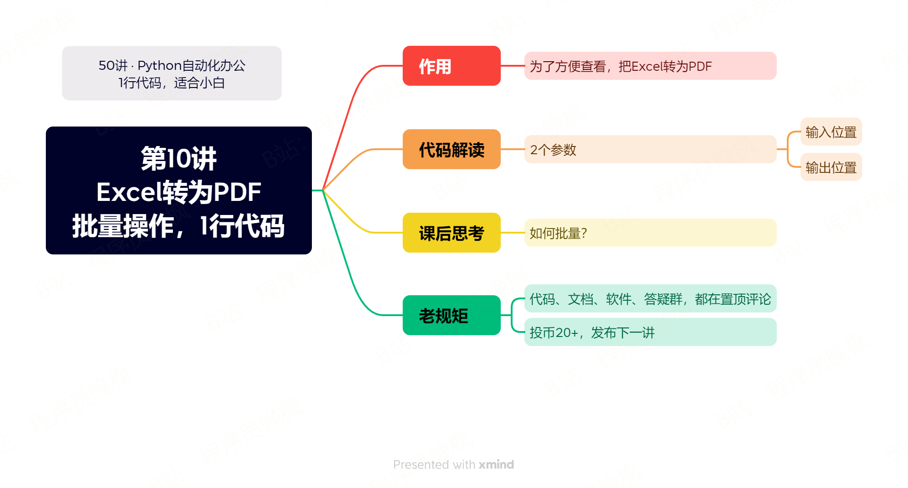

# 【第10讲】Excel转PDF，只需要1行Python代码，源码解读来了


------
> 点击学习：[50讲 · Python自动化办公](https://mp.weixin.qq.com/s/W39OFo6XoXsS-hL9poHP6Q)
------



之前第5讲，咱们学了[把Word转为PDF](https://mp.weixin.qq.com/s/0E47kN8pIwgUa_vc547Wrw)

今天咱们再来看看：如何把Excel转为PDF，只需要1行代码。

## 写在前面

特别感谢大家支持，截止写这篇文章，课程付费已经超过70人了（公众号合集64，B站工房14）。

在这里给订阅这套课程的同学说2件事情，

其一：因为课程还在更新中，所有平台价格都是10元。👉**更新结束后，这套课价格升到78元/套。**

其二：另外**从本讲开始，本合集的每一篇文章都增加一些课外基础知识**，让大家看完视频以后，还能通过阅读文章获得更多Python基础知识。这部分补充知识在文章的最后，是不用付费合集就可以阅读的哟~


## 本讲视频

<iframe src="//player.bilibili.com/player.html?bvid=BV1Nh4y1K7KG" scrolling="no" border="0" frameborder="no" framespacing="0" allowfullscreen="true" width=100%, height=500> </iframe>


## 下载课程代码


如需获取本套课程配套的全部:代码、文档、视频、软件、答疑群，可以付费本套合集。👇

> 2个付费渠道：B站和微信公众号，2选1就行，都是一样的价格 10元。


- B站 购买链接：[点我直达](https://mp.weixin.qq.com/s/J47pgSQBwKQxfT0mBBlvSA)
- 微信 购买链接：[点我直达](https://mp.weixin.qq.com/mp/appmsgalbum?__biz=MzI2Nzg5MjgyNg==&action=getalbum&album_id=3056320585091366915#wechat_redirect)

付费后，2个平台都会自动出现百度云链接，永久有效。

购买资料 或者 学习过程中有任何问题，也欢迎+我的微信交流👉[CoderWanFeng](https://mp.weixin.qq.com/s/B1V6KeXc7IOEB8DgXLWv3g)


## 补充知识 - 注释

今天给大家分享的补充知识是：注释，可以理解成是给代码的备注。注释最大的特点就是：不会运行，也不会对运行的代码有任何影响。

既然不运行，那么写注释还有什么作用呢？我们通过一段代码来体会一下。👇

```python
# -*- coding: UTF-8 -*-
'''
@作者  ：B站/抖音/微博/小红书/公众号，都叫：程序员晚枫
@微信     ：CoderWanFeng : https://mp.weixin.qq.com/s/B1V6KeXc7IOEB8DgXLWv3g
@个人网站      ：www.python-office.com
@代码日期    ：2023/8/22 23:28 
@本段代码的视频说明     ：https://www.bilibili.com/video/BV1em4y1H7ir/
'''

# pip install python-office
import office  # 导入第三方库

office.pdf.pdf2docx(file_path=r'./test_files/50-04-pdf2docx',
                    output_path=r'./test_files/50-04-pdf2docx/pdf2docx')
# 上面这种是Windows用户

# 如果你是尊贵的Mac和Linux用户，用下面这个代码
# pip install popdf
# import popdf
#
#
# popdf.pdf2docx(file_path=r'./test_files/50-04-pdf2docx/程序员晚枫.pdf',
#                output_path=r'./test_files/50-04-pdf2docx/pdf2docx')
```

上面这么多代码，80%的内容都是注释，只有中间的``office.pdf.pdf2docx``是可以运行的代码。

其它都是注释，内容包括：这段代码的说明、其它系统使用的代码。

> 程序员的代码好坏，有很多评判标准，其中之一就是：你的代码是否容易阅读。

而添加注释，可以有效提高代码的可读性，尤其是和别人合作的时候，别人只看代码很难理解你要表达的逻辑，这时候就可以通过阅读你给他的备注（注释），来快速理解你的代码了。

写注释的方式，主要有2种：

- 多行注释：用'''包起来。
- 单行注释：用#开头的内容，都是注释。

代码里没有注释是非常错误的行为，在有些大厂，对注释和代码的比例，甚至是有严格要求的，
所以在这里也建议大家在编写代码的时候，多写注释。让别人更好的阅读你的代码。


