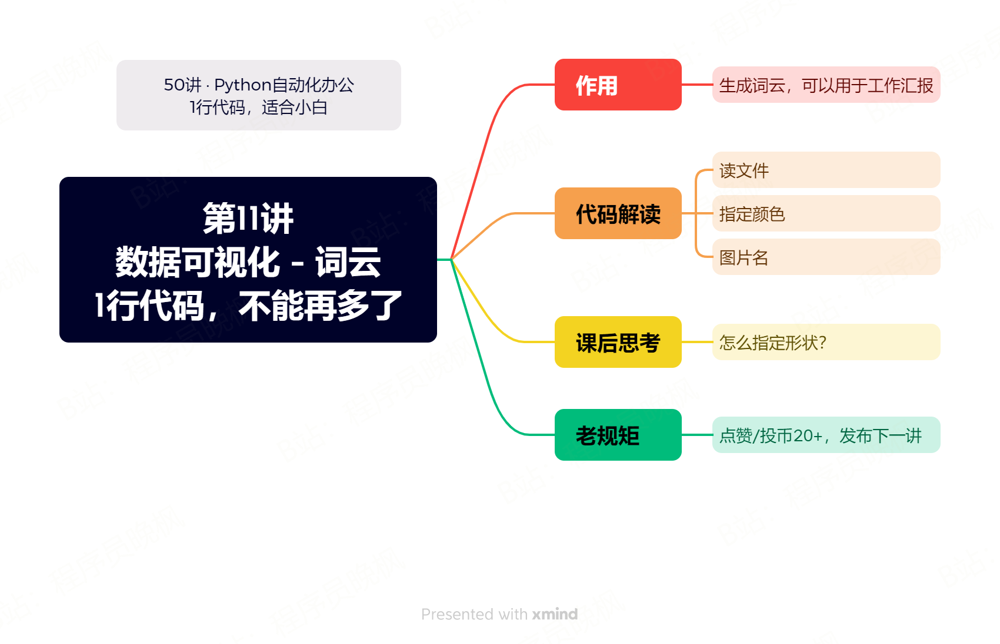

# 【第11讲】入门数据可视化，1行Python代码就够了，这是什么宝藏项目？

------
> 点击学习：[50讲 · Python自动化办公](https://www.python-office.com/course/50-python-office.html)
------



有多少朋友第一次听说Python，是因为它可以轻松实现数据可视化？


## 视频说明

<iframe src="//player.bilibili.com/player.html?bvid=BV1ph4y1v7MN" scrolling="no" border="0" frameborder="no" framespacing="0" allowfullscreen="true" width=100%, height=500> </iframe>

## 获取资料


如需获取本套课程配套的全部:代码、文档、视频、软件、答疑群，可以付费本套合集。👇

> 2个付费渠道：B站和微信公众号，2选1就行，都是一样的价格 10元。

- B站 购买链接：[点我直达](https://course-1300615378.cos.ap-guangzhou.myqcloud.com/50-python-office/bili-buy.jpg)
- 微信 购买链接：[点我直达](https://mp.weixin.qq.com/mp/appmsgalbum?__biz=MzI2Nzg5MjgyNg==&action=getalbum&album_id=3056320585091366915#wechat_redirect)

付费后，2个平台都会自动出现百度云链接，永久有效。

购买资料 或者 学习过程中有任何问题，也欢迎+我的微信交流👉[CoderWanFeng](https://mp.weixin.qq.com/s/B1V6KeXc7IOEB8DgXLWv3g)

## 补充知识 - 路径

路径，在编程里一般指的是文件存储的位置，主要有2种表示方式：相对路径和绝对路径。

- 绝对路径：从根目录开始写的位置，例如：D://work//code，
- 相对路径：相对于当前代码文件的位置，例如：./test/file。


> 既然绝对路径能定位到文件位置，为什么还要使用相对路径呢？

因为绝对路径是写死的，当你把代码给别人使用的时候，如果对方的存储位置和你的不一样，就找不到这个文件了。

但是使用相对路径，只要保持文件夹的层级关系是一致的，对方拿到你的文件夹，依然可以找到文件位置，成功运行代码。

所以我在视频里，所有代码都使用的是相对路径，如下面的代码所示。

**这样当你付费拿到课程的代码以后，就可以直接运行了。**

```python

import office

office.image.txt2wordcloud(filename=r'./test_files/50-11-txt2wordcloud/python-office.txt',  # 这里是相对路径
                           color="black", result_file="your_wordcloud.png")
```
