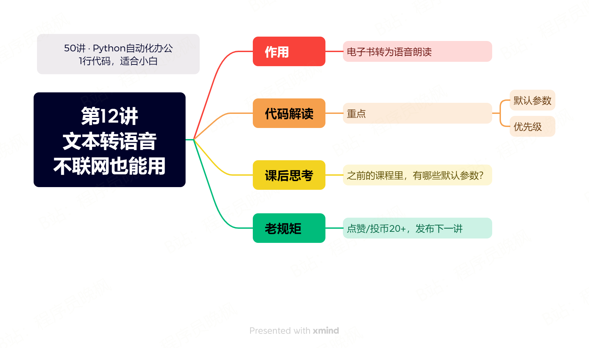

# 【第12讲】文字转语音是怎么实现的？1行Python代码，不需要联网

------
> 点击学习：[50讲 · Python自动化办公](https://mall.bilibili.com/neul-next/index.html?page=mall-up_itemDetail&noTitleBar=1&itemsId=1104200099&from=items_share&msource=items_share)
------

上一讲我们实现了TxT文本的数据可视化👉[点我复习](https://www.bilibili.com/video/BV1ph4y1v7MN/?spm_id_from=333.788&vd_source=dcea3feb81b702defb6006f671564224)

今天我们学一个好玩的：Txt文本转语音。

现在手机和各类APP都有一个默认功能：朗读文字。这个功能用1行Python代码就能实现，而且不用联网。
## 本讲视频

<iframe src="//player.bilibili.com/player.html?bvid=BV1R14y167Tb" scrolling="no" border="0" frameborder="no" framespacing="0" allowfullscreen="true" width=100%, height=500> </iframe>

## 下载课程代码

如需获取本套课程配套的全部:代码、文档、视频、软件、答疑群，可以直接付费下载。👇

> 哪个平台购买都可以，都是一样的资料 + 答疑群。

- B站 购买链接：[178元-点我直达](https://gf.bilibili.com/item/detail/1104200099)
- 公众号 购买链接：[178元-点我直达](https://mp.weixin.qq.com/s/VH93du82QMuPz_1V3c5a6w)

付费后，会自动出现网盘链接，永久有效。

购买资料 或者 学习过程中有任何问题，也欢迎+我的微信交流👉[CoderWanFeng](http://www.python4office.cn/wechat-qrcode/)

## 补充知识 - 代码规范

前几天在课程群里看到有老哥问：怎么把python代码写得更规范？

这里的规范，不是保证程序不报错的语法规范，而是**怎么让代码更容易阅读、更容易维护，甚至怎么让代码变得像诗一样优雅的编码规范。**

首先说一句，很遗憾，目前python还没有一个全行业统一的规范。或者严谨地说，Python有一个官方推荐的规范：``PEP8``，但大家没有严格做到。

怪只怪Python太火了，人人都想快速用Python解决问题，人人都不把繁琐的代码规范当回事。

其次，Python代码规范确实很繁琐，感兴趣的朋友可以去``PEP8``的原文看一看：``https://peps.python.org/pep-0008/``。

对于学习我们这套课程的朋友来说：你是程序员，你可以认真记忆一下这些规范，另外加上使用专业工具：pylint去解决代码规范的问题；

但如果你只是出于兴趣或者实用性的角度，想速成Python这门技术，你可以用下面的方式快速解决代码规范问题。👇

> 学会使用PyCharm的格式化功能。

我在所有的视频里都[推荐大家使用PyCharm去编写Python代码](https://www.python-office.com/course/docs/50-02-pycharm.html)，除了因为它的社区版是完全免费的，还因为它有很多帮助写出更好Python代码的功能。比如：代码格式化。

在使用PyCharm编写代码的时候，可以使用组合式快捷键：``ctrl+alt+l``，就可以自动按照``PEP8``的标准格式化你当前``.py``里的所有Python代码。

如果你不想格式化全部，只想格式化一部分代码，你可以先使用鼠标选中一部分代码，然后再按这段快捷键，那么就可以只格式化你选中部分的代码。

## 读者福利

       

