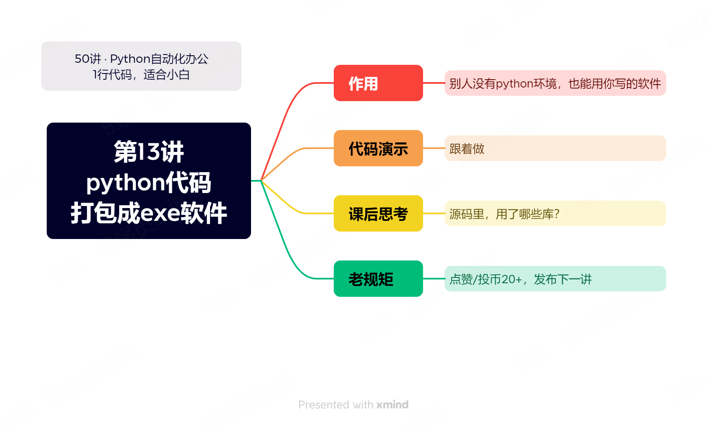

# 【第13讲】把Python代码打包成Exe软件，竟然用了100多行代码

------
> 点击学习：[50讲 · Python自动化办公](https://mp.weixin.qq.com/mp/appmsgalbum?__biz=MzI2Nzg5MjgyNg==&action=getalbum&album_id=3056320585091366915#wechat_redirect)
------



这一讲的主要内容是关于：python代码转成exe软件，但功能是用的PPT转PDF，这也是答疑群里读者自己提交的代码。

## 视频说明

<iframe src="//player.bilibili.com/player.html?bvid=BV1Fw411S7kV" scrolling="no" border="0" frameborder="no" framespacing="0" allowfullscreen="true" width=100%, height=500> </iframe>

## 代码演示

运行以下代码之前，请一定要升级一下python-office。

升级命令：pip install python-office
-U，不会用升级命令的同学，去看一下第3讲的最后：[打开第3讲](https://www.bilibili.com/video/BV1m14y1y76g/)

```python
# -*- coding: UTF-8 -*-
'''
@作者  ：B站/抖音/微博/小红书/公众号，都叫：程序员晚枫
@微信     ：CoderWanFeng : https://mp.weixin.qq.com/s/HYOWV7ImvTXImyYWtwADog
@个人网站      ：www.python-office.com
@代码日期    ：2023/9/10 11:43 
@本段代码的视频说明     ：
'''
# -*- coding: utf-8 -*-
# @Time    : 2023/8/10 13:25
# @Author  : Kyln.Wu
# @Email   : kylnwu@qq.com
# @File    : ppt2pdf_gui_2.0.py
# @Software: PyCharm
import os
import sys
import threading
import time
from threading import Thread
import poppt
from PyQt5.QtCore import pyqtSignal, QObject
from PyQt5.QtWidgets import QApplication, QWidget, QFileDialog, QPushButton, QLabel, QMessageBox, QDesktopWidget


class Converter(QObject):
    convert_done_signal = pyqtSignal(bool, str)
    reply_signal = pyqtSignal(str)
    pause_event = threading.Event()

    def __init__(self):
        super().__init__()
        # 定义一个是否覆盖转换的标志位
        self.do_cover = None

    # 槽函数
    def on_convert_done(self, success, msg):
        if success:
            QMessageBox.information(None, '提示', '转换成功!')
        elif msg == '该目录下没有可转换的文件！':
            QMessageBox.warning(None, '错误', msg)
        else:
            QMessageBox.warning(None, '警告', msg)

    def on_reply(self, msg):
        if msg == '询问覆盖':
            reply = QMessageBox.question(None, '提示', '文件已存在,是否覆盖?', QMessageBox.Yes | QMessageBox.No, QMessageBox.No)
            self.do_cover = reply


class Ppt2Pdf(QWidget):
    def __init__(self):
        super().__init__()
        self.title = 'PPT转PDF v2.0 By Kyln.wu'
        self.left = 500
        self.top = 500
        self.width = 410
        self.height = 200
        self.path = ''
        self.output_path = ''
        # 连接信号到槽函数
        self.converter = Converter()
        self.converter.reply_signal.connect(self.converter.on_reply)
        self.converter.convert_done_signal.connect(self.converter.on_convert_done)
        # 主界面
        self.init_ui()

    def init_ui(self):
        self.setWindowTitle(self.title)
        self.setGeometry(self.left, self.top, self.width, self.height)

        # 选择PPT文件夹
        self.select_path_label = QLabel('请选择PPT文件夹：', self)
        self.select_path_label.move(20, 20)

        self.select_path_label_show = QLabel(self)
        self.select_path_label_show.setGeometry(125, 10, 180, 30)
        self.select_path_label_show.setStyleSheet('background-color: #D0F5BE;')

        self.select_path_btn = QPushButton('选择文件夹', self)
        self.select_path_btn.move(320, 12)
        self.select_path_btn.clicked.connect(self.select_path)

        # 选择输出文件夹
        self.select_output_path_label = QLabel('请选择输出文件夹：', self)
        self.select_output_path_label.move(20, 60)

        self.select_output_path_label_show = QLabel(self)
        self.select_output_path_label_show.setGeometry(125, 50, 180, 30)
        self.select_output_path_label_show.setStyleSheet('background-color: #D0F5BE;')

        self.select_output_path_btn = QPushButton('选择文件夹', self)
        self.select_output_path_btn.move(320, 52)
        self.select_output_path_btn.clicked.connect(self.select_output_path)

        # 转换按钮
        self.convert_btn = QPushButton('开始转换', self)
        self.convert_btn.move(168, 100)
        # self.convert_btn.clicked.connect(self.convert)
        self.convert_btn.clicked.connect(self.run_convert_thread)  # connect to new method

        # 状态显示
        self.status_label = QLabel('提示：请选择PPT文件夹和输出文件夹', self)
        self.status_label.move(20, 140)

        self.center()
        self.show()

    def center(self):
        # 计算屏幕中心点
        qr = self.frameGeometry()
        cp = QDesktopWidget().availableGeometry().center()
        qr.moveCenter(cp)
        self.move(qr.topLeft())

    def select_path(self):
        """ 选择源路径 """
        self.path = QFileDialog.getExistingDirectory(self, '选择PPT文件夹')
        # self.select_path_label.setText('已选择PPT文件夹：' + self.path)
        self.select_path_label_show.setText(self.path)

    def select_output_path(self):
        """ 选择输出路径 """
        self.output_path = QFileDialog.getExistingDirectory(self, '选择输出文件夹')
        # self.select_output_path_label.setText('已选择输出文件夹：' + self.output_path)
        self.select_output_path_label_show.setText(self.output_path)

    def run_convert_thread(self):
        """ 启动子线程 """
        convert_thread = Thread(target=self.convert, args=(self.path, self.output_path))  # create new thread
        convert_thread.start()  # start the thread

    def convert(self, path, output_path):
        """ 转换方法 """
        if path or output_path:
            # PPT 批量转成 PDF
            # 如果是相对路径，转为绝对路径
            if not os.path.isabs(path):
                path = os.path.abspath(path)
            # 列出指定目录的内容
            filenames = os.listdir(path)
            # for循环依次访问指定目录的所有文件名
            for filename in filenames:
                # 判断文件的类型，对所有ppt或pptx结尾的文件进行处理
                if filename.endswith('.pptx') or filename.endswith('.ppt'):
                    if not output_path:
                        output_path = path + '\\ppt2pdf'
                    if not os.path.exists(output_path):
                        os.mkdir(output_path)
                    output_file = output_path + '\\' + filename.rsplit('.', 1)[0] + '.pdf'
                    if os.path.exists(output_file):
                        self.converter.reply_signal.emit('询问覆盖')
                        self.converter.pause_event.set()
                        # 等待询问的结果
                        while self.converter.do_cover is None:
                            time.sleep(0.1)
                        if self.converter.do_cover == QMessageBox.Yes:
                            # 继续执行
                            self.status_label.setText('正在转换中...')
                            poppt.ppt2pdf(path=path, output_path=output_path)
                            self.status_label.setText('转换完成!')
                            # 使用自定义信号返回结果
                            self.converter.convert_done_signal.emit(True, '转换完成!')
                            self.converter.do_cover = None
                            return
                        else:
                            # 跳过
                            self.converter.convert_done_signal.emit(False, '文件已存在，跳过!')
                            # 把do_cover重新初始化，否则转换完成一次之后，再转换时会出错
                            self.converter.do_cover = None
                            return
                else:
                    # 判断是否有可转换的文件
                    self.status_label.setText('该目录下没有可转换的文件!')
                    self.converter.convert_done_signal.emit(False, "该目录下没有可转换的文件！")
                    return
        else:
            self.status_label.setText('提示：请选择PPT文件夹和输出文件夹')
            self.converter.convert_done_signal.emit(False, "请选择PPT文件夹和输出文件夹！")
            return


if __name__ == '__main__':
    app = QApplication(sys.argv)
    ex = Ppt2Pdf()
    ex.show()
    app.exec_()

```

这段代码很复杂，后期我会发布Python专业课程，有兴趣的同学可以关注答疑群里的动态哟~

## 获取资料

如需获取本套课程配套的全部:代码、文档、视频、软件、答疑群，可以付费本套合集。👇

------
> 点击学习：[50讲 · Python自动化办公](https://mp.weixin.qq.com/mp/appmsgalbum?__biz=MzI2Nzg5MjgyNg==&action=getalbum&album_id=3056320585091366915#wechat_redirect)
------

付费合集后，下方自动出现百度云链接，永久有效。

学习过程中有任何问题，也欢迎+我的微信交流👉[CoderWanFeng](https://mp.weixin.qq.com/s/B1V6KeXc7IOEB8DgXLWv3g)
