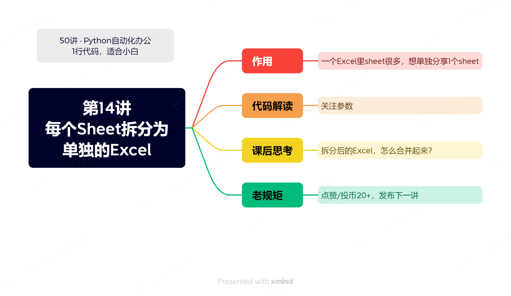

# 【第14讲】体制内有用！按Sheet拆分Excel，1行Python代码稿定

------
> 点击学习：[50讲 · Python自动化办公](https://mp.weixin.qq.com/s/VH93du82QMuPz_1V3c5a6w)
------

前几年特殊时期，我帮助体制内的朋友开发了不少统计工具，今天就是其中之一。

按照Sheet拆分Excel。

## 本讲视频

<iframe src="//player.bilibili.com/player.html?bvid=BV1ih4y1v7YY" scrolling="no" border="0" frameborder="no" framespacing="0" allowfullscreen="true" width=100%, height=500> </iframe>
## 下载课程代码

如需获取本套课程配套的全部:代码、文档、视频、软件、答疑群，可以付费本套合集。👇

> 2个付费渠道：B站和微信公众号，2选1就行。悄悄说：我的粉丝，用B站购买更优惠~

- B站 购买链接：[150元-点我直达](https://mall.bilibili.com/neul-next/index.html?page=mall-up_itemDetail&noTitleBar=1&itemsId=1104200099&from=items_share&msource=items_share)
- 微信 购买链接：[178元-点我直达](https://mp.weixin.qq.com/s/VH93du82QMuPz_1V3c5a6w)

付费后，2个平台都会自动出现网盘链接，永久有效。

购买资料 或者 学习过程中有任何问题，也欢迎+我的微信交流👉[CoderWanFeng](https://mp.weixin.qq.com/s/Nt8E8vC-ZsoN1McTOYbY2g)

## 补充知识 - 推荐一个库：pandas

这一讲是我们这套课程第2次涉及到Excel操作，我在课程答疑群里了解到：很多朋友学习Python，是为了学习数据分析。

今天就给大家推荐一个专门用来做数据分析的Python第三方库：pandas，这个库的名字是：Python Data Analysis Library（Python数据分析专用库）的缩写。

不夸张的说，业余爱好者把这个库学会，就可以解决你99%的数据分析的问题了，剩下的1%就当给专业程序员留碗饭吧。

因为这个库的功能太丰富，不可能靠一篇文章全部都介绍完，给大家推荐3个学习资料，可以快速掌握这个库的用法：
- 首先是pandas的官方网站：http://pandas.pydata.org/ 。优点：知识最权威、最准确。唯一的缺点：纯英文，对于英语不好的同学来说，很痛苦。
- 其次是1套播放量已经30w+的视频课程：[《30讲Pandas + Excel自动化办公》](https://www.bilibili.com/video/BV1hk4y1C73S/)。优点：通俗易懂，播放量已经说明问题了。缺点：太通俗易懂了，对于想专业学习Python数据分析的同学来说，不够深入。
- 最后是一本书：[《pandas创始人：我写了1本《利用Python进行数据分析》，提供全套代码》](https://mp.weixin.qq.com/s/aXEsRlZX1ChVeNrs4cPNtg)，这本书是pandas的创始人写的，既通俗易懂，又知识全面。

## 读者福利

       

