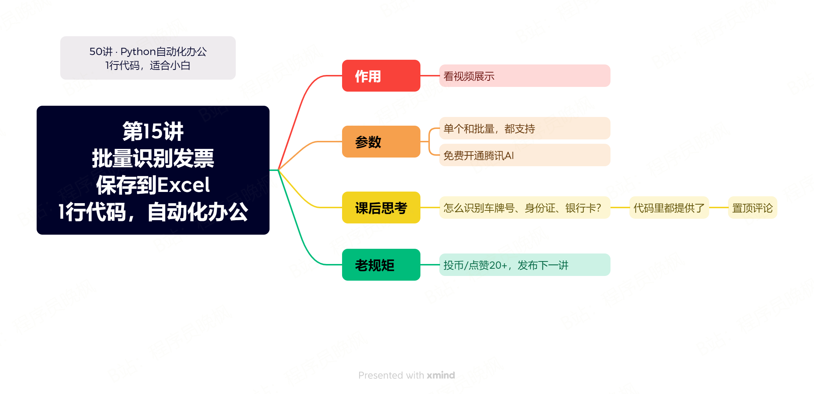

# 【第15讲】批量识别发票，自动保存到Excel中，1行Python代码稿定

------
> 点击学习：[50讲 · Python自动化办公](https://mp.weixin.qq.com/s/tKlzVee4kmJk4dGfKvVnFQ)
------

学习Python，怎么能少了财务人员的需求？

之前给大家分享过一些票据识别的视频：

- [识别火车票](https://www.bilibili.com/video/BV1Tv4y1n7Js/?spm_id_from=333.999.0.0)
- [识别身份证](https://www.bilibili.com/video/BV1484y1g7N4/?spm_id_from=333.999.0.0)
- [识别银行卡](https://www.bilibili.com/video/BV1QY4y1o7qc/?spm_id_from=333.999.0.0)

但有读者提问：能不能识别发票后，直接保存在Excel里面？

当然可以了！本期我们就来一起看一下，如何用1行代码批量识别发票，并且自动整理在Excle里。

## 本讲视频

<iframe src="//player.bilibili.com/player.html?bvid=BV1h94y1W7ds" scrolling="no" border="0" frameborder="no" framespacing="0" allowfullscreen="true" width=100%, height=500> </iframe>

## 下载课程代码

如需获取本套课程配套的全部:代码、文档、视频、软件、答疑群，可以付费本套合集。👇

> 2个付费渠道：B站和微信公众号，2选1就行。悄悄说：B站购买更优惠~

- B站 购买链接：[10元-点我直达](https://mp.weixin.qq.com/s/J47pgSQBwKQxfT0mBBlvSA)
- 微信 购买链接：[78元-点我直达](https://mp.weixin.qq.com/s/tKlzVee4kmJk4dGfKvVnFQ)

付费后，2个平台都会自动出现百度云链接，永久有效。

购买资料 或者 学习过程中有任何问题，也欢迎+我的微信交流👉[CoderWanFeng](https://mp.weixin.qq.com/s/B1V6KeXc7IOEB8DgXLWv3g)

## 补充知识 - 接口

运行完刚才的代码，你有没有一个疑问：这个识别是怎么实现的？

实现方式，我在视频里也提了一句：这个功能调用了腾讯云的接口。那么什么是接口呢？

还记得第13讲的补充知识：方法吗？

**你可以这样理解：方法是运行在自己电脑上的接口，网络接口是运行在服务器里的方法。**

比如我们查看本套课程的B站，存放了大量的视频，普通人是不可能存放那么多视频、并且能随时更新的。

所以我们通过一个接口，也就是一个视频的链接，就可以拿到我们想要的视频了：``https://www.bilibili.com/video/BV1zj411k7SX/?spm_id_from=888.80997.embed_other.whitelist&t=1``。

接口有不同的表现形式，我们看视频的网址是一种接口，我们识别发票的是另一种接口。

它们的作用是相同的：根据我们发布的命令（url），返回一串数据（视频/识别结果）。

说到这里，就不得不提到：在Python里，有一个专门处理接口的第三方库：requests，而它也是爬虫的基础库。

感兴趣的同学可以先在网上了解一下，我们在后面的爬虫课程里，也会详细介绍。