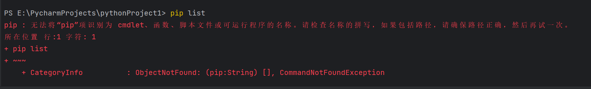
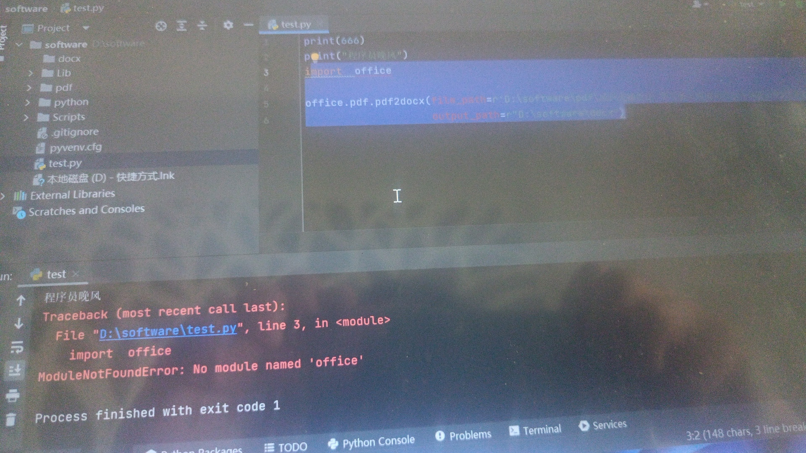

# 常见问题

       

> 遇到问题不要慌，可以加入我的读者交流群：[点我直达](https://mp.weixin.qq.com/s/yMl9-06DSmjLTobyJNrJJw)

> 如问题比较特殊，需找我1对1Python技术咨询/学习答疑，请直接添加我的个人微信：[CoderWanFeng](https://mp.weixin.qq.com/s/B1V6KeXc7IOEB8DgXLWv3g)

大家好，这里是程序员晚枫，小红书/B站/公众号/抖快/知乎，都叫这个名字。

最近在更新一套课程：[《给小白的50讲Python自动化办公》](https://www.python-office.com/course/50-python-office.html)

正确的代码只有一个，然而错误的代码和报错层出不穷。

别慌，程序出BUG很正常，本文收集了大家在学习过程中，尤其是小白在学习过程中，常见的技术问题。我们一起来看看吧~

### 有没有关于python-office自动化办公的课程？

有的，我正在更新一套课程《50讲 · Python自动化办公》，所有视频都是免费学习的。

- 视频链接：[打开](https://www.bilibili.com/video/BV118411R7bB)

另外说明一下，视频教程配套的：**软件、代码、文档、答疑群**，是收费的，10元钱（100微信豆）👉[点我获取资料](https://mp.weixin.qq.com/mp/appmsgalbum?__biz=MzI2Nzg5MjgyNg==&action=getalbum&album_id=3056320585091366915&from_itemidx=1&from_msgid=2247501346&scene=173&count=3&nolastread=1#wechat_redirect)

我不想定价几百几千的割韭菜，但是也不想纯纯用爱发电。如果觉得贵了，只看视频也是可以的学习的。
> 这里重点推荐一下答疑服务：所有问题，在答疑群我都会回复，**你实在搞不定的，我下班在家的时候，可以给你远程调试，也不另外收费。**希望这套课真正帮你

### win7安装不了python和pycharm怎么办？

换电脑或者换

### 第1讲中，pip list报错

报错信息如下，👇。

- 问题原因：pip没有安装（第1讲是不是没认真听）

- 解决方法：
  - 重新听第1讲：[Python3.11的下载、安装和卸载，有手就能学会](https://www.python-office.com/course/docs/50-01-python.html)
  - 卸载Python，然后跟着视频重新安装。每一步操作，都务必一模一样。

### 第2讲中，安装时要不要打勾的问题

小白的问题都差不多，大家下次遇到问题，可以先看看评论区。👇

### 第3讲中，下载python-office的速度太慢

请👉使用清华大学的国内镜像，加速python-office的下载，[点我查看，配置教程](https://www.bilibili.com/video/BV1SM411y7vw)

### 第4讲中，运行程序报错：

报错信息如下，👇。

2个原因：

1. 没下载python-office
2. 👉没有配置正确的 Python Interpreter

> 解决方法：跟着第3讲，从头到尾做一遍👉[打开下载和配置教程](https://www.bilibili.com/video/BV1m14y1y76g)

一定要把视频看完！！！

### 如何参与项目的开发，给python-office增加自己的方法

目前项目已开源在GitHub和Gitee，可以通过PR的方式，参与项目开发。

- 项目地址：
- GitHub：[https://github.com/CoderWanFeng/python-office](https://github.com/CoderWanFeng/python-office)
- Gitee：[https://gitee.com/CoderWanFeng/python-office](https://gitee.com/CoderWanFeng/python-office)

不会参与开源项目的同学，看这个视频👉[如何参与开源项目？0基础入门：怎么打开GitHub？什么是issue？什么是PR？](https://www.bilibili.com/video/BV1EP411d7Np/?spm_id_from=333.999.0.0v)

### 运行代码报错：AttributeError: module 'office' has no attribute 'xxx'

👉第一步： 确保下载了python-office，而且是最新版。不会下载和更新到最新版的同学：[点我看教程](https://www.bilibili.com/video/BV1m14y1y76g)

第二步：请确保自己没用虚拟环境。

第三步：如果以上2步都确保正确了，还报错，只有一个可能：你打错字了。确认一下你报错里的‘xxx’，和视频里是不是完全一致。

### 更多问题

- [入门10大问题](https://mp.weixin.qq.com/s/Z0CGigtAoomAcvmSfnv-eQ)

- [2个刁钻的问题](https://mp.weixin.qq.com/s/_yW6qM7fIBHqmWubWXX6aA)

